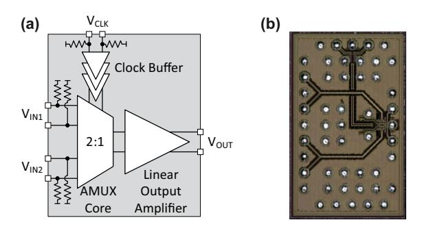
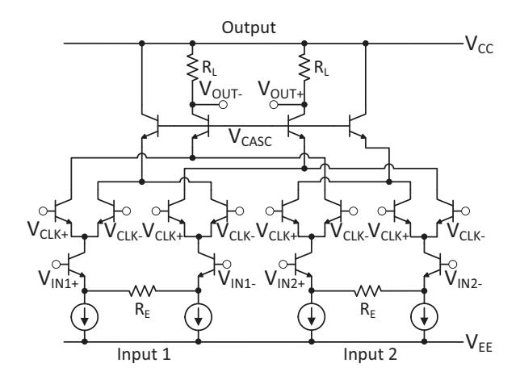
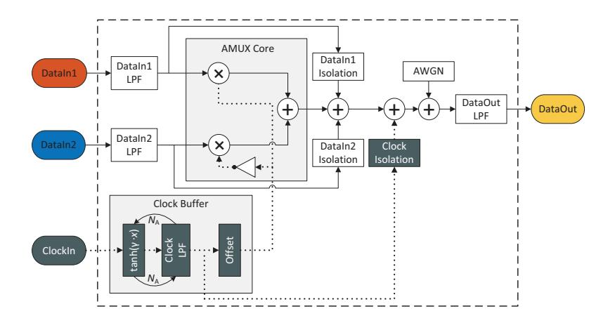
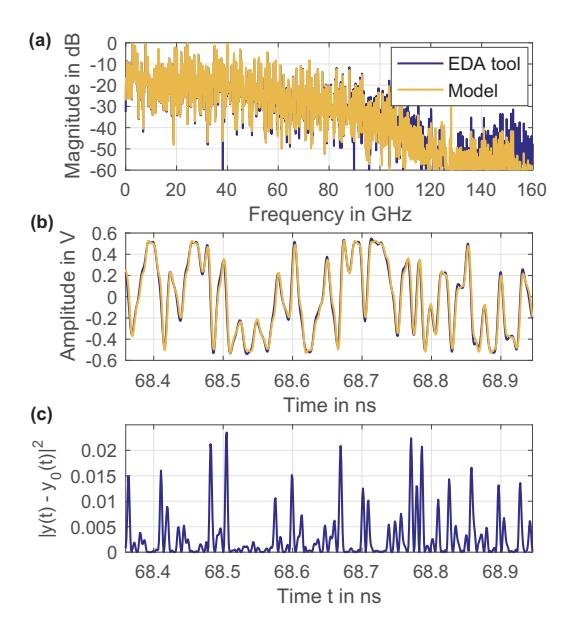

## **4.6 Behavioral 2:1 AMUX Model**

Simulating the AMUX-DAC architecture on transistor level in an electronic design automation (EDA) tool is very time-consuming, especially, if the impact of multiple parameters needs to be studied. In order to conduct simulations on system-level, a behavioral model is required. This way, the performance of AMUX-DACs in highspeed transceivers can be quantified and the IC design process can be supported with specifications for the AMUX's sub-blocks etc.

In this section, a generic behavioral model for the 2:1 AMUX is introduced; this model decreases the computation time by at least three orders of magnitude, which is of particular interest for system-level simulation. First, the investigated AMUX IC is introduced [\[42\]](#page-212-0). Then, the behavioral model is presented and explained in detail. Furthermore, the model is implemented in Matlab and fitted against simulation data obtained from an EDA tool.

In Secs. [4.8](#page-102-0) and [4.9,](#page-104-0) the AMUX model will be embedded in an AMUX-DAC system to study the impact of multiple parameters on both system behavior and performance. The behavioral model was developed during the supervision of a master's thesis [\[249\]](#page-231-0). Parts of this section have been previously published in [\[42,](#page-212-0) [43\]](#page-213-0).

## *4.6.1 2:1 AMUX IC*

In this section, the AMUX IC is presented. The 2:1 AMUX IC is designed in IHP's SiGe-HBT BiCMOS technology SG13G2, which features high-speed bipolar transistors having a maximum transit frequency of *f*T = 300 GHz and a maximum oscillation frequency of *f*max = 500 GHz [\[87\]](#page-216-0). In Fig. [4.8,](#page-95-0) a block diagram of the IC and a photograph of the chip with bumps are depicted. The fully differential circuit design with a differential port impedance of 100 Ohm for both inputs and output is composed of the AMUX core, the clock buffer and a linear output amplifier [\[42\]](#page-212-0). The AMUX supports a maximum differential peak-to-peak input voltage of 1 V and is designed for an overall voltage gain of one.

In Fig. [4.9,](#page-96-0) the schematic of a 2:1 AMUX core is depicted. *V*CC and *V*EE denote the positive and the negative supply voltage, respectively. For the input signals *V*IN1 and *V*IN2, differential transconductance amplifiers are put into place, which are linearized with the emitter degeneration resistors *R*E. The input termination and the emitter followers at the signal inputs are not depicted in Fig. [4.9.](#page-96-0) The signal currents pass through clocked-current switch pairs that select one of the signal currents. If the clock voltage *V*CLK+ is in high state, the signal currents of Input 1 are switched to the output and the signal currents of Input 2 are switched to a

Figure 4.8 Block diagram of the 2:1 AMUX IC (a); photograph of the chip (b). (a): © 2017 IEEE. Adapted, with permission, from [\[42\]](#page-212-0); (b): © 2018 IEEE. Reprinted, with permission, from [\[43\]](#page-213-0).

dummy load. If *V*CLK+ is in low state, the condition is vice versa. At the output, cascode transistors and load resistors *R*L generate the output voltages *V*OUT+ and *V*OUT−.

The differential output voltage *V*OUT for each input current *I*IN is given for a differential bipolar amplifier by [\[168\]](#page-224-0):

$$V_{\rm OUT} = 2I_{\rm IN}R_{\rm C} \cdot \tanh\left(\frac{V_{\rm CLK}}{2\kappa V_{\rm T}}\right)$$
, (4.41)

whereby *R*C, *V*CLK, κ, and *V*T denote the collector resistance, the clock voltage, a correction coefficient, and the temperature voltage, respectively. The operating point is linearized with respect to the input current *I*IN.

The clock buffer consists of multiple high-gain Cherry-Hooper amplifiers, which act as limiting amplifiers for the input clock signal to generate steep clock signal slopes, i.e., a quasi-rectangular clock signal for the AMUX core.

The output amplifier is implemented as a multi-stage amplifier consisting of two series connected emitter followers and a linearized differential transconductance cascode stage. It compensates the loss of the AMUX to achieve an overall gain of one and matches the AMUX core to the output impedance.

It is intended to operate the AMUX in an AMUX-DAC system consisting of two DACs, each running at a sampling rate of 64 GS/s and generating a symbol rate of 64 GBd. The outputs of the DACs are combined with the 2:1 AMUX to generate an 128 GBd signal. The AMUX operates at half clock rate, i.e., 64 GHz.

Figure 4.9 2:1 AMUX core schematic. © 2017 IEEE. Adapted, with permission, from [\[42\]](#page-212-0).

## *4.6.2 Block Diagram*

A behavioral model for the actual IC presented in the previous section is developed in this section, which can be easily adapted to other AMUX ICs. Therefore, a generic approach is taken and a quasi-linear model without nonlinear distortions in the data path is developed. The resulting model is depicted in Fig. [4.10.](#page-97-0) It consists of two data input signals DataIn1 and DataIn2, a clock input signal ClockIn and a data output signal DataOut.

The data input signals DataIn1 and DataIn2 are low-pass filtered to account for the low-pass characteristic of the transmission lines including pads and bumps, as well as for the low-pass characteristic of the transconductance amplifiers. In the AMUX core, the data signals are multiplied with the clock signals and added. Since, the operating point of the core transistors is linearized as described in Sec. [4.6.1,](#page-94-0) the core operation is an ideal multiplication; the tanh-characteristic in [\(4.41\)](#page-95-1) is included in the clock buffer.

The clock input signal ClockIn is processed in the clock buffer to generate a rectangular clock signal. First, ClockIn is fed *N*A times through a combination of a tanh-characteristic and a LPF, which corresponds to a bandwidth-limited differential amplifier cascade. The argument γ defines the slope of the tanh-characteristic. The low-pass characteristic of the transmission lines, pads, and bumps has a minor impact on the sine clock input signal. Eventually, the clock signal is scaled and

Figure 4.10 Behavioral 2:1 AMUX model block diagram: two data signals DataIn1, DataIn2 and one clock signal ClockIn are given as inputs and one data signal DataOut is given as output. The input data signals are multiplied with the clock signal in the AMUX core, combined and fed to the output port. Multiple parasitic effects are modeled. © 2018 IEEE. Adapted, with permission, from [43].

offset to convert the amplitude range of the tanh-characteristic [-1, +1] to the required amplitude range [0, +1]. This amplitude range enables switching off one of the input signals during one half of the clock period. The clock signal is fed to the AMUX core, where it is duplicated; the clock signal for the second path is inverted, i.e., phase shifted by  $180^{\circ}$ .

Furthermore, feedthrough is accounted for by adding attenuated copies of the data signals DataIn1 and DataIn2 as well as the clock signal ClockIn to the combined data signal. Since, the clock signal has a DC term as shown in Sec. 4.3, the modeled data cross talk is additional cross talk that deviates from the intended value 1/N.

Additive white Gaussian noise can be added to account for the thermal noise of the circuit. The combined data signal is eventually low-pass filtered to generate the output signal DataOut.

## 4.6.3 Parameter Fitting

In order to fit the generic model to the IC presented in Sec. 4.6.1, the parameters of the behavioral model are fitted with simulation data obtained with a SPICE-level

Figure 4.11 AMUX output difference between the EDA tool *y*0(*t*) and the behavioral model *y*(*t*): spectrum (a), time domain signal excerpt (b), squared error between both time domain signals (c). © 2018 IEEE. Adapted, with permission, from [\[43\]](#page-213-0).

circuit simulator, which is denoted as 'reference data' in the following. The fitting is performed on the differential signals and the low-pass characteristics are chosen from standard analog filter characteristics, i.e., Bessel, Butterworth, and Gaussian to easily vary their parameters in the following sections. The behavioral model is implemented in Matlab.

The reference data for the AMUX IC consists of PAM-8 input signals at 64 GBd, which are multiplexed to form a single 128 GBd PAM-8 output signal. The transient simulation reference data is interpolated on an evenly-spaced time vector with 16 samples per symbol relative to the output symbol rate [\[250\]](#page-231-1).

The fitting of the behavioral model is performed in two steps. First, a LS channel estimation is performed on several sub-systems of the IC in order to roughly estimate the parameters of the standard filters [\[251,](#page-231-2) [252\]](#page-231-3), e.g., from the bumps on the input pads to the AMUX core and from the AMUX core to the bumps on the output pads. Second, a multi-parameter optimization is performed, to both fit the parameters of the clock path and to optimize the roughly estimated parameters. Thereby, a brute force approach is chosen in order to check all parameter combinations. Note, that other approaches are viable as well, e.g., gradient-based. In order to evaluate the

| F                                       |                                                        |
|-----------------------------------------|--------------------------------------------------------|
| Parameter                               | Value                                                  |
| DataIn1 LPF,                            | 4th order Butterworth filter                           |
| DataIn2 LPF                             | $f_{\rm co} = 120\mathrm{GHz}$                         |
| DataIn1 isolation, DataIn2 isolation | 50 dB                                                  |
| DataOut LPF                             | 4th order Butterworth filter $f_{co} = 125 \text{GHz}$ |
| Clock offset                            | 0                                                      |
| Tanh argument $\gamma$                  | 2.5                                                    |
| Clock amplifier cascade N A  | 1                                                      |
| Clock LPF                               | 6th order Butterworth filter $f_{co} = 80 \text{GHz}$  |
| Clock isolation                         | 60 dB                                                  |
| AWGN                                    | -                                                      |

**Table 4.1** Extracted parameters for the SiGe-HBT 2:1 AMUX behavioral model. © 2018 IEEE. Adapted, with permission, from [43].

quality of the fitting, the normalized mean squared error (NMSE) is used, which can be calculated according to

NMSE = 
$$10 \cdot \log_{10} \left( \frac{\langle (y(t) - y_0(t))^2 \rangle}{\langle y_0^2(t) \rangle} \right)$$
, (4.42)

whereby, y(t) and  $y_0(t)$  denote the output signal of the behavioral model and the reference data, respectively.  $\langle \cdot \rangle$  denotes the expected value operator. The optimization is stopped after an NMSE of  $<-20\,\mathrm{dB}$  is achieved, i.e.,  $-20.8\,\mathrm{dB}$ , since no further improvements  $>0.1\,\mathrm{dB}$  were possible.

In order to obtain a visual impression and to compare the results of the behavioral model simulation with the reference data, both the spectrum of the AMUX output signal as well as an excerpt of the corresponding time-domain signal are plotted in Figs. 4.11(a) and 4.11(b). The simulated spectrum in Fig. 4.11(a) fits well to the spectrum of the reference data for frequencies < 100 GHz as expected from the low NMSE. However, for frequencies > 100 GHz, the fitting quality degrades. The corresponding time-domain signal visualized in Fig. 4.11(b) appears to fit very well to the reference data. However, for fast signal transitions, which correspond to high frequencies, there is a non-negligible squared error as depicted in Fig. 4.11(c).