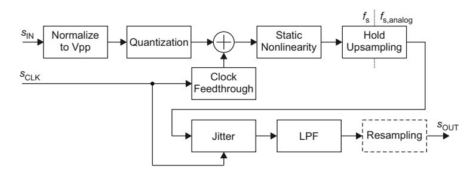
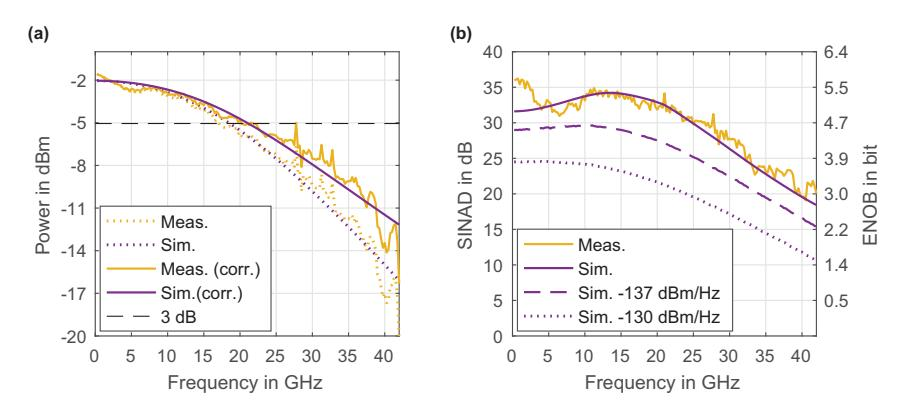
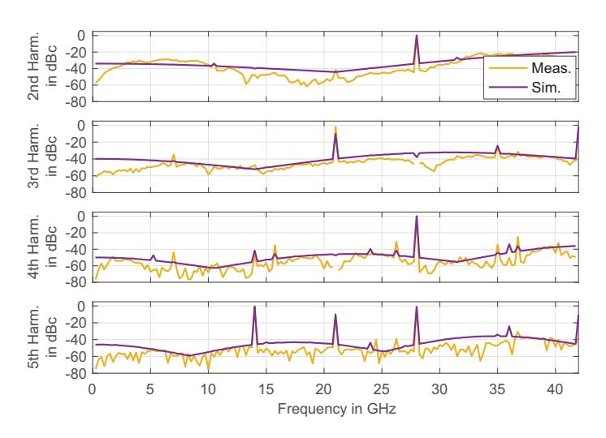
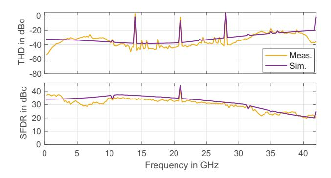
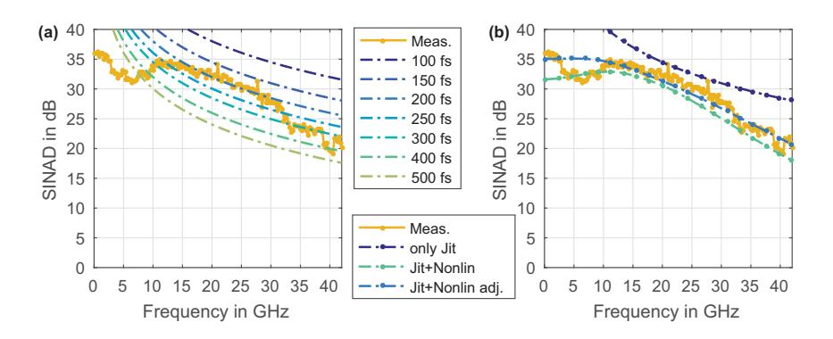

A behavioral DAC model is required to study both the FI-DAC's and the AMUX-DAC's performance. The model should have a limited number of parameters that sufficiently depict the major characteristics of a high-speed DAC.

From a system-level perspective, a simple DAC model consists of quantization and low-pass filtering. However, such a simple model does not account for a frequency dependent ENOB. Therefore, nonlinear distortions are implemented alongside with jitter resulting from clock phase noise.

A well-fitting model depicts the actual circuit design, i.e., by simulating the individual current sources [\[127,](#page-221-0) [325](#page-237-0)[–327\]](#page-237-1). However, information on the actual DAC design is required, which is usually not available for commercial DACs. Therefore, a generic approach is taken by implementing a two-box model [\[328\]](#page-237-2), which consists of a static nonlinearity and a LPF, i.e., a Hammerstein model [\[329\]](#page-237-3). It is further extended by quantization, clock feedthrough, hold upsampling, and jitter.

This appendix is structured as follows. First, the model is introduced and explained by means of a block diagram. Second, the model is fitted to measurement data from a current high-speed DAC. Finally, the implementation of jitter and phase noise is outlined.

## **Block Diagram**

The block diagram of the behavioral DAC model is depicted in Fig. [A.1.](#page-245-0) The digital input signal *s*IN is normalized to the peak-to-peak output amplitude of the DAC *V*pp and quantized with a resolution of 2*b* according to *b* bits. Furthermore, the attenuated clock signal *s*CLK is added to the signal to account for clock feedthrough.

Then, a static nonlinear transfer function is applied. In [\[330\]](#page-237-4), the nonlinear distortions are implemented as deviations from the ideal quantization curve by using random distributions for both DNL and INL. However, this does not provide one of the typical nonlinear transfer function shapes, i.e., bow-shape, s-shape, etc. [\[140\]](#page-222-0). In [\[325\]](#page-237-0), a bow-shape nonlinearity is analytically derived for the code-dependent output impedance.

For this model, a generic shape is desired that can be fitted to various DACs. A nonlinear polynomial is utilized, whose coefficients up to the fifth order are obtained

Figure A.1 Behavioral DAC model block diagram.

by first, measuring the harmonics' power levels for a sine input and second, solving the equation system presented in Appendix B.

Thereafter, the actual D/A conversion is performed by hold upsampling with an integer factor, i.e., the digital samples are duplicated according to the factor  $\left\lceil \frac{f_{s,analog}}{f_s} \right\rceil$ , whereby  $f_s$ ,  $f_{s,analog}$ , and  $\lceil \cdot \rceil$  denote the sampling rates of the DAC, the sampling rate of the analog simulation and the ceiling operator, respectively.

Then, timing jitter is applied to the signal. Hereby, only timing jitter common to all current sources is modeled [127] rather than individual jitter contributions from each current source, as described in Sec. 2.5. Common jitter is applied by shifting each analog sample according to the actual phase deviation of the sine clock signal. This operation is performed in the frequency domain by means of a linear phase [331]. More information on the jitter implementation is provided in the section after the next section.

An LPF accounts for the frequency-dependent DAC output signal. The frequency response can be estimated, e.g., by means of a sine wave frequency sweep [332].

Eventually, the output signal  $s_{\rm OUT}$  is optionally resampled, if the ratio of the analog simulation's sampling rate  $f_{\rm s,analog}$  and the DAC sampling rate  $f_{\rm s}$  is not integer-valued.

## Model Fitting

The behavioral model is fitted with measurement data for a 28 nm Socionext CMOS DAC on an evaluation board [28, 29], which has been used for the FI-DAC experiments. The DAC has a nominal vertical resolution of 8 bit.

The reference measurement data is obtained with a SINAD measurement at 84 GS/s, which comprises a full spectrum capture for each test vector. Each test vector is a sine wave with a different frequency, which is chosen according to the regulations

Figure A.2 Behavioral DAC model fitting: frequency response (a); SINAD and ENOB (b).

stated in the IEEE Standard for Terminology and Test Methods for DAC Devices [\[332\]](#page-237-6). The SINAD is defined according the definition in this standard [\[332\]](#page-237-6) as the ratio of the RMS amplitude of the DAC filtered reconstructed output sine wave to the RMS amplitude of the output noise and distortion. The model blocks are fitted in the following order: LPF, clock-feedthrough, and static nonlinearity.

The DAC LPF's frequency response is obtained from the test frequencies' power and is approximated with a 2nd order Bessel LPF with a cutoff frequency of 21 GHz. A standard filter type is chosen to enable a variation of both the cutoff frequency and the filter order in the simulations. The fitting for the magnitude response is depicted in Fig. [A.2\(](#page-246-0)a) for the cases with and without sinc correction. The measured frequency response has more ripple than the Bessel filter's frequency response and a dip at around 5 GHz. Overall, a profound frequency response fitting is achieved, which worsens for frequencies > 25 GHz.

From the SINAD measurement data, the power of the fed through clock is calculated to be −37 dBm.

The nonlinear harmonics' power levels in dBc are calculated for each test frequency. The harmonics' power varies with frequency; hence, a mean value is chosen for each harmonic for the calculation of the nonlinear polynomial to achieve a well-fitted SINAD. The harmonics' power levels are given as [34, 40, 50, 46] dBc for the 2nd to the 5th harmonic. The resulting polynomial coefficients are given in ascending order by [0.00, 1.00, 0.06, −0.96, 1.62, 20.53], whereby the first coefficient denotes the DC offset.

In Fig. [A.2\(](#page-246-0)b), both the SINAD measurement and the simulation results are depicted. On the right axis, the corresponding ENOB values are displayed. The SINAD has its maximum value of about 36 dB close to DC and decreases to about 20 dB at

Figure A.3 Behavioral DAC model fitting: power levels of harmonics.

the highest frequency. The simulation data matches the measurement results well, except for some greater deviations between DC and 3 GHz. The dips in the intervals from 2 to 10 GHz and 32 to 40 GHz may result from the internal time-interleaved architecture of the DAC.

In Secs. [5.10.4](#page-179-0) and [5.11,](#page-185-0) noise loading is applied at the receiver to match the experimental and the simulation results. In order to evaluate the implications on the DAC performance, the SINAD is depicted in Fig. [A.2\(](#page-246-0)b) with noise loading according to a PSD of −137 and −130 dBm/Hz, respectively. Due to the noise loading, the SINAD is decreased; furthermore, the increase in SINAD for frequencies between 5 and 20 GHz is depressed. An ideal amplifier was used before the noise loading, which has the same gain value as the amplifier in the first signal path in the simulations in Secs. [5.10.4](#page-179-0) and [5.11.2.](#page-186-0)

In Fig. [A.3,](#page-247-0) the harmonics' power levels are depicted. Since, only harmonics up to the 5th order are modeled, the harmonics' power in dBc is overestimated compared to the measurement to achieve a well fitted SINAD. Nonetheless, the spikes resulting from mixing with the fed through clock and from aliasing, match the measurement data very well.

In Fig. [A.4,](#page-248-0) the THD and the SFDR are depicted. As for the harmonics, they do not fit the measurement data perfectly. However, the spikes match very well as before. Furthermore, a symmetrical appearance is observed with stronger degradations at both low and high frequencies. This may be attributed to the internal timeinterleaved architecture of the DAC.

Figure A.4 Behavioral DAC model fitting: THD and SFDR.

For the measurements in this thesis, the DAC is operated single-ended. By using the differential output signal, i.e., with a balun, the output signal's quality can possibly be improved due to the canceling of even order harmonics and clock feedthrough.

Concluding, the derived model depicts sufficiently the SINAD characteristic of the measured reference data. The fitting can be further improved by using the exact frequency response rather than a standard filter's response. In order to enhance the fitting quality even further, more complex models such as memory polynomial, Volterra series, or neural networks can be utilized [\[328,](#page-237-2) [333\]](#page-238-0).

## **Jitter and Phase Noise**

The previous SINAD fitting was based on a LPF, a static nonlinearity, and clock feedthrough. Phase noise of the DAC clock was not considered, although the behavioral DAC model supports it as depicted in Fig. [A.1.](#page-245-0) In this section, the model fitting is performed again to include phase noise of the DAC clock. The phase noise spectrum relates to a certain RMS jitter according to [\(2.10\)](#page-50-0). The behavioral model is adapted to a DAC, which has an integrated PLL, whereby its parameters are not known; hence, it is regarded as a black box.

In Fig. [A.5\(](#page-249-0)a), the measured SINAD values are depicted alongside with SINAD curves for different RMS jitter values according to [\(2.11\)](#page-50-1). By assuming that the measured SINAD values between 10 and 30 GHz are mainly determined by the RMS jitter, the RMS jitter is estimated to equal 200 fs. However, since nonlinear distortions and clock feedthrough are also included in the model, the DAC clock RMS jitter is assumed less with 150 fs.

The phase noise spectrum's profile for the DAC clock signal is obtained from the data sheet of the frequency synthesizer Agilent E8257D [\[257\]](#page-231-0). Its magnitude is

Figure A.5 Behavioral DAC model fitting: jitter fitting for measured SINAD values: theoretical SINAD curves for different RMS jitter levels (a), behavioral DAC model results (b).

shifted in the logarithmic domain to obtain the RMS jitter value of 150 fs. The time domain phase noise samples are generated by filtering white Gaussian noise in the frequency domain with the phase noise spectrum profile and an additional IFFT. The corresponding RMS jitter is calculated by integrating the phase noise spectrum in the interval 100 Hz to 300 MHz according to (2.10). The lower cutoff frequency is further limited by the spectral resolution of the digital signal. The upper frequency is related to the DAC PLL loop filter cutoff frequency. In the experiments, the DAC clock frequency is obtained by dividing the frequency synthesizer's output signal by 16. The DAC PLL is assumed to have a maximum input frequency of 3 GHz and a PLL loop filter cutoff frequency of  $0.1 \cdot 3 \, \text{GHz} = 300 \, \text{MHz}$ . Therefore, the phase noise spectrum is further filtered with a rectangular frequency domain filter to account for the PLL loop filter's bandwidth. Information on more complex modeling of oscillator and PLL phase noise can be found in [334–337].

In the experiment, the frequency synthesizer and the DACs operate with a PLL each; thus, the random number generators for the DAC clock phase noise spectrum and the LO phase noise spectrum are initialized with different seeds in the simulations.

In Fig. A.5(b), the simulated SINAD values with the behavioral DAC model are depicted next to the measured SINAD values. If only jitter limitations are active, the simulated SINAD values match the theoretical values for an RMS jitter of 150 fs depicted in Fig. A.5(a). If the LPF, the static nonlinear transfer function and the clock feedthrough are active as well, the curve is below the measured SINAD values. In order to improve the fitting, the static nonlinear characteristic's influence is reduced by setting the harmonics' power levels to [39, 45, 55, 51]dBc for the 2nd to the 5th harmonic. The resulting SINAD values provide a better fit.