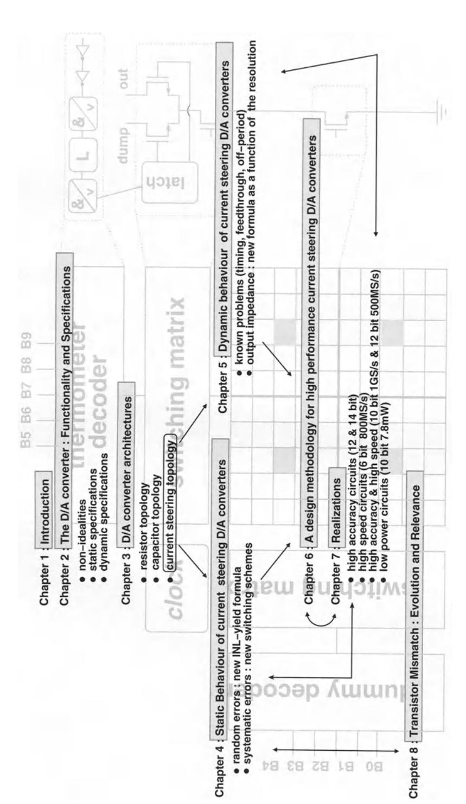

## **Chapter 1**

## **Introduction**

## **1.1 Introduction**

During the last decade, the telecommunication market and especially the mobile telecommunication systems have known an unprecedented growth. New services are constantly being introduced since the evolution towards smaller technologies makes it possible to integrate millions of transistors on a single chip. The digital designers create new DSP (Digital Signal Processing) architectures that allow complex algorithms to be implemented at very high computational speeds. In parallel, analog designers have been putting an enormous effort in developing high speed, low distortion blocks that in combination with the digital building blocks will result in the high performance telecommunication systems of tomorrow. However, this implies that the design of the interface circuit between the analog and digital part of the system -the *D/A* converter and the AID converter- is becoming more challenging in time. Besides a highly accurate circuit also a high operation speed achieved at a low power consumption are demanded. The combination of these constraints poses a real challenge for the designers of these circuits. Furthermore, additional problems -like the substrate noise coupling from the digital to the analog part on the chip and the scaling of the power supply voltage- add to the complexity of the design.

The presented work will focus on the design and implementation of high performance *D/A* converters and especially the current steering topology which offers at the moment the best result when realising the aforementioned constraints of speed, accuracy and power consumption in CMOS technologies. Since the static behaviour of a current steering architecture strongly depends on the mismatch behaviour of the transistors used to implement the current sources, this work will also address this issue in some more detail.

2 **Introduction** 

## **1.2 Outline of the Research Work**

Fig.l.l gives a schematic overview of this manuscript. First, chapter 2 will introduce the main set of specifications that are needed to fully describe the performance of a *DI* A converter. In the past, most publications only described the static behaviour of the presented *DI* A converter, while the telecommunication engineers of today also need information on the frequency domain behaviour of the circuit in order to accurately determine its impact on the whole system they are developing. Therefore, the second chapter of this work starts with a description of the basic functionality of an ideal *DI* A converter and the limitations this imposes on its attainable performance. Then, the different specifications that are commonly used (INL, DNL, ... ) to describe the static performance of a *D/A* converter, are discussed in more detail. The remainder of this chapter gives an overview of the dynamic specifications (SFDR, ... ).

Chapter 3 gives an overview of the different topologies existing today to implement a *D/A* converter. The basic functionality of this circuit is to generate for each digital input code a multiple of a certain reference quantity. Dependent on this quantity (a voltage, a charge or a current), three classes of *D/A* converters can be identified namely the resistor, the capacitor and the current steering architecture. In the first part of this chapter, both the resistor and the capacitor *DI* A converter will be discussed. It is the intention of the author to emphasise the existence of these architectures as useful alternatives for the current steering architecture. For a detailed study the reader is referred to [Razavi, Johns]. The remainder of this chapter describes the current steering topology. This topology will be analysed throughout this work.

The current steering topology is at the moment the preferred architecture for telecommunication applications requiring a high accuracy. In the fourth chapter, the emphasis will be put on the different factors that influence the static performance of this topology. This performance is mainly determined by the matching behaviour of the current source transistors. Since no two transistors behave exactly the same due to technological variations introduced during processing, it is important to know the impact of this phenomenon on the yield and the performance. This topic will be discussed in the first part of this chapter. Apart from the process variations which generate random errors, the current sources in the array are also influenced by systematic errors that are introduced by thermal, electrical and process gradients which will be discussed in detail in the second part of this chapter.

Chapter 5 will focus on the dynamic performance of the current steering *DI* A converter. The first part of this chapter will identify and discuss some design guidelines that will solve the generally known problems such as the imperfect synchronisation of the switch control signals, the digital signal feedthrough through the gate-drain capacitance of the switch transistors and the drain voltage variation of the current source transistor. The remainder of this chapter will focus on a fourth factor with a major impact on the frequency domain behaviour of the *DI* A converter, namely the dynamic output impedance. A formula will be derived for the spurious free dynamic range as a function of this impedance, providing the designer with the necessary information to design a high speed Nyquist *D/A* converter. For high resolution circuits, this implies the use of cascoded current cell structures as is discussed in the last part of this chapter.

The next chapter covers the design flow of a current steering topology. After discussing the approach to determine the segmentation level (number of binary and unary bits), the considerations that have to be made in choosing the thermometer decoder and the switch driver will be discussed. The remainder of this chapter describes the dimensioning of the transistors of the unit current cell (the switch, current source and cascode transistor).

In chapter 7, several implemented *DI* A converters will be discussed ranging from a high accuracy circuit (12 bits and 14 bits) to a high speed circuit (10 bits IGSample/s) and to a combination of both (12 bits 500 MSamples/s). Also the design of a 10 bit low power *DI* A converter for telecommunication applications will be addressed. The last section of this chapter gives an overview of the most important static and dynamic specifications of the realised *DI* A converters and of the state-of-the-art published devices. In order to make a comparison possible, a figure of merit will be introduced that is based on the resolution, the dynamic behaviour and the power consumption.

It is easy to understand that the design of high performance analog circuits such as *DI* A and *AID* converters, reference sources, ... requires the availability of reliable transistor mismatch models. Designers have to be able to rely on accurate simulation tools if they want to be successful in the realisation of a circuit with a performance that lies closely to the limits of the given technology. However, the accuracy of such simulation tools is determined by the underlying models. At this moment, the analog designer has to introduce large safety margins to guarantee the required performance of the circuit leading however to an unnecessary power consumption and an operation speed reduction [Kinge CICC96]. In literature, several models have been presented that describe the mismatch characteristics of the transistor by providing the designer with the standard deviation of the mismatch in a set of electrical parameters (like the threshold voltage *VT,* the current factor (3, the mobility degradation parameter (), the bulk threshold parameter *y).* In the first part of chapter 8, an overview of these models will be given starting with the basic models presented by Lakshmikumar and Pelgrom [Laksh JSSC86, Pelgr JSSC89]. However, going to deep submicron technologies, these models have to be adapted as to explain the transistor mismatch of short and narrow devices. The extraction of the transistor mismatch parameters for a 0.5 and a 0.4 *pm* standard CMOS technology and the transistor mismatch depen4 **Introduction** 

dency on the used topology (wafer, quad or hexagonal structure) and its immediate surroundings (metal coverage, ... ) will be discussed.

For the VLSI manufacturer, it is important to be able to provide his customers with the necessary quantitative data of the matching quality of his technology. This can be achieved by the use of dedicated test circuits that are especially designed for this purpose (low parasitics, high measurement accuracy, ... ). Furthermore, it is necessary to follow the evolution of the matching performance of the technology over different runs in time. This requires a test circuit that gives a good indication of the matching technology for a low cost. However, these circuits are of no further use to the manufacturer or the designer and therefore an alternative structure has been sought for. A high performance current steering *D/A* converter is highly dependent on the matching quality of the technology. Furthermore, the evaluation of the *DI* A converter's performance poses no problem since there exist standardised test procedures. In the last part of chapter 8, the *D/A* converter's performance will be directly translated in the transistor mismatch characteristics of the used technology.

Finally, the last chapter of this work gives a summary of the main results that have been achieved in this work and some recommendations are formulated towards future research.

Figure 1.1: Outline of the presented work