# **Chapter 2**

# **The** *DI* **A Converter: Functionality and Specifications**

# **2.1 Introduction**

Although the digital world is gaining in importance due to the decreasing feature size of transistors in the rapidly evolving semiconductor technology, the analog building blocks have proven to be indispensable. The advantages of digital processing (easier design, extensive programmability, ... ) are counteracted by the fact that people perceive information in an analog form (f.i. speech). The design of the interface between the analog and the digital system (the *AID* and the *D/A* converter) has to comply with the stringent specifications required by modern complex digital systems. Furthermore, additional problems -like the substrate noise coupling from the digital to the analog parts on the chip- add to the complexity of the design.

Where a few years ago, most papers only described the static behaviour of the *DI* A converter, the telecommunication engineers nowadays also need information on the frequency domain performance of these devices. The specifications describing both the static and the dynamic behaviour of a *DI* A converter will be discussed in this chapter.

# **2.2 The Basic** *DI* **A Converter Function**

### **2.2.1 Analog and Digital Signals**

Fig.2.1 gives a general schematic representation of the telecommunication systems that are used nowadays. All the signals in the our surrounding world have an analog

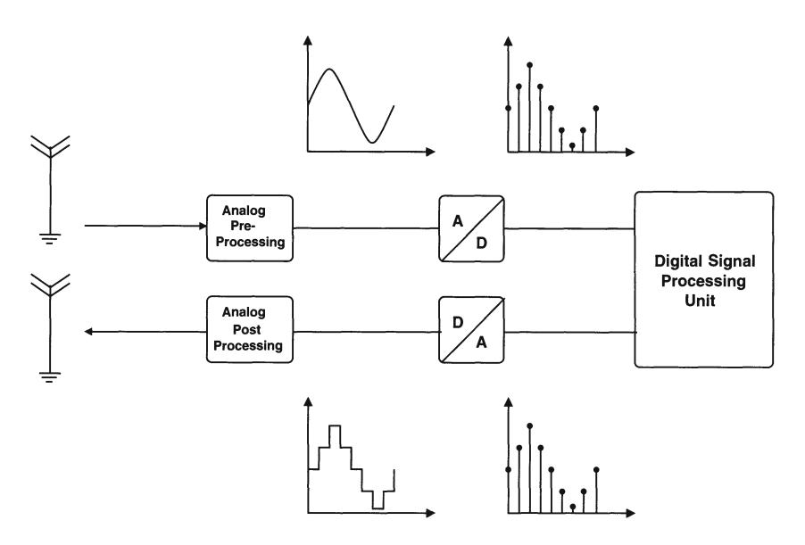

Figure 2.1: *The general schematic of a telecommunication system* 

nature (like f.i. speech), which means that those signals have a continuous amplitude varying in time. However, in order to perform the required signal operations mostly digital algorithms are used since digital signal processing systems are relatively easy to design and are highly flexible due to their programmable software. Furthermore, they are capable of realising quite complex data manipulation algorithms and incorporate a high computing power on a small area. Digital signals can have only two values, namely, a high state ("1") and a low state ("0") and are only allowed to vary according to a specified clock. These signals are therefore discrete in time and amplitude. To transform an analog signal into a digital signal and vice versa, *ND* and D/A converters are used.

However, since a N-bit digital signal can only have *2N* values, the amount of information at any given moment in time is limited and depends on the resolution (N) of the D/A converter. To illustrate this principle, fig.2.2 is given. Describing an analog signal at a given update rate with an one bit accuracy, only allows a coarse approximation as is indicated in fig.2.2.a. To improve the quality of the reconstructed analog signal, the resolution and/or the update rate of the D/A converter have to be increased (fig.2.2.b/c/d). It should be noted that a lower bound for the update rate is imposed by the Nyquist-Shannon theorem. This theorem states that the update rate of the D/ A converter has to be larger than or equal to two times the highest frequency component of the signal in order to avoid aliasing and thus be able to fully reconstruct the signal. Although one can conclude from this discussion that a high accuracy D/A with a high update rate will give the best results, these devices will increase the cost

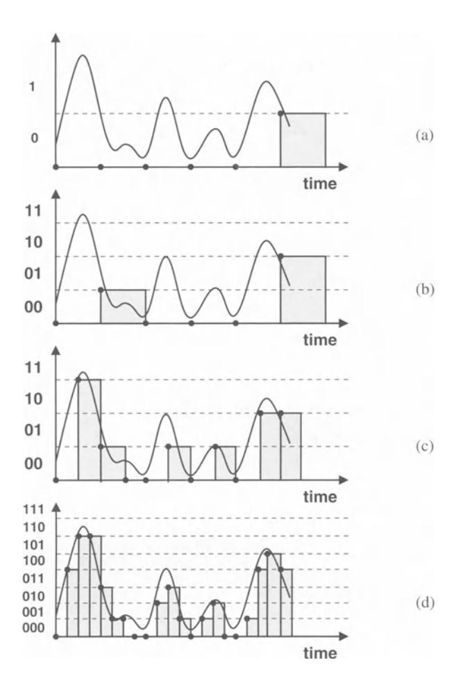

Figure 2.2: *Influence of the resolution and the update rate on the digital representation of an analog signal* 

of the overall system. Therefore, the actual requirements of the *Df* A converter always depend on the application and the signals that need to be processed.

### 2.2.2 The *DI* A Converter as a Black Box

The input of the *Df* A converter is a N bit digital sequence that can be described by the following binary vector:

$$\bar{B} = (b_0 \ b_1 \ b_2 \cdots \ b_{N-1}) \qquad b_i \in \{0, 1\}$$
 (2.1)

where *bo* is the least significant bit (LSB) and *bN-l* is the most significant bit (MSB). The decimal number corresponding to this binary vector is equal to :

$$B = \sum_{i=0}^{N-1} 2^i b_i \tag{2.2}$$

The *D/A* converter's output signal can either be a charge, a voltage or a current and can be expressed as :

$$Y_{out}(B) = \sum_{i=0}^{N-1} 2^{i} b_{i} * Y_{ref} = B * Y_{ref}$$
 (2.3)

where *Yre!* denotes the unity (=LSB) charge, voltage or current depending on the *D/A*  converter's architecture.

# **2.3 The Characteristics of an Ideal** *DI* **A Converter**

# **2.3.1 Introduction**

The function of an ideal *DI* A converter is the reconstruction of an analog waveform using sequences of digital words at the input. However, since these digital input words have a finite length and are updated at discrete time intervals, the output of the *D/A*  converter has a shape similar to the one of a sample-and-hold circuit. The discrete nature of the *D/A* converter's waveform reconstruction process imposes quantifiable limitations on the accuracy with which even an ideal *DI* A converter can generate an analog waveform. These limitations will be discussed in more detail in this paragraph.

### **2.3.2 The Quantisation Error**

By representing an analog signal with a finite number of bits, an error is introduced between the analog value and its digital representation. This error -which is called the quantisation error- inherently limits the maximum achievable dynamic range of the *DI* A converter. To better understand its impact on the dynamic behaviour of this device a short derivation is given [Razavi, VdPlassche, Stehr]. Fig.2.3 clearly shows that the quantisation process introduces an irreversible error since a signal with an amplitude *Yj* + *E:* will be quantised into the level *Yj.* This procedure introduces a random error that can be considered to be equivalent to white noise in the frequency domain.

**In** this derivation *E:* denotes the quantisation error and ~ denotes the quantisation step (fig.2.3). Furthermore, it has been assumed that *E:* is :

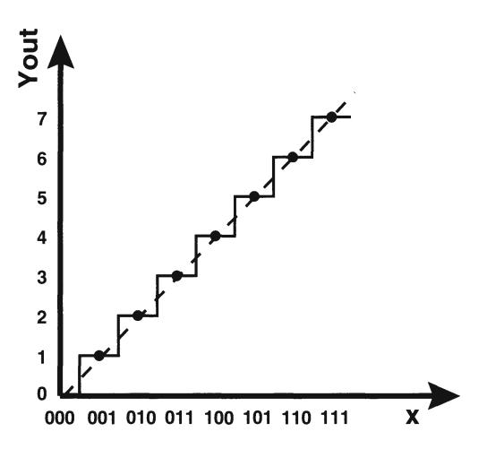

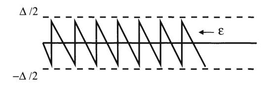

Figure 2.3: The quantisation error of a D/A converter

- a random variable that is uniformly distributed in the interval  $[-\Delta/2, \Delta/2]$
- independent of the analog signal.

In this case, the quantisation noise power can be expressed as the mean square value of  $\varepsilon$ :

$$P_{noise} = E(\varepsilon^2) = \frac{1}{\Delta} \int_{-\Delta/2}^{\Delta/2} \varepsilon^2 d\varepsilon = \frac{\Delta^2}{12}$$
 (2.4)

For a D/A converter with a high resolution ( $N \ge 5$ ), the peak-to-peak value of a sinusoidal output signal can be approximated by :

$$V_{ptp} = 2^N * \Delta \tag{2.5}$$

The total signal power is then equal to:

$$P_{signal} = \frac{V_{ptp}^2}{8} = \frac{2^{2N} \Delta^2}{8} \tag{2.6}$$

The signal-to-noise ratio can be calculated using eq.(2.4) and eq.(2.6):

$$SNR = \frac{P_{signal}}{P_{noise}} = \frac{3}{2} * 2^{2N}$$
 (2.7)

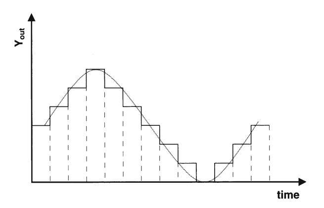

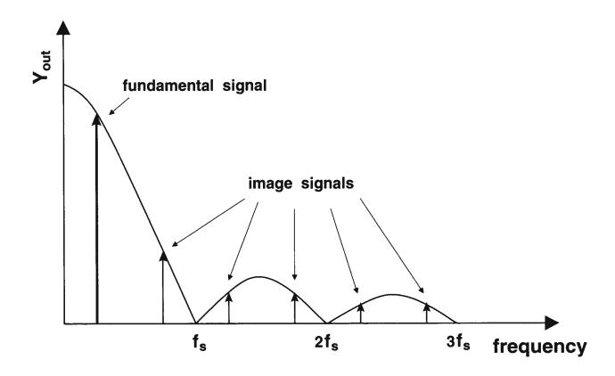

Figure 2.4: *The amplitude reduction error of an ideal DIA converter (fs is the sampling frequency)* 

or expressed in decibels:

$$SNR = 6.02N + 1.76dB (2.8)$$

This equation is often used to compare the performance of a given *DI* A converter with that of an ideal *D/A* converter. From eq.(2.8) it can be concluded that the influence of the quantisation error on the signal-to-noise ratio decreases when the resolution of the *DI* A converter increases.

## **2.3.3 The Sample and Hold like Amplitude Distortion**

During signal reconstruction, the *D/A* converter acts as a sample-and-hold circuit (fig.2.4). The analog output signal remains constant during the sampling time *ts.* **In**  the time domain the output is thus represented as a series of modulated rectangular pulses, while in the frequency domain the spectrum of the output is distorted by the sin(x)lx response (in which zeros appear at multiples of the sampling frequency). The frequency response of the output is given by :

$$|H(2\pi f_{in})| \sim \frac{\sin(\pi f_{in}/f_s)}{\pi f_{in}/f_s} \tag{2.9}$$

When sampling at the Nyquist rate, the input frequency *fin* equals half the sampling frequency *fs* leading to an amplitude reduction of *21](* or 3.92 dB.

As a conclusion it can be stated that the sin(x)lx frequency response acts as a low pass filter that modifies the amplitude of the fundamental signal. In some applications, this amplitude distortion has to be corrected by the use of an inverse sin(x)/x filter or an equalizer. Furthermore, the reconstruction of the sampled signal typically requires the elimination of the image frequencies. For narrow-band signals *(fin* « *f s)* the sin(x)/x filter can already introduce a significant suppression of these unwanted signals. Otherwise, an explicit analog reconstruction filter is needed after the *D/A* converter.

# 2.4 The Performance Specifications of a *DI* A Converter

### 2.4.1 Introduction

In order to be able to compare different *DI* A converter architectures, a number of performance measures have been introduced. Each of these measures highlights a different aspect of the *DI* A converter. Their importance has to be determined according to the *D/A* converter's intended use. High accuracy *D/A* converters that are used for instrumentation purposes should have a low integral non-linearity, differential non-linearity and offset error while *D/A* converters used for waveform reconstruction applications (f.i. telecommunication) should have an excellent dynamic performance (low total harmonic distortion, ... ).

In literature different definitions for these specifications can be found. In this paragraph an overview of the most important static and dynamic measures are given based on [Hendriks, VdPlassche, Stehr, Razavi].

# 2.4.2 The Static Specifications

#### 2.4.2.1 Introduction

The static specifications described in this paragraph give an idea of the *DI* A converter's distortion performance at low frequencies. It are these specifications that ultimately

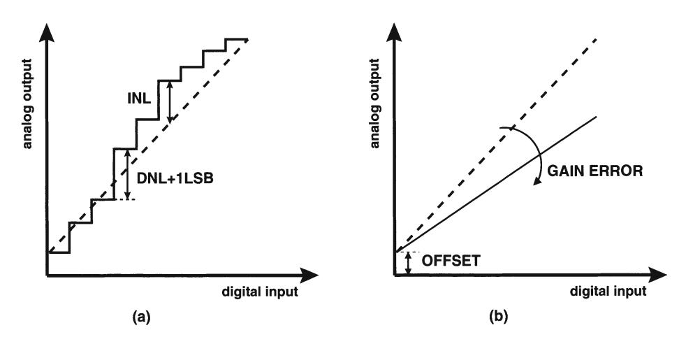

Figure 2.5: The static specifications of a D/A converter

impose the performance limit of the D/A converter. The most important static measures are the integral and differential non-linearity error.

#### 2.4.2.2 The Offset Error and the Gain Error

The offset error is defined as the constant DC offset of the D/A converter transfer characteristic while the gain error is defined as the deviation of the slope of the measured D/A converter in comparison with its ideal characteristic (fig.2.5.b). Since these errors do not introduce any non-linearities, no effect is seen on the frequency domain characteristics.

#### 2.4.2.3 The Differential Non-Linearity Error (DNL)

The differential non-linearity error is the worst case deviation between the actual and the ideal step size (= 1 LSB) between two adjacent codes. It can be described as:

$$DNL = max(Y_{out}(B) - Y_{out}(B-1) - 1LSB)$$
 (2.10)

Fig.2.5.a gives a graphical representation of the DNL error.

#### 2.4.2.4 The Integral Non-Linearity Error (INL)

The integral non-linearity error (INL) is defined as the maximum deviation of the measured D/A converter transfer characteristic from the ideal output curve (fig.2.5.a). This ideal curve is a straight line that is determined by the D/A converter's measured

zero and full-scale output. This implies that nor the gain error nor the offset error has an impact on the INL value. This curve is described by :

$$Y_{out,id}(B) = Y_{out}(0) + \frac{Y_{out}(2^N - 1) - Y_{out}(0)}{2^N - 1} * B$$
 (2.11)

Using eq.(2.11), the INL can be expressed by :

$$INL = max(Y_{out}(B) - Y_{out,id}(B))$$
(2.12)

Using this definition for the ideal output curve implies a compensation of the offset and the gain errors since a zero output for *Yout(O)* excludes a potential offset error and the boundary condition for the maximal output eliminates the gain error. In practice the definition of the ideal output curve as the "best fit" through the Of A converter's measured code transitions is frequently used.

Both INL and ONL errors are measured in terms of LSB's and can have either positive or negative values. Although these measures give a good indication of the static behaviour of the Of A converter, in some cases they also provide the designer with some general information on the frequency domain behaviour of the converter. The shape of the INL characteristic gives an indication of the distortion component that will limit the Of A converter's dynamic performance. Fig.2.6.a shows the output spectrum for a Of A converter where the dynamic behaviour is determined by quantisation noise. The impact of the INL characteristic is illustrated in fig.2.6.b and fig.2.6.c. It is shown that a bow like INL characteristic gives rise to a spurious free dynamic range (defined in the section regarding dynamic specifications) that is determined by a second order harmonic (for a low frequency signal at a low update rate). This already indicates the maximum achievable limit for the SFOR since for high frequency signals andfor high update rates other factors like timing errors gain in importance and will further deteriorate the dynamic performance. It should however be clear that two Of A converters with the same INL error can have totally different distortion components since in both cases the INL characteristic can be completely different.

#### 2.4.2.5 Monotonicity

A *DfA* converter is monotone when its output never decreases with an increasing digital input code. This implies that a minimum increase of zero is allowed when the input signal of the *DfA* converter increases with only one LSB. It can be proven for a binary *DfA* converter that it is always monotonic when the integral non-linearity error is less than or equal to 112 LSB [V dPlassche].

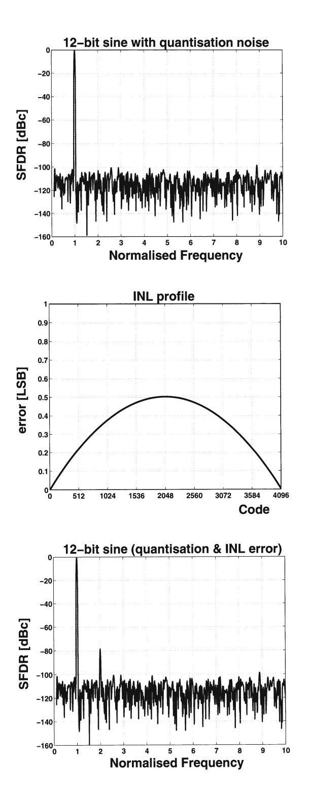

Figure 2.6: The INL characteristic related to the dynamic performance of the D/A converter

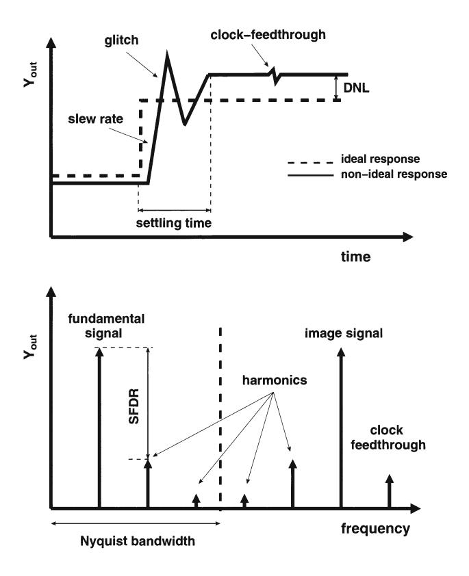

Figure 2.7: The dynamic specifications of a D/A converter

# 2.4.3 The Dynamic Specifications

#### 2.4.3.1 Introduction

The influence of the dynamic non-linearities on the distortion performance of the D/A converter can be described by using measures in both the time and the frequency domain. Although the time domain specifications were frequently used in the past, the frequency domain specifications gain in importance.

The main purpose of D/A converters used in telecommunication systems is the reconstruction of waveforms from digital data. It is important that as a result of this conversion no new signal components are created that alter the information content of the original signal. In the remainder of this paragraph, the most important time and frequency domain specifications will be discussed in more detail.

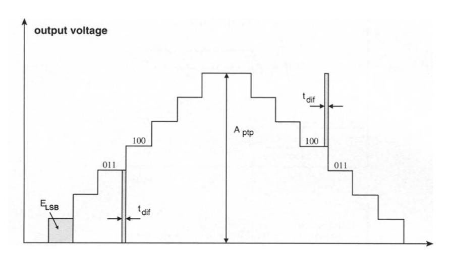

Figure 2.8: *The glitch energy error* 

#### 2.4.3.2 The Update Rate

The update rate is the rate at which the output is sampled. It therefore determines the maximal output signal frequency (which equals half of the update rate according to the Nyquist theorem).

### 2.4.3.3 The Settling Time

In general, the settling time of a *D/A* converter is defined as the time required for the output to experience a full scale transition and to settle within a specified error band around its final value.

However, also in the code-to-code transition response a settling time can be defined (fig.2. 7). If this settling time is dependent on the applied code, it will affect the *DI* A converter's frequency domain behaviour.

#### 2.4.3.4 The Glitch Energy

The glitch impulse gives an idea of the error generated by the earliest part of the transient response when the *D/A* converter switches between two consecutive output codes (fig.2.7). The glitch energy is defined as the area under this transient response. This error is mainly caused by timing errors within the *DI* A converter and results in a deterioration of the dynamic performance.

A qualitative description of the glitch energy for a binary *D/A* converter is given

here under the following assumptions [VdPlassche]:

- the largest glitch impulse occurs at the MSB transition
- the glitch impulse has a square shape (worst case calculation)
- the timing error is represented by  $t_{dif}$
- the peak-to-peak amplitude of the D/A converter is given by  $A_{ptp}$

The glitch energy error can then be expressed as (fig.2.8):

$$E_{glitch} = t_{dif} * \frac{A_{ptp}}{2} \tag{2.13}$$

The energy of one LSB equals:

$$E_{LSB} = 2^{-N+1} * t_{sample} * \frac{A_{ptp}}{2}$$
 (2.14)

To have a D/A converter with a good dynamic performance, the following ratio has to be minimised:

$$\frac{E_{glitch}}{E_{LSB}} = \frac{t_{dif}}{2^{-N+1} * t_{sample}} \tag{2.15}$$

The glitch energy can be reduced by placing a "deglitcher" circuit at the output of the D/A converter. However, since such highly accurate linear circuits are difficult to design, it is simpler to minimise the timing error  $t_{dif}$  by the use of well-placed synchronisation blocks.

#### **2.4.3.5** The Slew Rate

The slew rate is defined as the maximal rate at which the output of the D/A converter can change with the varying input (fig.2.7).

$$SR = \frac{dV_{out}}{dt} = \frac{dV_{out}}{dq} * \frac{dq}{dt} = \frac{I}{C_{out}}$$
 (2.16)

It should be noted that the slew rate can be different for the charging (SR+) or the discharging (SR-) of the output capacitance depending on the architecture of the D/A converter. If the output slewing has code dependent rise and fall times, it is also a contributor to distortion.

### 2.4.3.6 The Clock-Feedthrough

Due to parasitic capacitive coupling, the effect of the switching of the clock can be directly seen at the output of the *Df* A converter (fig.2.7). This clock feedthrough does not introduce any additional noise or distortion in the Nyquist baseband zone since it is not code dependent and manifests itself in the frequency domain as a component at the sampling frequency. This component can be easily removed by the use of a low pass filter at the output of the *Df* A converter.

Other feedthrough components that arise from coupling between the digital and the analog part of the *Df* A converter usually tend to increase the overall noise floor unless this feedthrough is directly related with the input codes.

#### 2.4.3.7 The Signal to Noise Ratio (SNR)

The signal to noise ratio (SNR) is defined as the ratio of the power of the fundamental signal to the integrated noise power. Although this specification is rarely quoted on the *DfA* converter's data sheets, it is an important frequency domain specification. A lower limit of this specification is dictated by the quantisation noise. The quantisation contribution has already been calculated in paragraph 2.3.2.

$$SNR = 6.02N + 1.76dB (2.17)$$

#### 2.4.3.8 The Signal to Noise and Distortion Ratio (SNDR)

The signal to noise and distortion ratio (SNDR) is defined as the ratio of the power of the fundamental signal to the sum of the integrated noise power and the power in all distortion components.

#### 2.4.3.9 The Spurious Free Dynamic Range (SFDR)

The spurious free dynamic range (SFDR) specification is defined as the ratio between the fundamental signal and the largest distortion component within a specified frequency band (fig.2.7). This distortion component does not necessarily has to be a harmonic of the fundamental signal nor does the frequency band has to be equal to the *DfA* converter's Nyquist baseband zone.

$$SFDR = \frac{P_{signal}}{P_{largest-dist}} \tag{2.18}$$

In some applications it is sufficient to have an idea on the SFDR specification within a certain frequency interval as any larger out-of-band spurs will be filtered out

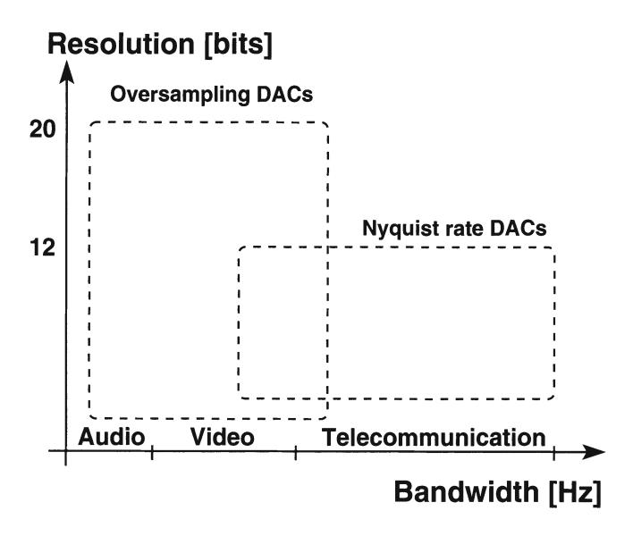

Figure 2.9: *The different DIA converter types as a function of speed and resolution [Wikner]* 

in the next stage. In any case, it is imperative that the SFDR specification is always given together with the information concerning the measured frequency window. Furthermore, it should be noted that the SFDR is not a constant for a given *D/A* converter as the INL specification is. It depends on the operating conditions, the update rate, the digital sine wave and on the measurements (differential or single ended output). Therefore, in order to characterise the dynamic performance of a *DI* A converter, the SFDR should be given as a function of the update rate (for a number of fixed fullscale sinusoidal output signals) and as a function of the signal frequency (for different values of the update rate).

#### 2.4.3.10 The Total Harmonic Distortion (THD)

The total harmonic distortion is defined as the ratio of sum of the power of the harmonic components to the power of the fundamental signal (eq.2.19). This specification is usually expressed in decibels and gives a more complete picture of the *DI* A converter's distortion performance than the SFDR.

$$THD = \frac{P_{H2+H3+H4+...}}{P_{signal}}$$
 (2.19)

Since in most cases the worst distortion component is harmonically related and contains more than 80 % of the total harmonic energy, the total harmonic distortion is rarely plotted over frequency since its value is only 1-3 dB higher than the SFDR value. However, plotting the three most significant harmonic distortion components as a function of the frequency can be helpful in gaining more insight in the *D/A* converter's spectral performance.

# **2.5 The** *DI* **A converter specifications as a function of the application**

Based on a literature study, a schematic overview of the required specifications in terms of resolution and bandwidth is given as a function of the application area (audio, video or telecommunication applications) in fig.2.9. This study has been done by [Wikner]. From this figure, it can be concluded that current steering Nyquist *D/A*  converters are highly suited for high speed applications.

# **2.6 Conclusions**

**In** this chapter the basic functionality and the characteristics of an ideal *DI* A converter have been described. To make a comparison between different *DI* A converters possible, a set of performance measures have been introduced that describe the static and the dynamic behaviour of these devices.