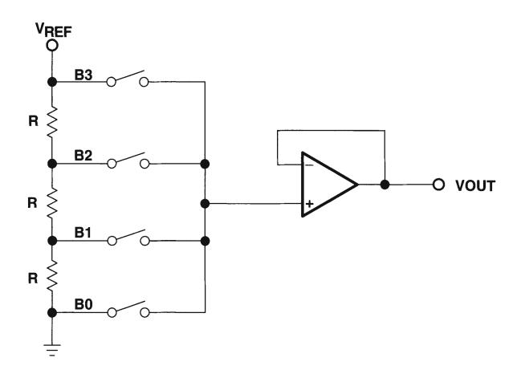
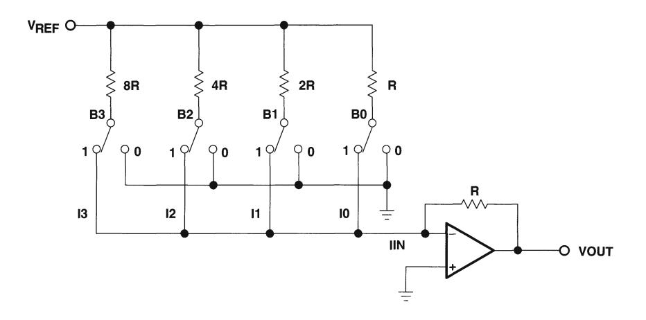
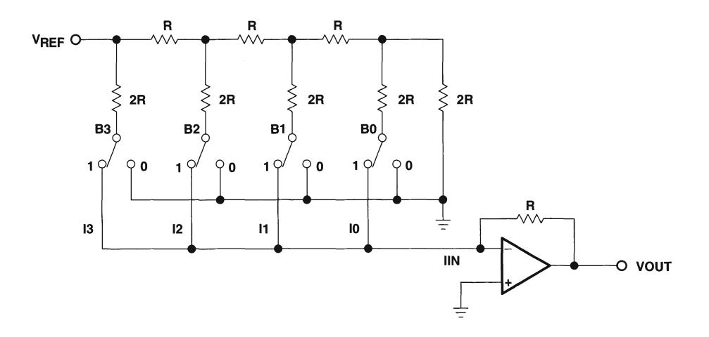
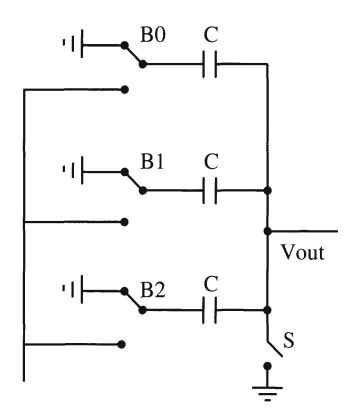
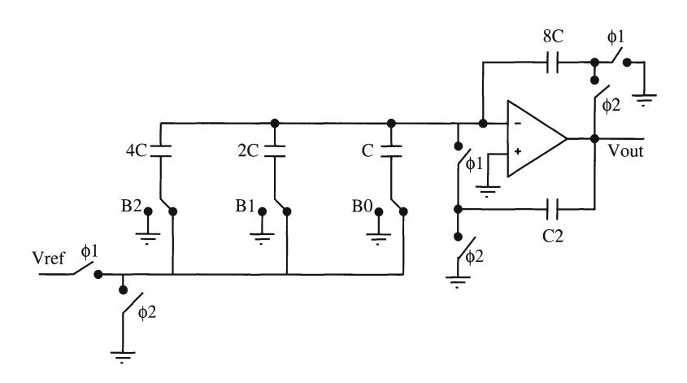
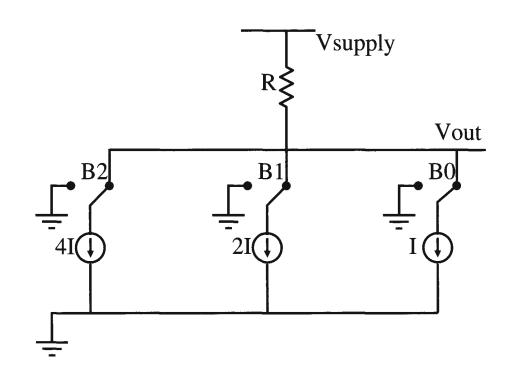
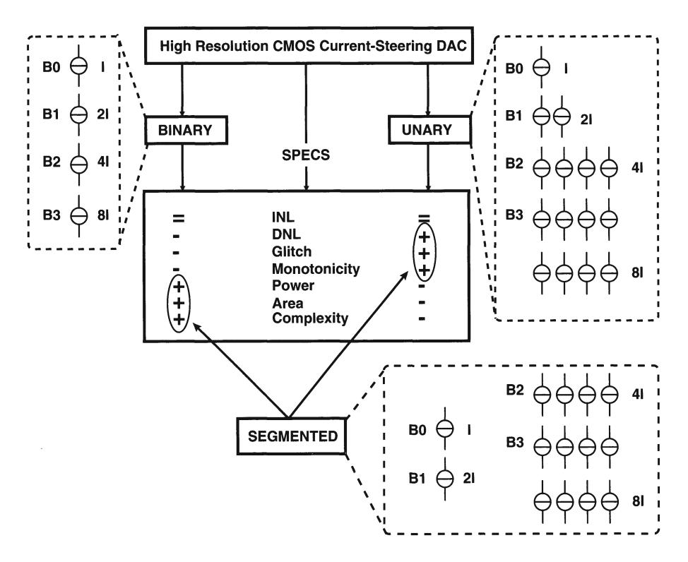

# **Chapter 3**

# **CMOS** *D/A* **Converter Architectures**

## **3.1 Introduction**

**In** the previous chapter, the functionality of a *DI* A converter has been explained together with the specifications that describe its static and dynamic behaviour. This chapter discusses the different architectures for a *D/A* converter.

A *DI* A converter generates for each digital input code a mUltiple of a certain reference quantity. Dependent on this quantity (a voltage, a charge or a current), three classes of *D/A* converters can be identified namely the resistor, the capacitor and the current steering architecture. **In** the first part of this chapter, both the resistor and the capacitor *DI* A converter will be discussed. It is the intention of the author to emphasise the existence of these architectures as useful alternatives for the current steering architecture. For a detailed study the reader is referred to [Razavi, Johns]. The remainder of this chapter describes the current steering topology. Three possible implementations together with their advantages and disadvantages will be discussed in detail. During the remainder of this thesis, this architecture will be analysed with regard to its static and dynamic performance.

# **3.2 The Resistor** *DI* **A Converter**

#### **3.2.1 The resistor string** *D/A* **converter**

**In** this type of *D/A* converter, a reference voltage is divided into *2N* - 1 parts by selecting one tap of a segmented resistor string using a switching network (fig.3.1). Although this implementation provides a simple and inherently monotonic *D/A* conversion, it has some major drawbacks. For resolutions higher than eight bits, the

Figure 3.1: The resistor string architecture

occupied silicon area becomes fairly large. For a ten bit D/A converter, 1023 resistors and 1024 switches are required. Furthermore, the delay through the switching network poses a severe limitation on the update rate of the D/A converter.

The integral non linearity error is directly related to the matching precision of the used resistors. Due to uncertainties during processing, the values of the resistors in the resistor string will not be equal. The relative mismatch between two resistors is given by:

$$\frac{\Delta R}{R} = \frac{\Delta \rho}{\rho} + \frac{\Delta L}{L} - \frac{\Delta W}{W} - \frac{\Delta t}{t} + \frac{\Delta R_C}{R}$$
 (3.1)

with  $R_C$  the contact resistance, L the length, W the width, t the thickness and  $\rho$  the resistivity of the resistor. The width, length and value of the resistor can be freely chosen by the designer as to minimise the mismatch. However, larger dimensions need more silicon area and create a higher capacitance to the substrate.

The influence of this mismatch on the integral non-linearity error of the resistor string D/A converter is given by [Razavi]:

$$INL = \frac{V_{ref}}{\sqrt{4N}} \frac{\Delta R}{R} \tag{3.2}$$

which is reached at the middle of the resistor string. Since this formula is a standard deviation, it has to be interpreted as follows. In 68 % of the cases, the non-linearity error will be smaller than or equal to the value calculated in eq.(3.2).

For high speed, high accuracy applications, this architecture is no longer the preferred solution.

Figure 3.2: *The binary weighted resistor DIA converter* 

#### 3.2.2 The binary weighted resistor *DI* A converter

This type of converter is very similar to the resistor string structure. Each resistor in the string is given a value proportional to the binary value of the bit it represents (fig.3.2). The currents generated from each active bit are then summed to obtain the required output. The number of resistors and switches is now reduced to one per bit, but the range of the resistors is extremely wide for high resolution *D/A* converters. Furthermore, it is important to note that the feedback resistor R is implemented on chip. As a result, it experiences the same thermal drift as the resistor ladder and has no significant influence on the accuracy of the *DI* A converter. Besides the large resistor values for high resolution implementations, this architecture has no guaranteed monotonicity and is susceptible to glitches.

#### 3.2.3 The R-2R based *D/A* converters

The large resistor values of the binary architecture can be reduced by using series resistors. This results in the very frequently used R-2R *D/A* converter (fig.3.3). Although the number of resistors has doubled in comparison to the binary structure, only a single size resistor is necessary since the 2R is realised by a series combination of two resistors with a value of R. The major advantages of this structure are its smaller area and higher accuracy. However, the resistors often exhibit a non linear behaviour. Furthermore, a time delay between the processing of the different bits adds to the generation of glitches and distortion components.

Figure 3.3: The R-2R D/A converter

## 3.3 The Capacitor D/A Converter

A simple architecture for the capacitor D/A converter is given in fig.3.4. The bottom plates of the capacitors switch from the ground to the reference voltage according to the digital input. If all the capacitors have the same value, a thermometer decoded input is necessary. Similar to the resistor string D/A converter, a binary structure can be implemented by adjusting the capacitor values. An example of a 3 bit charge redistribution D/A converter is given in fig.3.5.

One of the causes that influences the non linearity error of a capacitor D/A converter is the random mismatch caused by processing inaccuracies. This mismatch can be expressed as:

$$\frac{\Delta C}{C} = \frac{\Delta W}{W} + \frac{\Delta L}{L} - \frac{\Delta t_{ox}}{t_{ox}}$$
 (3.3)

with W the width, L the length and  $t_{ox}$  the oxide thickness of the capacitors. The designer can minimise the mismatch by carefully choosing the dimensions of the capacitor. Besides the random errors, the non linearity error of the D/A converter is also determined by the voltage dependence of the capacitance modelled by

$$C = C_0 + C_0 \alpha_1 V + C_0 \alpha_2 V^2 + \dots$$
 (3.4)

with  $\alpha_j$  the jth order voltage coefficient of the capacitor, and the non-linearity of the junction capacitance of the switches connected to the output expressed as

$$C_{junction} = \frac{C_0}{(1 + V_j/\phi)^{m_j}} \tag{3.5}$$

Figure 3.4: The capacitor D/A converter

Figure 3.5: A 3 bit charge redistribution D/A converter

where  $C_0$  is the zero bias capacitance,  $V_j$  is the voltage across the junction,  $\phi$  is the built-in potential and  $m_j$  has a value that is typically between 0.3 and 0.5.

In recent years, this architecture has not been frequently used for telecommunication applications. However, [Fergu CICC00, Khano AACD01] presented two 10 bit D/A converters that possess a high linearity. Overcoming the problem of their non linear behaviour and the need for implementing a special driver for the D/A converter load, this architecture lends itself for low power applications.

Figure 3.6: The binary current steering D/A converter

Figure 3.7: The advantages/disadvantages of the unary, binary and segmented current steering D/A converter architecture

# **3.4 The Current-Steering** *DI* **A Converter**

### **3.4.1 Introduction**

In the current steering architecture (fig.3.6), the reference quantity is given by a current. Also here different implementations are possible as will be discussed in the following paragraphs. This architecture has the advantage of combining a small silicon area with a high update rate. The resolution of the D/ A converter is determined by the matching behaviour of the current sources. This issue is analysed in the next chapter.

#### **3.4.2 The Binary Implementation**

In the binary implementation, every switch switches a current to the output that is twice as large as that of the next less significant bit. The digital input code directly controls these switches. The advantages of this architecture are its simplicity (since no decoding logic is necessary) and the small required silicon area. However, this structure does not always exhibit a monotone behaviour and suffers from a large DNL and dynamic error. At the half scale transition, 2N- 1 unit sources are switched on/off and *2N- 1* - 1 other independent sources are switched off/on. Assuming a normal distribution for the unit current sources with a standard deviation *a (I),* this step has a *a(ll I)* determined by:

$$\sigma^{2}(\Delta I) = (2^{N} - 1)\sigma^{2}(I)$$

$$\Rightarrow \sigma(\Delta I) = \sqrt{2^{N} - 1} \frac{\sigma(I)}{I} LSB$$
(3.6)

This sigma, *a(ll I),* is a good approximation for the DNL error.

#### **3.4.3 The Unary Implementation**

In the unary decoded architecture every unit current source is addressed separately. The digital input code is converted to a thermometer code that controls the switches (table 3.1). The advantages of this architecture are its good DNL error and the small dynamic switching errors. Furthermore, the D/A converter has a guaranteed monotone behaviour since only one additional current source has to be switched to the output for one extra LSB. The major disadvantages of the unary decoded architecture are the complexity, the area and the power consumption of the thermometer decoder. Performing similar calculations as in eq(3.6) for the unary architecture leads to the following result:

$$\sigma(\Delta I) = \frac{\sigma(I)}{I} LSB \tag{3.7}$$

| Decimal | Binary |    |    | Thermometer Code |    |    |    |    |    |    |
|---------|--------|----|----|------------------|----|----|----|----|----|----|
|         | bl     | b2 | b3 | dl               | d2 | d3 | d4 | ds | d6 | d7 |
| 0       | 0      | 0  | 0  | 0                | 0  | 0  | 0  | 0  | 0  | 0  |
| 1       | 0      | 0  | 1  | 0                | 0  | 0  | 0  | 0  | 0  | 1  |
| 2       | 0      | 1  | 0  | 0                | 0  | 0  | 0  | 0  | 1  | 1  |
| 3       | 0      | 1  | 1  | 0                | 0  | 0  | 0  | 1  | 1  | 1  |
| 4       | 1      | 0  | 0  | 0                | 0  | 0  | 1  | 1  | 1  | 1  |
| 5       | 1      | 0  | 1  | 0                | 0  | 1  | 1  | 1  | 1  | 1  |
| 6       | 1      | 1  | 0  | 0                | 1  | 1  | 1  | 1  | 1  | 1  |
| 7       | 1      | 1  | 1  | 1                | 1  | 1  | 1  | 1  | 1  | 1  |

Table 3.1: *The decimal, binary and thermometer code* 

This formula mathematically represents the idea behind the unary decoding. The error between two consecutive codes is just the deviation on the additional unity current source. The DNL error was defined as the maximum deviation at a single LSB transition. For an N bit converter, this means that the DNL error is determined by the maximum when taking *2N* - 1 samples from a normal distribution with the sigma defined in eq.(3.7).

## 3.4.4 The Segmented Implementation

To get the best of both worlds, most current-steering *Df* A converters are implemented using a segmented architecture. In this case, the *DfA* converter is divided into two sub-DfA converters: the B LSBs (least significant bits) are implemented using a binary architecture while the (N-B) MSBs (most significant bits) are implemented in a unary way. In this architecture, a balance between good static and dynamic specifications versus a reasonable decoder power, area and complexity can be found. This is illustrated in fig.3.7. Since the segmented architecture is a mixture of the previous two architectures, the result for the most critical transition is of the same form.

$$\sigma(\Delta I) = \sqrt{2^{B+1} - 1} \frac{\sigma(I)}{I} LSB \tag{3.8}$$

Note that the formula in eq.(3.8) for the segmented architecture is a general formula that is valid for the binary (B=N-l) and the unary implementation (B=O).

# 3.5 Conclusions

In this chapter, an overview has been given of the different *DfA* converter architectures. In the remainder of this work, the current steering topology has been studied. **3.5 Conclusions 31** 

The advantages and disadvantages of the unary, binary and segmented architecture have been analysed as to optimise the *D/A* converter's performance.