## **Chapter 4**

# **Static Behaviour of Current Steering** *DI* **A converters**

### **4.1 Introduction**

As has been discussed in the previous chapter, the current steering topology is currently the preferred architecture for telecommunication applications requiring a high update rate and/or a high accuracy. Designing such a *DI* A converter requires a thorough understanding of both the static and the dynamic behaviour of this device.

In this chapter, the emphasis will be put on the static performance of the current steering *DI* A converter. This performance is determined by the matching behaviour of the current source transistors. Since no two transistors behave exactly the same due to technological variations introduced during processing, it is important to know the impact of this phenomenon on the yield and the performance of the circuit. This topic will be discussed in the first part of this chapter. Apart from the process variations which generate random errors, the current sources in the array are also influenced by systematic errors that are introduced by thermal, electrical and process gradients. The second part of this chapter discusses the errors generated by these gradients and will go into more detail on how to solve this problem.

### **4.2 Modelling of the random errors**

### **4.2.1 Introduction**

Due to the mismatch of the current source transistors, the INL performance of different *D/A* converters made in the same process technology will vary randomly. It is therefore important to be able to predict this performance within certain boundaries. For this purpose, the concept of the *DfA* converter's INL\_yield will be introduced. This yield figure is defined as the percentage of functional *DfA* converters with an INL performance smaller than the specification of half a LSB (least significant bit).

In this section, several analytical expressions for the INL\_yield found in open literature will be discussed and evaluated. Also a new model will be derived that is easy to use and gives the designer an accurate indication on the required matching behaviour of the current sources as a function of the resolution of the *Df* A converter. All the models - including the new one- start from the assumption that the unit current source errors have a Gaussian nature.

### 4.2.2 Lakshmikumar Approach

A first suggestion to analytically determine the yield of a *DfA* converter as a function of the matching parameters of the current source transistors was made in [Laksh JSSC86]:

$$INL\_yield = \prod_{i=2}^{2^{N}-1} erf(\frac{Q_i}{\sqrt{2}})$$
 (4.1)

with

- N = the number of bits,
- *Zi* = the mean normalised output at code i,
- *a* }l) = the unit current relative standard deviation.

However, this formula is based on the assumption that there exists no correlation between the outputs of a current-steering *DfA* converter. The INLyield can then be obtained by multiplying the probabilities that each output has an error smaller than half an LSB. To demonstrate that this assumption is not correct the following example is given. The outputs corresponding with the digital input word 01100 and 01101 are strongly correlated since they are both implemented using the same current sources.

Using eq.(4.1) to estimate the yield will impose too severe constraints in terms of matching accuracy on the current sources leading to an oversizing of these transistors. In [Laksh JSSC88], an adjustment of this model was presented. Here the MSB (most significant bit) transition is considered to be the most critical one since in a binary implementation this transition has the largest probability of generating an output error.

Furthermore, the *DfA* converter's outputs before and after the MSB transition are not correlated. The yield can then be described as :

$$INL\_yield = \prod_{i=2^{N-1}-1}^{2^{N-1}} erf(\frac{Q_i}{\sqrt{2}})$$
 (4.2)

with

- N = the number of bits,
- Z; = the mean normalised output at code i,
- °Y) = the unit current relative standard deviation.

FigA.l shows a comparison between the Monte Carlo simulations and the formulas derived in this section. The yield estimation given in eq.( 4.2) is too optimistic since the influence of only two outputs is taken into account while the errors generated by the other outputs are being ignored.

Comparing the two approaches, one can conclude that designing a chip using the first approach can lead to a large but nearly fault-free *Df* A converter while using the second approach results in a compact but low yield circuit. The correct yield estimation is situated somewhere in between these two results.

### **4.2.3 Monte Carlo Approach**

To obtain an accurate estimation of the INLyield, the Monte Carlo simulation has been considered to be the best alternative [Conro JSSC88]. A lot of recent publications refer to this method to do their accuracy analysis. The following procedure can be used. Each of the (2 *N* - 1) current sources has a random value that has been derived from a Gaussian distribution with a mean value *I LSB* and a standard deviation (J (I). For every digital code the output current of the *Df* A converter is calculated and compared to the ideal value. If the difference is larger than half an LSB - even for only one digital code - the *DfA* converter is regarded as not functional and is rejected. For every (J(I) this procedure is repeated a large number of times (> 100) to obtain reliable results. The INLyield is then given by the ratio of the number of functional *DfA* converters (I *N L* < *1/2LSB)* to the total number of try- outs. In this way the relation between the unit current standard deviation and the INLyield is determined. However, to obtain the results depicted in figA.l, a large amount of CPU time is necessary. Running a Monte Carlo simulation for a high resolution *DfA* converter takes several hours which is a major drawback.

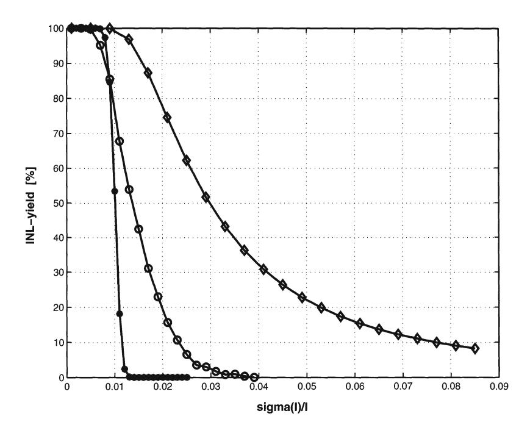

Figure 4.1: Monte Carlo simulations ( $\circ$ ) of the INL\_yield compared to the results of the formulas in eq.4.1 ( $\bullet$ ) and eq.4.2 ( $\diamond$ ) for a 10 bit D/A converter

### 4.2.4 A new INL\_yield Formula

#### 4.2.4.1 Introduction

The models presented in the previous section either lack accuracy but are fast or are accurate but very time consuming. The model that will be derived in this section is both accurate and fast. The INL\_yield calculated with this formula shows a good agreement with the Monte Carlo simulations and can be thousands of times faster for high resolutions (table 4.1).

#### **4.2.4.2** Theory

The idea will be elaborated for an arbitrary number of bits N. For the simplicity of notation the following symbols are defined:

Definition 1: X(j) is the sum of j non-correlated unity current sources Definition 2: Y(j) is the difference between X(j) and the sum of the ideal current sources

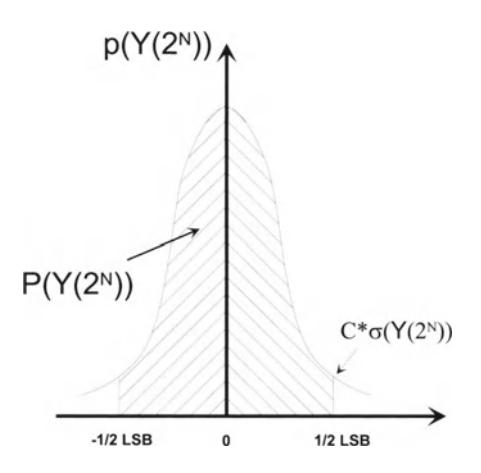

Figure 4.2: *The shaded area determines the probability p(Y(2N)* < *0.5LSB)* 

Every current source has a normal distribution with a mean value *Imean* and a standard deviation *a* (I).This implies that both XG) and YG) also have a normal distribution with the following properties eq.(4.3):

$$X_{mean}(j) = j * I_{mean} Y_{mean}(j) = 0$$
  
$$\sigma(X(j)) = \sqrt{(j)} * \sigma(I) \sigma(Y(j)) = \sigma(X(j)) (4.3)$$

The exact possibility that an INL error will occur is based on the fact that each current source generates an error and is given by the following sum of probabilities:

$$P(INL\_error) =$$

$$P(|Y(1)| \ge 0.5\&|Y(2)| < 0.5\& \cdots \&|Y(2^N - 1)| < 0.5) +$$

$$P(|Y(2)| \ge 0.5\& \cdots \&|Y(2^N - 1)| < 0.5) + \cdots +$$

$$P(|Y(2^N)| \ge 0.5)$$

$$(4.4)$$

However, this equation is not transparant and therefore not suitable for practical use. The basic idea behind the new theory is based on the fact that if at any point IY(})I reaches half an LSB, there exists a 50% chance that the error increases and 50% chance that it decreases again since a normal distribution with mean value zero is used. Extending this line of thought, one can say that if an INL error occurs - when passing through all the possible codes generated by the (2 *N* - 1) digital input words there is a 50% chance that this error still exists for the (fictive) code *2N.* This idea can be expressed as:

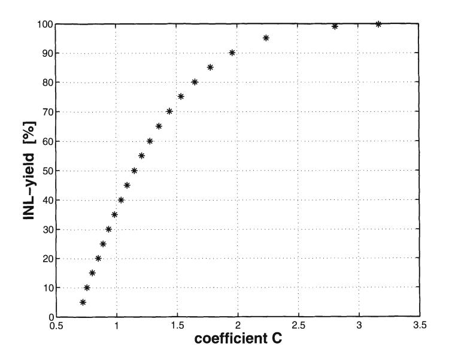

Figure 4.3: INL\_yield as a function of the coefficient C

$$P(|Y(2^N)| \ge 0.5) = \frac{P(\exists j \in [1..(2^N - 1)] : |Y(j)| \ge 0.5])}{2}$$
(4.5)

At this point the INL\_yield of the D/A converter can be integrated in the calculation since there exists an obvious relation between the yield and the possibility of an INL error to occur:

$$INL\_yield = 1 - P(\exists j \in [1..(2^N - 1)] : |Y(j)| \ge 0.5])$$
 (4.6)

Combining eq.(4.5) and eq.(4.6):

$$P(|Y(2^N)| \ge 0.5) = \frac{1 - INL\_yield}{2}$$
 (4.7)

From eq.(4.7), the possibility that no INL error occurs at code  $2^N$  can be easily derived and equals:

$$P(|Y(2^N)| < 0.5) = 0.5 + \frac{INL\_yield}{2}$$
 (4.8)

At this point, the  $INL_yield$  is no longer described as a sum of probabilities (eq.(4.4))

but as the possibility that a sample from a normal distribution is smaller than half an LSB. This requirement can be written as:

$$\int_{-1/2LSB}^{1/2LSB} p(Y(2^N)) dY(2^N) = \int_{-C*\sigma}^{C*\sigma} p(Y(2^N)) dY(2^N) = 0.5 + \frac{INL\_yield}{2}$$
 (4.9)

with  $p(Y(2^N))$  the probability density function (fig.4.2). Eq.(4.9) directly gives the following result:

$$C * \sigma(Y(2^N)) \le \frac{1}{2} LSB \tag{4.10}$$

with:

$$C = inv\_norm_{(-x,x)}(0.5 + \frac{INL\_yield}{2})$$

The  $inv\_norm_{(-x,x)}$  is the inverse function of the normal cumulative function integrated from -x to x. In appendix 1, a table is given determining the value of C as a function of either the INL\_yield or as a function of the value of  $(0.5 + \frac{INL\_yield}{2})$ . It should be further noted that if the normal cumulative function integrates from minus infinity to x the expression for C slightly alters and is given by:

$$C = inv\_norm_{(-\infty,x)}(0.75 + \frac{INL\_yield}{4})$$

Since  $Y(2^N)$  has a normal distribution with a standard deviation  $\sqrt{2^N}\sigma(I)$  (eq.(4.3)), the relation existing between the INL\_yield of the current steering D/A converter and the matching properties of the current source transistors can be deduced from eq.(4.10).

$$\frac{\sigma(I)}{I} = \frac{1}{2\sqrt{2^N}C} \tag{4.11}$$

Fig.4.3 shows the INL\_yield of the D/A converter as a function of the coefficient C. In fig.4.4 the INL\_yield of a 10-bit D/A converter calculated using the new formula in eq.(4.11) and simulated using the Monte Carlo approach are depicted. From this figure, it can be concluded that the formula is in good agreement with the Monte Carlo simulations.

To gain more insight in eq.(4.11), the unit current standard deviation is plotted in logarithmic scale versus the resolution of the D/A converter (fig.4.5). As can be seen from this figure, the relationship is characterised by straight lines since

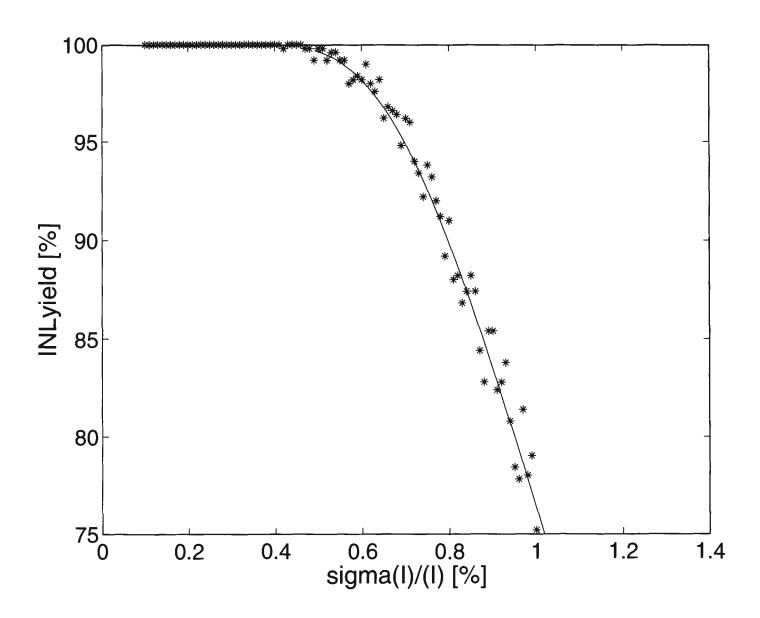

Figure 4.4: *Comparison between the Monte-Carlo simulations and the new formula for a JO-bit DIA converter* 

$$\log(\frac{\sigma(I)}{I}) = A * N + B \tag{4.12}$$

with

$$A = -\frac{\log 2}{2}$$
$$B = -\log 2 - \log C$$

One can easily conclude from fig.4.5 that for the design of a high accuracy current steering CMOS *D/A* converter the matching parameters playa significant role. A small deviation of the required a(I)/I can lead to severe yield degradation.

The time to create a figure like fig.4.5 using Monte Carlo simulations in MATLAB is given in table 4.1, where the results for an INL\_yield from 100% to 10% for a current steering *D/A* converter with different resolutions can be found. For all the simulations twenty values for the relative unit current standard deviation were taken. This can be understood as follows. In a first coarse approximation, a simulation using 10 values for a(I)/I -that span a wide range- is run. From the obtained result, the interval for the a(I)/I that obtain a high INL\_yield can be specified. In this interval another 10 points are simulated. Creating fig.4.5 using the new formula takes only a few minutes. The time to write the short MATLAB program is so to speak the most time consuming. It is also worth noting that the time necessary to calculate the INL\_ yield is independent

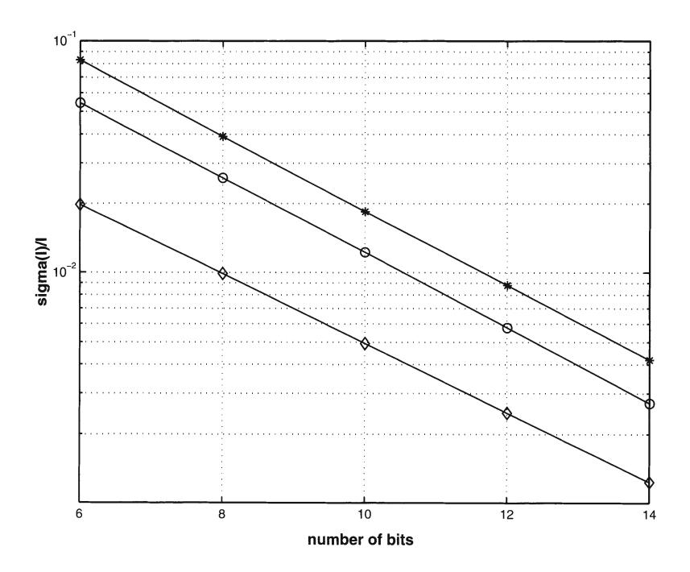

Figure 4.5: *The unit current relative standard deviation as afunction of the resolution of the DIA converter for a yield of99.7%* (0), *of50%* (0) *and of* 10% (\*)

| resolution | Monte Carlo  | formula |
|------------|--------------|---------|
| 8 bit      | 0.13 hours   | seconds |
| 10 bit     | 0.69 hours   | seconds |
| 12 bit     | 5.31 hours   | seconds |
| 14 bit     | 108.57 hours | seconds |

Table 4.1: *Comparison between the CPU time consumption of the Monte Carlo simulations and the new formula* 

on the resolution of the *DI* A converter while the time consumption of the Monte Carlo simulations "explodes" with an increasing *D/A* converter's accuracy.

### 4.2.5 Conclusion

In this section, the impact of random errors caused by the matching behaviour of the current source transistors on the yield of the *DI* A converter has been discussed. A new formula has been derived that provides a clear insight on this issue in a fast and

accurate way. In chapter 6, that discusses the design flow for a current steering *Df* A converter, the usefulness of this formula will become clear during the dimensioning of the current source transistors. It will allow to determine the area of the unit current source transistor in such a way as to optimise the static performance of the *D/A*  converter and to minimise its silicon area consumption.

### 4.3 Modelling of the systematic errors

### 4.3.1 Possible causes

Apart from the random errors, the static performance of the *D/A* converter is determined by the following systematic errors:

- Although the transistor mismatch effect of the current sources has already been taken into account during the sizing of these transistors, it can still have a negative influence on the static performance of the *DI* A converter due to the "edge effect" [Wong ICMTS95] which states that the mismatch behaviour of a transistor is dependent upon its surroundings. To avoid this error, the current source array has to be expanded by inserting dummy rows and columns as to provide identical surroundings for all the active current source transistors.
- The voltage drop along the ground line will slightly change the output current of the different current source transistors placed on the same row. This leads to an integral non linearity error that is given by [Miki JSSC86] :

$$E_{INL-VD} = \frac{g_m R}{f \sqrt{3}} \tag{4.13}$$

where *gm* is the derivative of the full scale current to the current source bias voltage, R is the total resistance of the ground line and f is a factor depending on the used switching scheme. If all the current sources are switched sequentially from the left to the right, the value for f equals 9. This error can be reduced by either using sufficiently wide power supply lines (reducing the resistance R) or by using a special switching scheme (increasing the factor f).

• If the resolution of the *DfA* converter increases by a single bit, the number of current sources in the current source array doubles. The area occupied by a single unity current source also doubles because of the random matching constraint. This leads to a four-times area increase for the current source array for each additional bit. For *DI* A converters with a resolution of 10 bit and higher,

the dimensions of the current source array become so large that process- and temperature gradients have to be considered. The non-linearity errors introduced by these gradients can be (partially) compensated by the introduction of a special switching scheme. How this is implemented is discussed in more detail in the next section.

### 4.3.2 Switching Schemes

#### 4.3.2.1 Introduction

If the error contributions of the current sources are totally random and uncorrelated, the INLyield of the D/ A converter dictates the minimal requirement for the matching precision of the current sources as is indicated in the previous paragraph. The random error can then be kept within the specified boundaries (l *N L* < *0.5LS B)* by adjusting the active area. This implies that in order to guarantee a good static performance, the systematic errors introduced by linear and/or symmetrical gradients have to be compensated in order to keep the random errors dominant. This is done by using optimised switching schemes for the current sources. Several switching schemes have been presented in literature [Miki JSSC86, Nakam JSSC91, Marqu ISSCC98, VdPla JSSC99, VdBos ISSCC01]. These switching schemes will be discussed in more detail in the next paragraphs. First, a short introduction on the basic principles of gradients will be given.

#### 4.3.2.2 The Gradient Error Distribution

It is generally assumed that the error distribution introduced by the gradients can be modelled by a superposition of both a linear and a quadratic component [Cong TCASII].

The linear gradient error can be expressed as :

$$\varepsilon_l(x, y) = a_l * \cos\vartheta * x + a_l * \sin\vartheta * y \tag{4.14}$$

with *iJ* E [0, 360°] is the angle of the gradient, *at* represents the slope of the gradient and (x,y) determines the position of the current source transistor. This type of gradient can be caused by f.i. a variation of the oxide thickness over the wafer or by the voltage drop along the ground line of the current source transistors [Miki JSSC86].

The quadratic gradient error can be expressed as :

$$\varepsilon_s(x, y) = a_s * (x^2 + y^2) - b_0$$

with *bo , as* being technological parameters and (x,y) the position ofthe current sources.

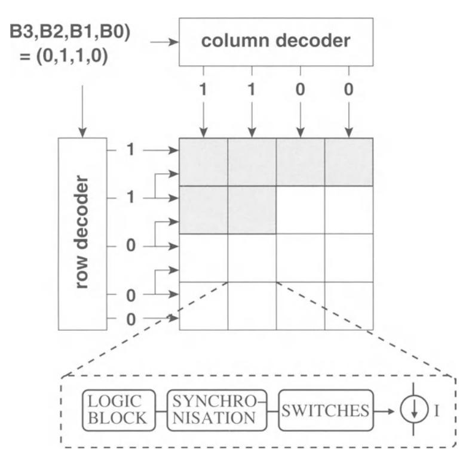

Figure 4.6: The row and column decoding principle; every cell of the matrix contains some decoding logic, a synchronisation block, a switch and the current source

This expression has been derived under the assumption that the symmetrical gradient is identical for both the x and the y dimension and that the current source array is located in the center of the die [Cong TCASII]. Examples of symmetrical gradients are f.i. the gradients introduced by temperature and by die stress [Basto TSM97].

Since the actual error distribution is a superposition of both the linear and the symmetrical gradient error, it can be expressed as:

$$\varepsilon(x, y) = \varepsilon_l(x, y) + \varepsilon_s(x, y) \tag{4.15}$$

# 4.3.2.3 The sequential, conventional and hierarchical symmetrical switching schemes

The switching schemes that will be discussed in the next two subsections are determined by the implementation of the thermometer decoder that transforms the digital input word in a decimal value. Fig.4.6 shows the schematic of a row and a column

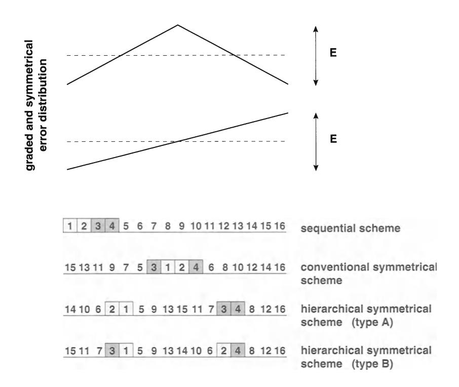

Figure 4.7: The sequential, the conventional symmetrical and the hierarchical symmetrical switching scheme

decoder [Miki JSSC86]. The working principle is based on comparing the generated row signals of two adjacent rows as follows:

- If both signals are high, the entire row of current sources is turned on.
- If both signals have different values, only the current sources that have a high column signal are turned on.

The above described principle can be implemented by using a simple digital logic block, leading to a high speed decoder circuit with a low power consumption. Three different switching schemes have been presented in [Miki JSSC86, Nakam JSSC91] using this decoder logic: the sequential, the conventional symmetrical and the hierarchical symmetrical scheme. A schematic representation of these switching sequences is given in fig.4.7.

In the sequential switching scheme, the current sources in a given row are turned on sequentially from the left to the right. The effect of this scheme on the integral non-linearity error is given in fig.4.8 and fig.4.9. As can be clearly seen from these figures,

| Switching Sequence          | Graded Error        | Symmetrical Error   |
|-----------------------------|---------------------|---------------------|
| sequential                  | E 52 "8 * 5-1 | E 52 16 * 5-2 |
| conventional symmetrical    | E 2"             | E 52 "8 * 5-2 |
| hierarchical symmetrical(A) | f*(1+5~1)           | E 2"             |
| hierarchical symmetrical(B) | E 2"             | E                   |

Table 4.2: *The INL errors of the three types of switching schemes [Nakam JSSC91 J* S *denotes the number of current sources in a row of the current source array and E denotes the peak-to-peak error in both the graded and the symmetrical error distribution* 

the sequential switching sequence causes large linearity errors due to the accumulation of both graded and symmetrical errors.

In the conventional symmetrical switching scheme, the current sources are turned on symmetrically around the center of the row. By using this scheme, the graded errors are cancelled at every two increments of the digital input (fig.4.8) but the errors generated by a symmetrical gradient will accumulate as is indicated in fig.4.9.

In the hierarchical symmetrical switching scheme, the current sources are turned on around the first and the third quarter of the current source row. Two different schemes are possible, depending on which error is cancelled first. Using switching scheme A, the symmetrical error generated by current source I is cancelled by current source 2 while the graded error caused by the current source pair (1,2) is cancelled by the current source pair (3,4). In switching scheme B, the errors caused by the linear gradient are cancelled out at current source level while the symmetrical errors are cancelled at the current source pair level. Comparing the linearity error of both switching schemes leads to the following result. In type A, the integral non-linearity error is approximately the same for both the graded and the symmetrical error distribution while in type B, the integral non-linearity error caused by the symmetrical error distribution is twice as large as the one caused by the graded error distribution (fig.4.8 and fig.4.9).

Table 4.2 gives an overview of the non-linearity errors of the three types of switching sequences where S denotes the number of current sources in a row of the current source array and E denotes the peak-to-peak error in both the graded and the symmetrical error distribution.

As a conclusion, it can be stated that if a I-dimensional row and column decoder is used, it is best to implement the hierarchical symmetrical switching scheme type A since this scheme avoids the accumulation of linear and symmetrical errors resulting in a small integral non-linearity error.

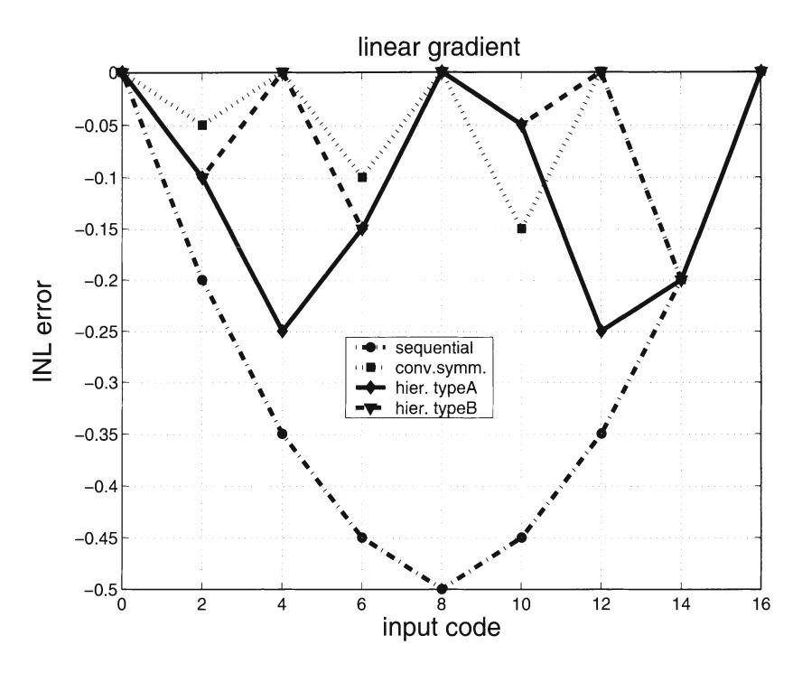

Figure 4.8: The INL error caused by a linear gradient for the sequential, the conventional symmetrical and the hierarchical symmetrical (type A and type B) switching schemes (E=0.4)

#### 4.3.2.4 Switching Schemes for the 2-D Row and Column Decoding Principle

In the previous paragraph, the errors generated by the systematic gradients are only minimised in one dimension, namely the x-dimension. It is possible to adjust the decoder as to implement a hierarchical scheme in both the x and the y-direction. Although this implementation improves the overall linearity of the D/A converter, it is still not optimal.

In [Marqu ISSCC98] a switching scheme has been presented that preserves the simple row and column decoder but further reduces the INL error. The presented D/A converter has a 6-2-4 segmented architecture where the 6 most significant bits are implemented using a row and column decoder. Instead of using only one current source, the current is generated by four current sources that are placed symmetrically around the center of the array. Each current source is controlled by a separate decoder. This implies that instead of using only one decoder, four decoders have been placed on the chip. The D/A converter is actually built up out of four sub D/A converter blocks. By implementing the conventional symmetrical switching scheme in both the x and y direction, the linear errors have been completely cancelled out due to the spatial

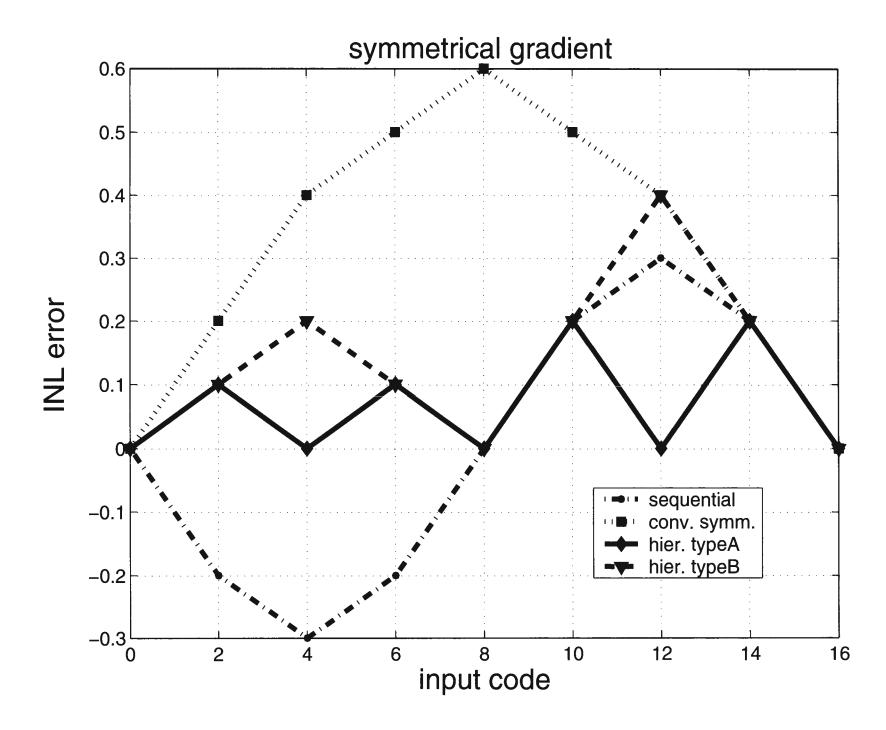

Figure 4.9: The INL error caused by a symmetrical gradient for the sequential, the conventional symmetrical and the hierarchical symmetrical (type A and type B) switching schemes (E=0.4)

symmetry while the symmetrical errors have been reduced significantly.

#### 4.3.2.5 Decoder Independent 2-D Centroid Switching Schemes

In most D/A converters implemented using a row and column decoder, the switches and the current source transistors are part of the same matrix. However, to minimise the coupling between the 'digital' switches and the 'analog' current sources and at the same time increase the flexibility of the switching schemes, two separate matrices for the current source and the switch transistors are used. In this way, the decoder does no longer determine the complexity of the switching scheme. This complexity is now dictated by the occupied silicon area for the interconnections (which can be done on top of the current source transistors), the used technology (especially the number of metal layers) and the creativity of the layout engineer.

Most current steering D/A converters have a segmented architecture implying that the unary current source in most cases equals a number of times the unit current source (= LSB current). It is therefore possible to divide this unary current source into a number of "sub"-current sources. For the 12 bit implementation [VdBos CICC98],

16 sub- current sources have been used that were switched on simultaneously around the center of each quadrant (double centroid switching scheme). In the 12 bit D/A converter described in [VdBos ISSCCOl], the current source array was divided in 16 blocks and the sub-current sources were placed symmetrically around the center of each block leading to an INL error smaller than 0.3 LSB. This switching scheme is better known as the triple centroid switching scheme. To indicate the possibilities of defining alternative switching schemes, the example of a 14 bit D/A converter is given in figA.I0. This figure shows a comparison between the switching scheme presented by [Miki JSSC86] and the Q2 Random Walk switching scheme presented by [VdPla JSSC99] for a 14 bit D/A converter. To obtain such a high resolution without the use of any tuning or trimming, the systematic errors have to be made as small as possible. In this case, information regarding the gradients had been extracted from an earlier test chip. A Q2 random walk switching scheme has been implemented. The resulting INL error for this switching scheme is about ten times smaller than for the classical switching scheme presented by Miki, which resulted in the first CMOS D/A converter with an intrinsic accuracy of 14 bit. More details on the here discussed switching schemes can be found in chapter 7.

#### 4.3.2.6 The Analytical Optimisation of a Switching Scheme

Up until now, deriving the optimal switching sequence has been done in a heuristic manner [Miki JSSC86, Nakam JSSC91, Marqu ISSCC98]. However, trying to solve this optimisation problem analytically can have several advantages. The problem of determining the switching scheme on sight is converted in solving a set of analytical equations that describe the gradients. A first advantage of this approach is obvious. This method allows to find a solution for every type of gradient by simply modifying and/or adding an extra equation. Another advantage is that solving this optimisation problem, a (near) optimal switching sequence will be found that is in most cases better than the heuristically derived one. For the case of the Q2 random walk switching scheme of the 14 bit D/A converter [VdPla JSSC99] which has been determined using an optimisation algorithm which was heuristically constrained, it has been shown in [Cong TCASII] that this switching scheme is an optimal solution for the minimisation of the quadratic gradient errors but not for the minimisation of the linear graded errors. In the remainder of this paragraph, the mathematical ideas behind the optimisation problem will be highlighted.

In order to find the optimal switching sequence, a lower bound for the INL error of the D/A converter has to be determined. This is done by taking the following elements into account :

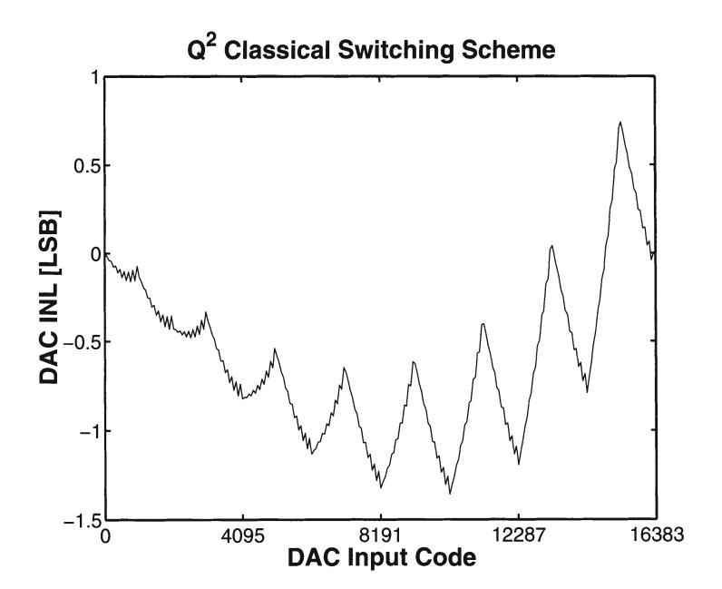

(a) Simulation of the INL for the  $Q^2$  classical switching scheme

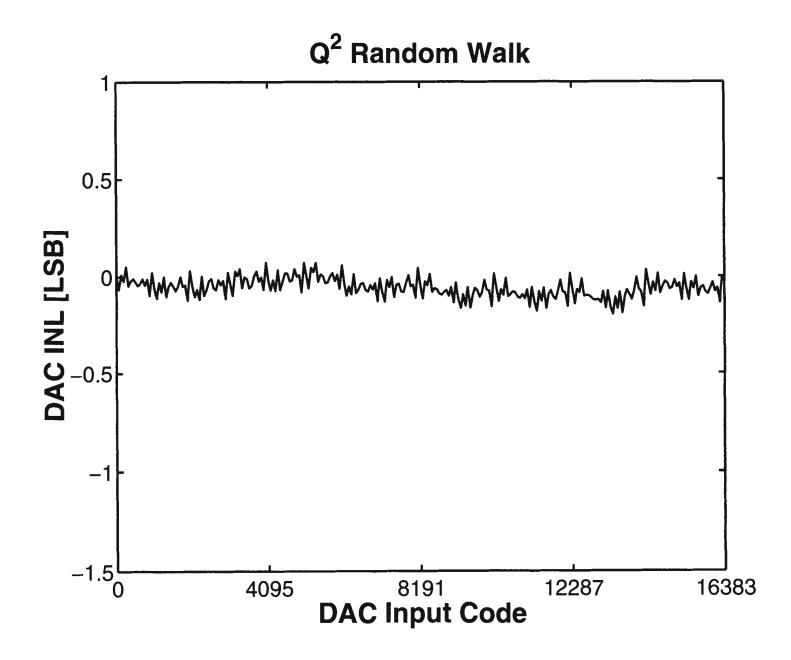

(b) Simulation of the INL for the  $Q^2$  Random Walk switching scheme

Figure 4.10: A comparison between the switching scheme presented by [Miki JSSC86] and the  $Q^2$  Random Walk switching scheme [VdPla JSSC99]

4.4 Conclusion 51

• The INL error of a *DI* A converter is by definition equal to :

$$INL = max(-INL_m, INL_M) (4.16)$$

where *IN Lm* is the minimal value and *IN L M* is the maximal value of the INL characteristic of the *DI* A converter.

• If the percentual errors of the different current sources are given *[1M*\* 100= *Ideal F;, i* = 1 ... *2N* - 1], one can state that the difference between the upper and the lower limit for the INL characteristic has to be larger than the maximum current source error.

$$F_{max} \le INL_M - INL_m \tag{4.17}$$

• The INL error of the *D/A* converter will be minimal if *IN Lm* and *IN LM* are located symmetrically around zero.

$$INL = INL_m = INL_M (4.18)$$

Combining these three elements results in an absolute lower bound on the INL error:

$$INL_{LB} = \frac{F_{max}}{2} \tag{4.19}$$

Once the lower bound of the INL error is given, the (near) optimal switching sequence can be determined by using an INL bounded algorithm. Since it is not the intention of the author to go deeper into the computing algorithms for solving the optimisation problem, the reader is referred to [Cong TCASII] for more information.

It should be noted that some gradient information has to be available to tackle the switching scheme optimisation problem. This information can be extracted from a test chip but this method significantly increases the design time of the *DI* A converter circuit [VdPla JSSC99]. When this is not allowed, the heuristically derived schemes are at the moment still the best alternative. If extra silicon area and power consumption are not a problem, calibration circuits can be implemented that counteract the influence of the gradients (and even of the random mismatch errors) [Bugej JSSCCOO].

### **4.4 Conclusion**

A new INLyield formula has been derived that in an accurate way describes the influence of the mismatch behaviour of the current sources on the yield of the *DI* A converter. In the second part of this chapter, the impact of the systematic errors on the static performance of a current steering *DI* A converter has been discussed. Implementing special switching schemes leads to a minimisation of these errors in such

a way that the random errors become dominant. This is important since the derived yield formula will remain valid and can be used for determining the dimensions of the current source transistor.