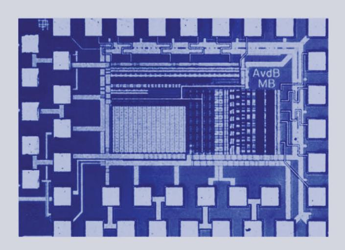

# STATIC AND DYNAMIC PERFORMANCE LIMITATIONS FOR HIGH SPEED D/A CONVERTERS

Anne Van den Bosch, Michiel Steyaert and Willy Sansen

## STATIC AND DYNAMIC PERFORMANCE LIMITATIONS FOR **HIGH** SPEED *D/A* CONVERTERS

## THE KLUWER INTERNATIONAL SERIES IN ENGINEERING AND COMPUTER SCIENCE

## ANALOG CIRCUITS AND SIGNAL PROCESSING

*Consulting Editor:* Mohammed Ismail. *Ohio State University* 

## *Related Titles:*

## MIXED-SIGNAL LAYOUT GENERATION CONCEPTS

Lin, van Roermund, Leenaerts

ISBN: 1-4020-7598-7

## HIGH-FREQUENCY OSCILLATOR DESIGN FOR INTEGRA TED TRANSCEIVERS

Van der Tang, Kasperkovitz and van Roennund

ISBN: 1-4020-7564-2

## CMOS INTEGRATION OF ANALOG CIRCUITS FOR HIGH DATA RATE TRANSMITTERS

DeRanter and Steyaert

ISBN: 1-4020-7545-6

#### SYSTEMATIC DESIGN OF ANALOG IP BLOCKS

Vandenbussche and Gielen

ISBN: 1-4020-7471-9

## SYSTEMATIC DESIGN OF ANALOG IP BLOCKS

Cheung & Luong

ISBN: 1-4020-7466-2

#### LOW-VOLTAGE CMOS LOG COMPANDING ANALOG DESIGN

Serra-Graells, Rueda & Huertas

ISBN: 1-4020-7445-X

#### CIRCUIT DESIGN FOR WIRELESS COMMUNICATIONS

Pun, Franca & Leme

ISBN: 1-4020-7415-8

#### DESIGN OF LOW-PHASE CMOS FRACTIONAL-N SYNTHESIZERS

DeMuer & Steyaert

ISBN: 1-4020-7387-9

#### MODULAR LOW-POWER, HIGH SPEED CMOS ANALOG-TO-DIGITAL CONVERTER FOR EMBEDDED SYSTEMS

Lin, Kemna & Hosticka

ISBN: 1-4020-7380- 1

## DESIGN CRITERIA FOR LOW DISTORTION IN FEEDBACK OPAMP CIRCUITE

Hemes & Saether

ISBN: 1-4020-7356-9

## CIRCUIT TECHNIQUES FOR LOW-VOLTAGE AND HIGH-SPEED AID CONVERTERS

Walteri

ISBN: 1-4020-7244-9

#### DESIGN OF HIGH-PERFORMANCE CMOS VOLTAGE CONTROLLED OSCILLATORS

Dai and Harjani

ISBN: 1-4020-7238-4

## CMOS CIRCUIT DESIGN FOR RF SENSORS

Gudnason and Bruun

ISBN: 1-4020-7127-2

#### ARCHITECTURES FOR RF FREQUENCY SYNTHESIZERS

Vaucher

ISBN: 1-4020-7120-5

#### THE PIEZOJUNCTION EFFECT IN SILICON INTEGRA TED CIRCUITS AND SENSORS

Fruett and Meijer

ISBN: 1-4020-7053-5

#### CMOS CURRENT AMPLIFIERS; SPEED VERSUS NONLINEARITY

Koli and Halonen

ISBN: 1-4020-7045-4

#### MULTI-STANDARD CMOS WIRELESS RECEIVERS

Li and Ismail

ISBN: 1-4020-7032-2

# STATIC AND DYNAMIC PERFORMANCE LIMITATIONS FOR HIGH SPEED D/A CONVERTERS

by

## Anne Van den Bosch

K.U. Leuven, Belgium

# **Michiel Steyaert**

K.U. Leuven, Belgium

and

## Willy Sansen

K.U. Leuven, Belgium

SPRINGER SCIENCE+BUSINESS MEDIA, LLC

ISBN 978-1-4419-5434-3 ISBN 978-1-4757-6579-3 (eBook) DOI 10.1007/978-1-4757-6579-3

*Printed on acid-free paper* 

#### All Rights Reserved

© 2004 Springer Science+Business Media New York Originally published by Kluwer Academic Publishers, Boston in 2004 No part of this work may be reproduced, stored in a retrieval system, or transmitted in any form or by any means, electronic, mechanical, photocopying, microfilming, recording or otherwise, without written permission from the Publisher, with the exception of any material supplied specifically for the purpose of being entered and executed on a computer system, for exclusive use by the purchaser of the work.