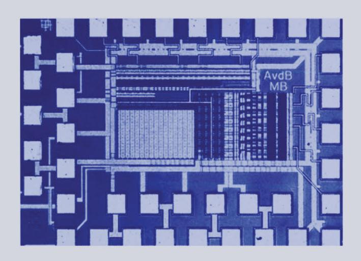

# STATIC AND DYNAMIC PERFORMANCE LIMITATIONS FOR HIGH SPEED D/A CONVERTERS

Anne Van den Bosch, Michiel Steyaert and Willy Sansen

## STATIC AND DYNAMIC PERFORMANCE LIMITATIONS FOR **HIGH** SPEED *D/A* CONVERTERS

## THE KLUWER INTERNATIONAL SERIES IN ENGINEERING AND COMPUTER SCIENCE

### ANALOG CIRCUITS AND SIGNAL PROCESSING

*Consulting Editor:* Mohammed Ismail. *Ohio State University* 

### *Related Titles:*

### MIXED-SIGNAL LAYOUT GENERATION CONCEPTS

Lin, van Roermund, Leenaerts

ISBN: 1-4020-7598-7

### HIGH-FREQUENCY OSCILLATOR DESIGN FOR INTEGRA TED TRANSCEIVERS

Van der Tang, Kasperkovitz and van Roennund

ISBN: 1-4020-7564-2

#### CMOS INTEGRATION OF ANALOG CIRCUITS FOR HIGH DATA RATE TRANSMITTERS

DeRanter and Steyaert

ISBN: 1-4020-7545-6

#### SYSTEMATIC DESIGN OF ANALOG IP BLOCKS

Vandenbussche and Gielen

ISBN: 1-4020-7471-9

#### SYSTEMATIC DESIGN OF ANALOG IP BLOCKS

Cheung & Luong

ISBN: 1-4020-7466-2

#### LOW-VOLTAGE CMOS LOG COMPANDING ANALOG DESIGN

Serra-Graells, Rueda & Huertas

ISBN: 1-4020-7445-X

#### CIRCUIT DESIGN FOR WIRELESS COMMUNICATIONS

Pun, Franca & Leme

ISBN: 1-4020-7415-8

#### DESIGN OF LOW-PHASE CMOS FRACTIONAL-N SYNTHESIZERS

DeMuer & Steyaert

ISBN: 1-4020-7387-9

#### MODULAR LOW-POWER, HIGH SPEED CMOS ANALOG-TO-DIGITAL CONVERTER FOR EMBEDDED SYSTEMS

Lin, Kemna & Hosticka

ISBN: 1-4020-7380- 1

#### DESIGN CRITERIA FOR LOW DISTORTION IN FEEDBACK OPAMP CIRCUITE

Hemes & Saether

ISBN: 1-4020-7356-9

#### CIRCUIT TECHNIQUES FOR LOW-VOLTAGE AND HIGH-SPEED AID CONVERTERS

Walteri

ISBN: 1-4020-7244-9

#### DESIGN OF HIGH-PERFORMANCE CMOS VOLTAGE CONTROLLED OSCILLATORS

Dai and Harjani

ISBN: 1-4020-7238-4

#### CMOS CIRCUIT DESIGN FOR RF SENSORS

Gudnason and Bruun

ISBN: 1-4020-7127-2

#### ARCHITECTURES FOR RF FREQUENCY SYNTHESIZERS

Vaucher

ISBN: 1-4020-7120-5

#### THE PIEZOJUNCTION EFFECT IN SILICON INTEGRA TED CIRCUITS AND SENSORS

Fruett and Meijer

ISBN: 1-4020-7053-5

### CMOS CURRENT AMPLIFIERS; SPEED VERSUS NONLINEARITY

Koli and Halonen

ISBN: 1-4020-7045-4

#### MULTI-STANDARD CMOS WIRELESS RECEIVERS

Li and Ismail

ISBN: 1-4020-7032-2

# STATIC AND DYNAMIC PERFORMANCE LIMITATIONS FOR HIGH SPEED D/A CONVERTERS

by

## Anne Van den Bosch

K.U. Leuven, Belgium

## **Michiel Steyaert**

K.U. Leuven, Belgium

and

## Willy Sansen

K.U. Leuven, Belgium

SPRINGER SCIENCE+BUSINESS MEDIA, LLC

ISBN 978-1-4419-5434-3 ISBN 978-1-4757-6579-3 (eBook) DOI 10.1007/978-1-4757-6579-3

*Printed on acid-free paper* 

#### All Rights Reserved

© 2004 Springer Science+Business Media New York Originally published by Kluwer Academic Publishers, Boston in 2004 No part of this work may be reproduced, stored in a retrieval system, or transmitted in any form or by any means, electronic, mechanical, photocopying, microfilming, recording or otherwise, without written permission from the Publisher, with the exception of any material supplied specifically for the purpose of being entered and executed on a computer system, for exclusive use by the purchaser of the work.

# **Abstract**

Although the digital world gains in importance due to the decreasing feature size of the transistors, the analog building blocks remain indispensable. The design of the interface between the two worlds has to comply with the strict requirements of both sides. The presented research focusses on the design of current steering *DI* A converters in the modem telecommunication systems of tomorrow.

An accurate description of both the static and the dynamic behaviour is of the utmost importance when designing a current steering *D/A* converter with a high performance. A new formula has been derived that accurately describes the INL-yield of a *D/A* converter as a function of the transistor mismatch behaviour in a given technology. The influence of systematic errors introduced by linear and quadratic gradients has to be minimised by the use of special switching schemes. Based on these elements, two 12 bit and one 14 bit current steering *D/A* converter have been implemented.

Apart from the three well known factors influencing the dynamic behaviour of the *DI* A converter, a fourth element has been introduced. The frequency dependency of the output impedance has a negative effect on high resolution, high speed current steering *DI* A converters. Taking this new element into account during the design resulted in the realisation of a 10 bit *D/A* converter with a Nyquist performance in the entire frequency band for a clock frequency up to 1 *GS/s.* 

To determine the optimal segmentation level of a current steering *DI* A converter, a statistical analysis has been performed. It could be concluded that if the requirement dictated by the transistor mismatch of the unit current sources is fulfilled, both the INL and the DNL error are smaller than 112 LSB regardless of the number of bits implemented in a binary way. A low segmentation level implies a low decoder complexity and as such leads to a small power and area consumption. Based on these findings, a fully binary 10 bit *D/A* converter has been realised with a small power consumption and a good dynamic performance.

The second part of this work is focussed on transistor mismatch. An overview is given of the most important mismatch models and on the influence of both the immediate surroundings and the used transistor topology. Also the link between the static performance of a current steering *D/A* converter and the extraction of the transistor mismatch parameters has been investigated. **It** is suggested that a current steering *D/A*  converter could act as a test structure for matching characterisation.

# **Contents**

|          | Abs  | tract    |              |                                            | V  |  |
|----------|------|----------|--------------|--------------------------------------------|----|--|
| Contents |      |          |              |                                            |    |  |
|          | List | of Sym   | bols and A   | Abbreviations                              | xv |  |
| 1        | Inti | roductio | n            |                                            | 1  |  |
|          | 1.1  | Introdu  | action       |                                            | 1  |  |
|          | 1.2  | Outlin   | e of the Re  | esearch Work                               | 2  |  |
| 2        | The  | D/A Co   | nverter: ]   | Functionality and Specifications           | 7  |  |
|          | 2.1  | Introdu  | action       |                                            | 7  |  |
|          | 2.2  | The Ba   | asic D/A C   | Converter Function                         | 7  |  |
|          |      | 2.2.1    | Analog a     | and Digital Signals                        | 7  |  |
|          |      | 2.2.2    | The D/A      | Converter as a Black Box                   | 9  |  |
|          | 2.3  | The Cl   | naracteristi | ics of an Ideal D/A Converter              | 10 |  |
|          |      | 2.3.1    | Introduct    | tion                                       | 10 |  |
|          |      | 2.3.2    | The Qua      | ntisation Error                            | 10 |  |
|          |      | 2.3.3    | The Sam      | ple and Hold like Amplitude Distortion     | 12 |  |
|          | 2.4  | The Pe   | erformance   | e Specifications of a D/A Converter        | 13 |  |
|          |      | 2.4.1    | Introduct    | tion                                       | 13 |  |
|          |      | 2.4.2    | The Stati    | c Specifications                           | 13 |  |
|          |      |          | 2.4.2.1      | Introduction                               | 13 |  |
|          |      |          | 2.4.2.2      | The Offset Error and the Gain Error        | 14 |  |
|          |      |          | 2.4.2.3      | The Differential Non-Linearity Error (DNL) | 14 |  |
|          |      |          | 2.4.2.4      | The Integral Non-Linearity Error (INL)     | 14 |  |
|          |      |          | 2.4.2.5      | Monotonicity                               | 15 |  |
|          |      | 2.4.3    | The Dyn      | amic Specifications                        | 17 |  |
|          |      |          | 2.4.3.1      | Introduction                               | 17 |  |
|          |      |          | 2.4.3.2      | The Update Rate                            | 18 |  |
|          |      |          | 2.4.3.3      | The Settling Time                          | 18 |  |
|          |      |          | 2.4.3.4      | The Glitch Energy                          | 18 |  |
|          |      |          |              |                                            |    |  |

viii CONTENTS

|   |      |         | 2.4.3.5     | The Slew Rate                                      | 19 |
|---|------|---------|-------------|----------------------------------------------------|----|
|   |      |         | 2.4.3.6     | The Clock-Feedthrough                              | 20 |
|   |      |         | 2.4.3.7     | The Signal to Noise Ratio (SNR)                    | 20 |
|   |      |         | 2.4.3.8     | The Signal to Noise and Distortion Ratio (SNDR) .  | 20 |
|   |      |         | 2.4.3.9     | The Spurious Free Dynamic Range (SFDR)             | 20 |
|   |      |         | 2.4.3.10    | The Total Harmonic Distortion (THD)                | 21 |
|   | 2.5  | The D   | A converte  | er specifications as a function of the application | 22 |
|   | 2.6  | Conclu  | isions      |                                                    | 22 |
| 3 | CM   | OS D/A  | Converte    | r Architectures                                    | 23 |
|   | 3.1  | Introdu | action      |                                                    | 23 |
|   | 3.2  | The Re  | esistor D/A | Converter                                          | 23 |
|   |      | 3.2.1   | The resis   | tor string D/A converter                           | 23 |
|   |      | 3.2.2   | The binar   | ry weighted resistor D/A converter                 | 25 |
|   |      | 3.2.3   | The R-2F    | R based D/A converters                             | 25 |
|   | 3.3  | The Ca  | apacitor D/ | 'A Converter                                       | 26 |
|   | 3.4  | The Cu  | urrent-Stee | ring D/A Converter                                 | 29 |
|   |      | 3.4.1   | Introduct   | ion                                                | 29 |
|   |      | 3.4.2   | The Bina    | ry Implementation                                  | 29 |
|   |      | 3.4.3   | The Unar    | ry Implementation                                  | 29 |
|   |      | 3.4.4   | The Segn    | nented Implementation                              | 30 |
|   | 3.5  | Conclu  | isions      |                                                    | 30 |
| 4 | Stat | ic Beha | viour of C  | urrent Steering D/A converters                     | 33 |
|   | 4.1  | Introdu | action      |                                                    | 33 |
|   | 4.2  | Model   | ling of the | random errors                                      | 33 |
|   |      | 4.2.1   | Introduct   | ion                                                | 33 |
|   |      | 4.2.2   | Lakshmil    | kumar Approach                                     | 34 |
|   |      | 4.2.3   | Monte Ca    | arlo Approach                                      | 35 |
|   |      | 4.2.4   | A new IN    | NL_yield Formula                                   | 36 |
|   |      |         | 4.2.4.1     | Introduction                                       | 36 |
|   |      |         | 4.2.4.2     | Theory                                             | 36 |
|   |      | 4.2.5   | Conclusi    | on                                                 | 41 |
|   | 4.3  | Model   | ling of the | systematic errors                                  | 42 |
|   |      | 4.3.1   | Possible    | causes                                             | 42 |
|   |      | 4.3.2   | Switchin    | g Schemes                                          | 43 |
|   |      |         | 4.3.2.1     | Introduction                                       | 43 |
|   |      |         | 4.3.2.2     | The Gradient Error Distribution                    | 43 |
|   |      |         | 4.3.2.3     | The sequential, conventional and hierarchical sym- |    |
|   |      |         |             | metrical switching schemes                         | 44 |

CONTENTS ix

|   |     |         | 4.3.2.4    | Decoding Principle                                      | 47 |  |  |  |
|---|-----|---------|------------|---------------------------------------------------------|----|--|--|--|
|   |     |         | 4.3.2.5    | Decoder Independent 2-D Centroid Switching Schemes      | 48 |  |  |  |
|   |     |         | 4.3.2.6    | The Analytical Optimisation of a Switching Scheme       | 49 |  |  |  |
|   | 4.4 | Conclu  |            |                                                         | 51 |  |  |  |
| 5 | Dyn | amic Be | ehaviour ( | of Current Steering D/A Converters                      | 53 |  |  |  |
|   | 5.1 |         |            |                                                         | 53 |  |  |  |
|   | 5.2 |         |            | ors                                                     | 54 |  |  |  |
|   |     | 5.2.1   | The Imp    | perfect Synchronisation of the Control Signals of the   |    |  |  |  |
|   |     |         | Switches   | S                                                       | 55 |  |  |  |
|   |     | 5.2.2   | The Dig    | ital Signal Feedthrough via the $C_{GD}$ of the Switch  |    |  |  |  |
|   |     |         | Transisto  | ors                                                     | 55 |  |  |  |
|   |     | 5.2.3   | The Volt   | age Variation at the Drain of the Current Source Tran-  |    |  |  |  |
|   |     |         | sistors .  |                                                         | 55 |  |  |  |
|   |     | 5.2.4   | The Out    | put Impedance                                           | 56 |  |  |  |
|   | 5.3 | SFDR-   | -Bandwidt  | th limitations                                          | 58 |  |  |  |
|   | 5.4 | SFDR-   | -Bandwidt  | th Optimised Implementations                            | 60 |  |  |  |
|   |     | 5.4.1   | The Case   | coded Current Source Transistor                         | 61 |  |  |  |
|   |     |         | 5.4.1.1    | The analysis of the zeroes of the impedance $Z_{imp}$ . | 62 |  |  |  |
|   |     |         | 5.4.1.2    | The analysis of the poles of the impedance $Z_{imp}$    | 62 |  |  |  |
|   |     |         | 5.4.1.3    | A numerical example                                     | 63 |  |  |  |
|   |     |         | 5.4.1.4    | Fault analysis of the presented theory                  | 67 |  |  |  |
|   |     |         | 5.4.1.5    | Conclusion                                              | 68 |  |  |  |
|   |     | 5.4.2   | The Case   | coded Switch Transistor                                 | 68 |  |  |  |
|   |     |         | 5.4.2.1    | The analysis of the zeroes of the impedance $Z_{imp}$ . | 69 |  |  |  |
|   |     |         | 5.4.2.2    | The analysis of the poles of the impedance $Z_{imp}$    | 70 |  |  |  |
|   |     |         | 5.4.2.3    | A numerical example                                     | 70 |  |  |  |
|   |     |         | 5.4.2.4    | Fault analysis of the presented theory                  | 71 |  |  |  |
|   |     |         | 5.4.2.5    | Conclusion                                              | 71 |  |  |  |
|   |     | 5.4.3   |            | ble Cascoded Current Source Transistor                  | 72 |  |  |  |
|   |     |         | 5.4.3.1    | The analysis of the zeroes of the impedance $Z_{imp}$ . | 73 |  |  |  |
|   |     |         | 5.4.3.2    | The analysis of the poles of the impedance $Z_{imp}$    | 73 |  |  |  |
|   |     |         | 5.4.3.3    | A numerical example                                     | 75 |  |  |  |
|   | 5.5 | Conclu  | ision      |                                                         | 76 |  |  |  |
| 6 |     |         |            | gy for High Performance CMOS Current Steering           |    |  |  |  |
|   |     | Conver  |            |                                                         | 77 |  |  |  |
|   | 6.1 |         |            |                                                         | 77 |  |  |  |
|   | 6.2 | Detern  | nining the | level of segmentation in a current steering D/A con-    |    |  |  |  |
|   |     | verter  |            |                                                         |    |  |  |  |

CONTENTS

|   |     | 6.2.1    | The area approach                                          | 7   |
|---|-----|----------|------------------------------------------------------------|-----|
|   |     | 6.2.2    | The mathematical approach                                  | 8   |
|   |     | 6.2.3    | Conclusion                                                 | 4   |
|   | 6.3 | Archit   | tectural choice of the thermometer decoder                 | 4   |
|   | 6.4 |          | n of the synchronised switch driver                        | 5   |
|   | 6.5 | Dimen    | nsioning the unit current cell                             | 5   |
|   |     | 6.5.1    | The current source transistor                              | 5   |
|   |     |          | 6.5.1.1 The area constraint                                | 5   |
|   |     |          | 6.5.1.2 The output voltage swing 8                         | 7   |
|   |     | 6.5.2    | The switch and cascode transistor                          | 7   |
|   | 6.6 | Conclu   | usion                                                      | 8   |
|   |     |          |                                                            |     |
| 7 |     | lisation |                                                            | 9   |
|   | 7.1 |          | uction                                                     |     |
|   | 7.2 |          | 3                                                          | 0   |
|   |     | 7.2.1    | First Design of a 12 bit D/A Converter                     |     |
|   |     |          | 7.2.1.1 The Floorplan                                      |     |
|   |     |          | 7.2.1.2 Design of the swatch cell 9                        |     |
|   |     |          | 7.2.1.3 Design of the thermometer decoder 9                |     |
|   |     |          | 7.2.1.4 The switching scheme                               |     |
|   |     |          | 7.2.1.5 The layout                                         |     |
|   |     |          | 7.2.1.6 Measurement results                                |     |
|   |     |          |                                                            | 6   |
|   |     |          |                                                            | 7   |
|   |     |          | 7.2.1.7 Conclusion                                         | 0   |
|   |     | 7.2.2    | A 14-bit Intrinsic Accuracy Q2 Random Walk CMOS D/A        | _   |
|   |     |          | converter                                                  |     |
|   |     |          | 7.2.2.1 The Floorplan                                      | 2   |
|   |     |          | 7.2.2.2 Design of the swatch cell and the thermometer de-  |     |
|   |     |          | coder                                                      |     |
|   |     |          | 7.2.2.3 The switching scheme                               |     |
|   |     |          | 7.2.2.4 The Layout                                         |     |
|   |     |          | 7.2.2.5 Measurements                                       |     |
|   |     |          | 7.2.2.5.1 Static measurements                              |     |
|   |     |          | 7.2.2.5.2 Dynamic measurements                             |     |
|   | 7.0 | TT' 1 (  | 7.2.2.6 Conclusion                                         |     |
|   | 7.3 | _        | Speed D/A Converters                                       | I   |
|   |     | 7.3.1    | A 800 MHz Ultra Low Glitch Energy 6-bit CMOS D/A Convertor | 1   |
|   |     |          | verter                                                     |     |
|   |     |          | 7.3.1.1 The Floorplan                                      | . 1 |

CONTENTS xi

|     |        | 7.3.1.2    | Design of the swatch cell and the thermometer de- |     |
|-----|--------|------------|---------------------------------------------------|-----|
|     |        |            | coder                                             | 112 |
|     |        | 7.3.1.3    | The switching scheme                              | 113 |
|     |        | 7.3.1.4    | Layout                                            | 113 |
|     |        | 7.3.1.5    | Measurements                                      | 113 |
|     |        | 7          | 7.3.1.5.1 Static measurements                     | 115 |
|     |        | 7          | 7.3.1.5.2 <b>Dynamic measurements</b>             | 115 |
|     |        | 7.3.1.6    | Conclusion                                        | 116 |
| 7.4 | High S | Speed, Hig | gh Accuracy D/A Converters                        | 120 |
|     | 7.4.1  | A 10-bit   | t 1-GS/s Nyquist Current-Steering CMOS D/A Con-   |     |
|     |        | verter .   |                                                   | 120 |
|     |        | 7.4.1.1    | The Floorplan                                     | 120 |
|     |        | 7.4.1.2    | Design of the swatch cell                         | 123 |
|     |        | 7.4.1.3    | Design of the thermometer decoder                 | 126 |
|     |        | 7.4.1.4    | The switching scheme                              | 130 |
|     |        | 7.4.1.5    | The layout                                        | 133 |
|     |        | 7.4.1.6    | Measurement results                               | 133 |
|     |        | 7          | 7.4.1.6.1 Static measurements                     | 133 |
|     |        | 7          | 7.4.1.6.2 <b>Dynamic measurements</b>             | 134 |
|     |        | 7.4.1.7    | Conclusion                                        | 137 |
|     | 7.4.2  | A 12-bit   | 500-MS/s Current-Steering CMOS D/A Converter .    | 140 |
|     |        | 7.4.2.1    | The Floorplan                                     | 140 |
|     |        | 7.4.2.2    | Design of the swatch cell and the thermometer de- |     |
|     |        |            | coder                                             | 141 |
|     |        | 7.4.2.3    | The switching scheme                              | 142 |
|     |        | 7.4.2.4    | The layout                                        | 143 |
|     |        | 7.4.2.5    | Measurement results                               | 144 |
|     |        | 7          | 4.4.2.5.1 Static measurements                     | 144 |
|     |        | 7          | <b>Dynamic measurements</b>                       | 144 |
|     |        | 7.4.2.6    | Conclusion                                        | 149 |
| 7.5 | Low Po |            | n Speed D/A Converters                            | 149 |
|     | 7.5.1  |            | tion                                              | 149 |
|     | 7.5.2  | A Low P    | Power 10 bit fully binary D/A Converter           | 150 |
|     |        | 7.5.2.1    | Floorplan                                         | 150 |
|     |        | 7.5.2.2    | Design of the swatch cell                         | 150 |
|     |        | 7.5.2.3    | The switching scheme                              | 150 |
|     |        | 7.5.2.4    | The Layout                                        | 152 |
|     |        | 7.5.2.5    | Measurement Results                               | 152 |
|     |        | 7.         | .5.2.5.1 Static measurements                      | 152 |
|     |        | 7.         | .5.2.5.2 <b>Dynamic measurements</b>              | 152 |

**xii CONTENTS** 

|   |     | 156 7.5.2.6 Conclusion.                                           |  |
|---|-----|-------------------------------------------------------------------------|--|
|   | 7.6 | Overview of Realised DACs 159                                        |  |
|   | 7.7 | Comparison with literature 159                                       |  |
|   |     | The Figure of Merit 7.7.1 159                                     |  |
|   | 7.8 |  162 Conclusion                                                   |  |
| 8 |     | 165 Transistor Mismatch: Evolution and Relevance                     |  |
|   | 8.1 | Introduction 165                                                     |  |
|   | 8.2 | Model of Lakshmikumar  166                                        |  |
|   |     | 166 8.2.1 Characterisation Methodology                            |  |
|   |     | 167 8.2.2 Physical causes for mismatch                            |  |
|   |     | 8.2.2.1 Threshold Voltage Mismatch 167                            |  |
|   |     | 168 8.2.2.2 Current factor mismatch .                             |  |
|   | 8.3 |  Model of Pelgrom 169                                             |  |
|   |     | 169 8.3.1 Characterisation methodology                            |  |
|   |     | 170 8.3.2 Mismatch model                                          |  |
|   | 8.4 | 171 Other models                                                  |  |
|   |     | Model of Abel 171 8.4.1                                           |  |
|   |     | Model of Bastos 172 8.4.2                                         |  |
|   |     | Model of Gotarredona-Linares 174 8.4.3                            |  |
|   |     | Model of Griinebaum-Oehm . 176 8.4.4                              |  |
|   |     | 176 8.4.4.1 The Spectral model                                    |  |
|   |     | 177 8.4.4.2 Different mismatch effects explained                  |  |
|   |     | Drennan-McAndrew 178 8.4.5                                        |  |
|   |     | Model of Croon 179 8.4.6                                 |  |
|   | 8.5 | Mismatch parameters for the 0.5 and the 0.4 p.,m CMOS technology 181 |  |
|   |     | 8.5.1 The 0.5 p.,m technology     . 181               |  |
|   |     | 8.5.2 The 0.4 p.,m technology    183                     |  |
|   |     | 8.5.3 Evolution of the mismatch parameters A VT and A.s 186       |  |
|   | 8.6 | Transistor mismatch dependency on its geometry 186                   |  |
|   |     | Introduction 8.6.1 186                                            |  |
|   |     | 8.6.2 Different Layout Structures 186                             |  |
|   |     | 188 8.6.3 The hexagonal transistor                                |  |
|   |     |  188 8.6.3.1 Introduction                                      |  |
|   |     | 8.6.3.2 The Hexagonal Transistor. 189                             |  |
|   |     | 8.6.3.2.1 The transistor structure 189                            |  |
|   |     | 8.6.3.2.2 The transistor parameters 189                           |  |
|   |     | Transistor Properties of the Hexagonal Structure 8.6.3.3 191      |  |
|   |     | 8.6.3.3.1 The drain and source capacitance. 191                   |  |
|   |     | 8.6.3.3.2 The matching performance 195                            |  |
|   |     | Conclusion 8.6.3.4 198                                            |  |

**CONTENTS xiii** 

| 8.7        | Influence of the surroundings of the transistors on the mismatch be |                                                                      |                                                     |         |  |  |  |
|------------|---------------------------------------------------------------------|----------------------------------------------------------------------|-----------------------------------------------------|---------|--|--|--|
|            | haviour                                                             |                                                                      |                                                     | 198     |  |  |  |
|            | 8.7.1                                                               |                                                                      | Side Effects                                  | 198  |  |  |  |
|            | 8.7.2                                                               | Metal Coverage                                                       |                                                     | 198     |  |  |  |
| 8.8        |                                                                     | The CMOS current steering D/A Converter as a test structure for tran |                                                     |         |  |  |  |
|            | sistor mismatch parameter extraction . 199                       |                                                                      |                                                     |         |  |  |  |
|            | 8.8.1                                                               |                                                                      | Introduction                                        | 199     |  |  |  |
|            | 8.8.2                                                               |                                                                      | The Test Structure Approach .                       | 199     |  |  |  |
|            | 8.8.3                                                               |                                                                      | The D/A converter Approach.                         | 200     |  |  |  |
|            |                                                                     | 8.8.3. I                                                             | The D/A converter architecture as a test structure. | 200     |  |  |  |
|            |                                                                     | 8.8.3.2                                                              | Measurement and extraction procedure of the tran    |         |  |  |  |
|            |                                                                     |                                                                      | sistor mismatch parameters                          | 201     |  |  |  |
|            |                                                                     | 8.8.3.3                                                              | Measurement Results                                 | 202     |  |  |  |
| 8.9        | Conclusion                                                          |                                                                      |                                                     | 202     |  |  |  |
| Appendix 1 | 205                                                                 |                                                                      |                                                     |         |  |  |  |
| Appendix 2 |                                                                     |                                                                      |                                                     |         |  |  |  |
|            | Bibliography                                                        |                                                                      |                                                     | 211     |  |  |  |

# **List of Symbols and Abbreviations**

# **Symbols**

*AVT, A,6 f3*  MOS transistor mismatch parameters Current factor of a MOS transistor

*C gs, Cgd,* etc. Device capacitances

*dB f*  decibel Frequency

*gm*  Transconductance

*go L, W*  Transistor small-signal output conductance Transistor gate-length and gate-width

*VT q*  Threshold voltage Elementary Charge

# **Abbreviations**

AC,ac Alternating Current

ADC, AID-converter Analog-to-Digital Converter

ASIC CMOS Application Specific Integrated Circuit Complementary Metal Oxide Semiconductor

CPU DAC, D/A-converter Central Processing Unit Digital-to-Analog Converter

DC,dc Direct Current

DNL DSP ENOB FSOC Differential non-linearity Digital Signal Processing Effective Number of Bits **Full** scale output current

FOM Figure-of-Meri t

GBW Gain-bandwidth product

GSM Global System for Mobile communications