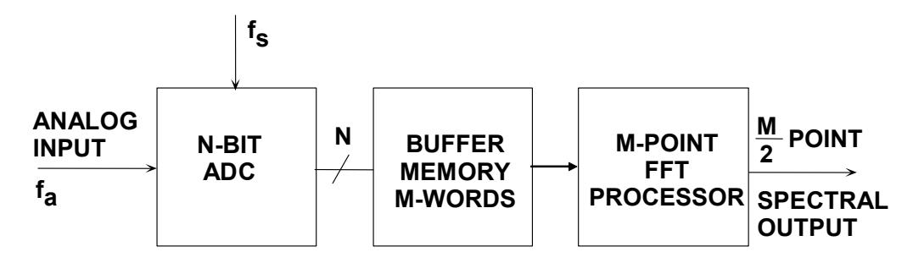

## Understand SINAD, ENOB, SNR, THD, THD + N, and SFDR so You Don't Get Lost in the Noise Floor

## by Walt Kester

## **INTRODUCTION**

Six popular specifications for quantifying ADC dynamic performance are SINAD (signal-to-noise-and-distortion ratio), ENOB (effective number of bits), SNR (signal-to-noise ratio), THD (total harmonic distortion plus noise), and SFDR (spurious free dynamic range). Although most ADC manufacturers have adopted the same definitions for these specifications, some exceptions still exist. Because of their importance in comparing ADCs, it is important not only to understand exactly what is being specified, but the relationships between the specifications.

There are a number of ways to quantify the distortion and noise of an ADC. All of them are based on an FFT analysis using a generalized test setup such as shown in Figure 1.

Figure 1: Generalized Test Setup for FFT Analysis of ADC Output

The spectral output of the FFT is a series of M/2 points in the frequency domain (M is the size of the FFT—the number of samples stored in the buffer memory). The spacing between the points is  $f_s/M$ , and the total frequency range covered is dc to  $f_s/2$ , where  $f_s$  is the sampling rate. The width of each frequency "bin" (sometimes called the *resolution* of the FFT) is  $f_s/M$ . Figure 2 shows an FFT output for an ideal 12-bit ADC using the Analog Devices' ADIsimADC® program. Note that the theoretical noise floor of the FFT is equal to the theoretical SNR plus the FFT *process gain*,  $10 \times \log(M/2)$ . It is important to remember that the value for noise used in the SNR calculation is the noise that extends over the entire Nyquist bandwidth (dc to  $f_s/2$ ), but the FFT acts as a narrowband spectrum analyzer with a bandwidth of  $f_s/M$  that sweeps over the spectrum. This has the effect of pushing the noise down by an amount equal to the process gain—the same effect as narrowing the bandwidth of an analog spectrum analyzer.