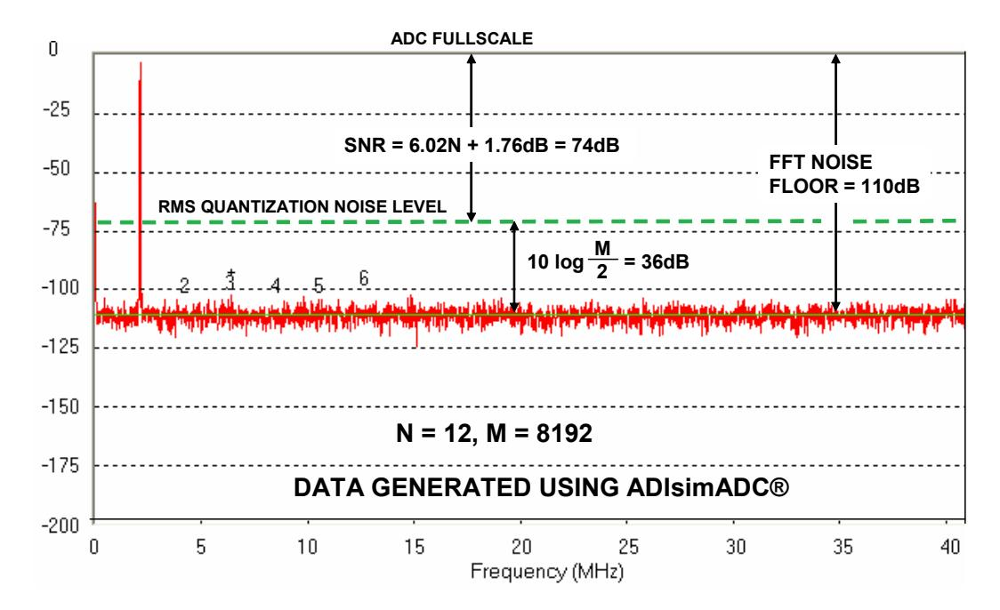
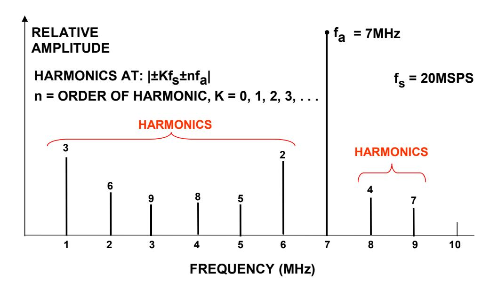
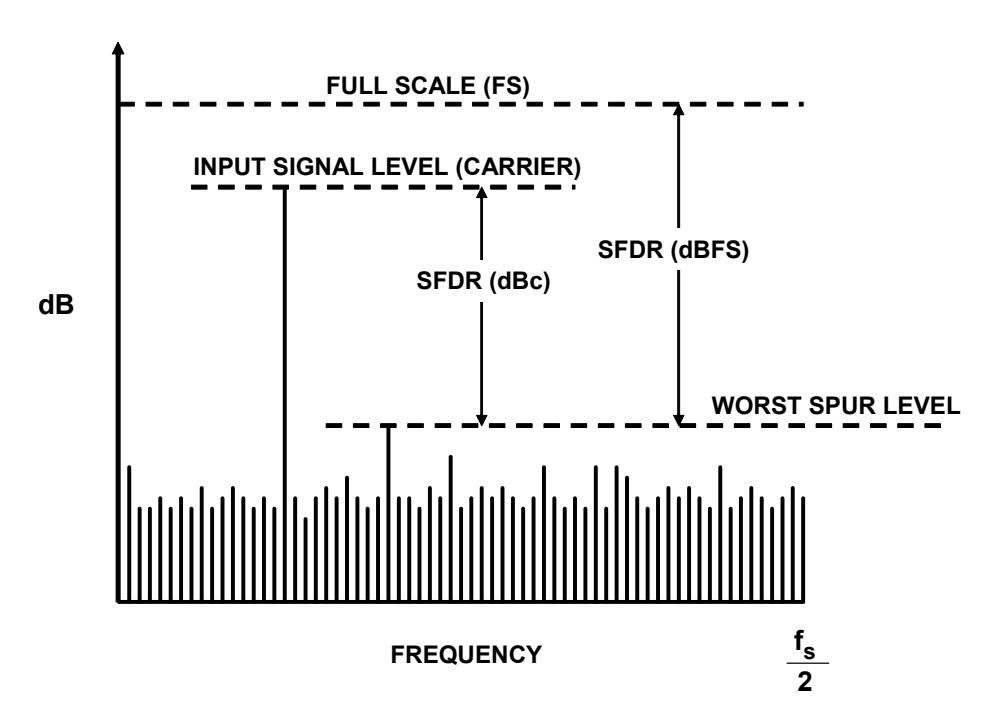
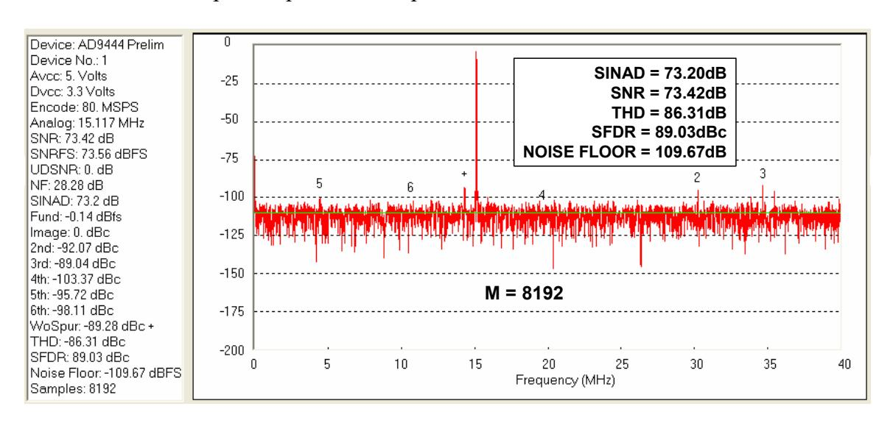
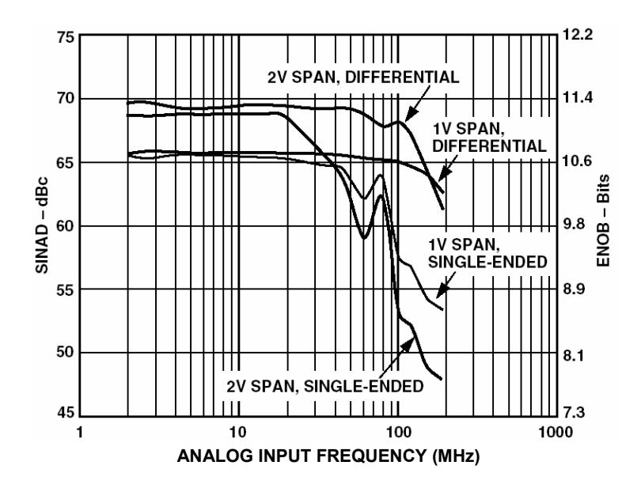

# Understand SINAD, ENOB, SNR, THD, THD + N, and SFDR so You Don't Get Lost in the Noise Floor

## by Walt Kester

#### INTRODUCTION

Six popular specifications for quantifying ADC dynamic performance are SINAD (signal-to-noise-and-distortion ratio), ENOB (effective number of bits), SNR (signal-to-noise ratio), THD (total harmonic distortion), THD + N (total harmonic distortion plus noise), and SFDR (spurious free dynamic range). Although most ADC manufacturers have adopted the same definitions for these specifications, some exceptions still exist. Because of their importance in comparing ADCs, it is important not only to understand exactly what is being specified, but the relationships between the specifications.

There are a number of ways to quantify the distortion and noise of an ADC. All of them are based on an FFT analysis using a generalized test setup such as shown in Figure 1.

Figure 1: Generalized Test Setup for FFT Analysis of ADC Output

The spectral output of the FFT is a series of M/2 points in the frequency domain (M is the size of the FFT—the number of samples stored in the buffer memory). The spacing between the points is fs/M, and the total frequency range covered is dc to fs/2, where fs is the sampling rate. The width of each frequency "bin" (sometimes called the *resolution* of the FFT) is fs/M. Figure 2 shows an FFT output for an ideal 12-bit ADC using the Analog Devices' ADIsimADC® program. Note that the theoretical noise floor of the FFT is equal to the theoretical SNR plus the FFT *process gain*, 10×log(M/2). It is important to remember that the value for noise used in the SNR calculation is the noise that extends over the entire Nyquist bandwidth (dc to fs/2), but the FFT acts as a narrowband spectrum analyzer with a bandwidth of fs/M that sweeps over the spectrum. This has the effect of pushing the noise down by an amount equal to the process gain—the same effect as narrowing the bandwidth of an analog spectrum analyzer.

The FFT data shown in Figure 2 represents the average of 5 individual FFTs. Note that averaging a number of FFTs does not affect the average noise floor, it only acts to "smooth" the random variations in the amplitudes contained in each frequency bin.

*Figure 2: FFT Output for an Ideal 12-Bit ADC, Input = 2.111MHz, fs = 82MSPS, Average of 5 FFTs, M = 8192, Data Generated from [ADIsimADC®](http://www.analog.com/en/analog-to-digital-converters/ad-converters/ad6645/products/evaluation-boardstools/CU_ADIsimADC_evaluation_tools/resources/fca.html)*

The FFT output can be used like an analog spectrum analyzer to measure the amplitude of the various harmonics and noise components of a digitized signal. The harmonics of the input signal can be distinguished from other distortion products by their location in the frequency spectrum. Figure 3 shows a 7-MHz input signal sampled at 20 MSPS and the location of the first 9 harmonics. Aliased harmonics of fa fall at frequencies equal to |±Kfs ± nfa|, where n is the order of the harmonic, and K = 0, 1, 2, 3,.... The second and third harmonics are generally the only ones specified on a data sheet because they tend to be the largest, although some data sheets may specify the value of the *worst* harmonic.

*Harmonic distortion* is normally specified in dBc (decibels below *carrier*), although in audio applications it may be specified as a percentage. It is the ratio of the rms signal to the rms value of the harmonic in question. Harmonic distortion is generally specified with an input signal near full-scale (generally 0.5 to 1 dB below full-scale to prevent clipping), but it can be specified at any level. For signals much lower than full-scale, other distortion products due to the differential nonlinearity (DNL) of the converter—not direct harmonics—may limit performance.

*Figure 3: Location of Distortion Products: Input Signal = 7 MHz, Sampling Rate = 20 MSPS* 

*Total harmonic distortion* (THD) is the ratio of the rms value of the fundamental signal to the mean value of the root-sum-square of its harmonics (generally, only the first 5 harmonics are significant). THD of an ADC is also generally specified with the input signal close to full-scale, although it can be specified at any level.

*Total harmonic distortion plus noise* (THD + N) is the ratio of the rms value of the fundamental signal to the mean value of the root-sum-square of its harmonics plus all noise components (excluding dc). The bandwidth over which the noise is measured must be specified. In the case of an FFT, the bandwidth is dc to fs/2. (If the bandwidth of the measurement is dc to fs/2 (the Nyquist bandwidth), THD + N is equal to SINAD—see below). Be warned, however, that in audio applications the measurement bandwidth may not necessarily be the Nyquist bandwidth.

*Spurious free dynamic range (SFDR)* is the ratio of the rms value of the signal to the rms value of the worst spurious signal regardless of where it falls in the frequency spectrum. The worst spur may or may not be a harmonic of the original signal. SFDR is an important specification in communications systems because it represents the smallest value of signal that can be distinguished from a large interfering signal (blocker). SFDR can be specified with respect to full-scale (dBFS) or with respect to the actual signal amplitude (dBc). The definition of SFDR is shown graphically in Figure 4.

*Figure 4: Spurious Free Dynamic Range (SFDR)* 

The Analog Devices' [ADIsimADC®](http://www.analog.com/en/analog-to-digital-converters/ad-converters/ad6645/products/evaluation-boardstools/CU_ADIsimADC_evaluation_tools/resources/fca.html) ADC modeling program allows various high performance ADCs to be evaluated at varioius operating frequencies, levels, and sampling rates. The models yield an accurate representation of actual performance, and a typical FFT output for the [AD9444](http://www.analog.com/en/analog-to-digital-converters/ad-converters/ad9444/products/product.html) 14-bit, 80-MSPS ADC is shown in Figure 5. Note that the input frequency is 95.111 MHz and is aliased back to 15.111 MHz by the sampling process. The output also displays the locations of the first five harmonics. In this case, all the harmonics are aliases. The program also calculates and tabulates the important performance parameters as shown in the left-hand data column.

*Figure 5: [AD9444](http://www.analog.com/en/analog-to-digital-converters/ad-converters/ad9444/products/product.html) 14-Bit, 80MSPS ADC fin = 95.111MHz, fs = 80MSPS, Average of 5 FFTs, M = 8192, Data Generated from ADIsimADC®* 

# **SIGNAL-TO-NOISE-AND-DISTORTION RATIO (SINAD), SIGNAL-TO-NOISE RATIO (SNR), AND EFFECTIVE NUMBER OF BITS (ENOB)**

SINAD and SNR deserve careful attention, because there is still some variation between ADC manufacturers as to their precise meaning. Signal-to-Noise-and-Distortion (SINAD, or S/(N + D) is the ratio of the rms signal amplitude to the mean value of the root-sum-square (rss) of all other spectral components, *including harmonics*, but excluding dc. SINAD is a good indication of the overall dynamic performance of an ADC because it includes all components which make up noise and distortion. SINAD is often plotted for various input amplitudes and frequencies. For a given input frequency and amplitude, SINAD is equal to THD + N, provided the bandwidth for the noise measurement is the same for both (the Nyquist bandwidth). A typical plot for the [AD9226](http://www.analog.com/en/analog-to-digital-converters/ad-converters/ad9226/products/product.html) 12-bit, 65-MSPS ADC is shown in Figure 6.

*Figure 6: [AD9226](http://www.analog.com/en/analog-to-digital-converters/ad-converters/ad9226/products/product.html) 12-bit, 65-MSPS ADC SINAD and ENOB for Various Input Full-Scale Spans (Range)* 

The SINAD plot shows that the ac performance of the ADC degrades due to high-frequency distortion and is usually plotted for frequencies well above the Nyquist frequency so that performance in undersampling applications can be evaluated. SINAD plots such as these are very useful in evaluating the dynamic performance of ADCs. SINAD is often converted to *effectivenumber-of-bits* (ENOB) using the relationship for the theoretical SNR of an ideal N-bit ADC: SNR = 6.02N + 1.76 dB. The equation is solved for N, and the value of SINAD is substituted for SNR:

$$ENOB = \frac{SINAD - 1.76 \text{ dB}}{6.02} .$$
 Eq. 1

Note that Equation 1 assumes a full-scale input signal. If the signal level is reduced, the value of SINAD decreases, and the ENOB decreases. It is necessary to add a correction factor for calculating ENOB at reduced signal amplitudes as shown in Equation 2:

$$ENOB = \frac{SINAD_{MEASURED} - 1.76 \text{ db} + 20 \log \left( \frac{Fullscale Amplitude}{Input Amplitude} \right)}{6.02}$$
Eq. 2

The correction factor essentially "normalizes" the ENOB value to full-scale regardless of the actual signal amplitude.

Signal-to-noise ratio (SNR, or sometimes called SNR-without-harmonics) is calculated from the FFT data the same as SINAD, except that the signal harmonics are excluded from the calculation, leaving only the noise terms. In practice, it is only necessary to exclude the first 5 harmonics, since they dominate. The SNR plot will degrade at high input frequencies, but generally not as rapidly as SINAD because of the exclusion of the harmonic terms.

A few ADC data sheets somewhat loosely refer to SINAD as SNR, so you must be careful when interpreting these specifications and understand exactly what the manufacturer means.

### THE MATHEMATICAL RELATIONSHIPS BETWEEN SINAD, SNR, AND THD

There is a mathematical relationship between SINAD, SNR, and THD (assuming all are measured with the same input signal amplitude and frequency. In the following equations, SNR, THD, and SINAD are expressed in dB, and are derived from the actual numerical ratios S/N, S/D, and S/(N+D) as shown below:

$$SNR = 20\log\left(\frac{S}{N}\right),$$
 Eq. 3

THD = 
$$20 \log \left( \frac{S}{D} \right)$$
, Eq. 4

$$SINAD = 20 \log \left( \frac{S}{N+D} \right).$$
 Eq. 5

Eq. 3, Eq. 4, and Eq. 5 can be solved for the numerical ratios N/S, D/S, and (N+D)/S as follows:

$$\frac{N}{S} = 10^{-SNR/20}$$
 Eq. 6

$$\frac{D}{S} = 10^{-THD/20}$$
 Eq. 7

$$\frac{N+D}{S} = 10^{-SINAD/20}$$
 Eq. 8

Because the denominators of Eq. 6, Eq. 7, and Eq. 8 are all equal to S, the root sum square of N/S and D/S is equal to (N+D)/S as follows:

$$\frac{N+D}{S} = \left[ \left( \frac{N}{S} \right)^2 + \left( \frac{D}{S} \right)^2 \right]^{\frac{1}{2}} = \left[ \left( 10^{-SNR/20} \right)^2 + \left( 10^{-THD/20} \right)^2 \right]^{\frac{1}{2}}, \quad \text{Eq. 9}$$

$$\frac{N+D}{S} = \left[10^{-SNR/10} + 10^{-THD/10}\right]^{\frac{1}{2}}.$$
 Eq. 10

Therefore, S/(N+D) must equal:

$$\frac{S}{N+D} = \left[10^{-SNR/10} + 10^{-THD/10}\right]^{-\frac{1}{2}},$$
 Eq. 11

and hence,

SINAD = 
$$20 \log \left( \frac{S}{N+D} \right) = -10 \log \left[ 10^{-SNR/10} + 10^{-THD/10} \right]$$
. Eq. 12

Eq. 12 gives us SINAD as a function of SNR and THD.

Similarly, if we know SINAD and THD, we can solve for SNR as follows:

SNR = 
$$20 \log \left( \frac{S}{N} \right) = -10 \log \left[ 10^{-SINAD/10} - 10^{-THD/10} \right]$$
. Eq. 13

Similarly, if we know SINAD and SNR, we can solve for THD as follows:

THD = 
$$20 \log \left( \frac{S}{D} \right) = -10 \log \left[ 10^{-SINAD/10} - 10^{-SNR/10} \right]$$
. Eq. 14

Equations 12, 13, and 14 are implemented in an easy to use design tool on the Analog Devices' website. It is important to emphasize again that these relationships hold true only if the input frequency and amplitude are equal for all three measurements.

# **SUMMARY**

Because SINAD, SNR, ENOB, THD, THD + N, and SFDR are common measures of ADC dynamic performance, a complete understanding of them in the context of the manufacturers' data sheet is critical. This tutorial has defined the quantities and derived the mathematical relationship between SINAD, SNR, and THD.

# **REFERENCES**

- 1. Walt Kester, *[Analog-Digital Conversion](http://www.analog.com/library/analogDialogue/archives/39-06/data_conversion_handbook.html)*, Analog Devices, 2004, ISBN 0-916550-27-3, Chapter 6. Also available as *[The Data Conversion Handbook](http://www.amazon.com/Data-Conversion-Handbook-Analog-Devices/dp/0750678410/ref=sr_1_1?ie=UTF8&s=books&qid=1222800176&sr=1-1)*, Elsevier/Newnes, 2005, ISBN 0-7506-7841-0, Chapter 2.
- 2. Hank Zumbahlen, *Basic Linear Design*, Analog Devices, 2006, ISBN: 0-915550-28-1. Also available as *[Linear Circuit Design Handbook](http://www.amazon.com/Linear-Circuit-Handbook-Engineering-Devices/dp/0750687037/ref=pd_bbs_sr_1?ie=UTF8&s=books&qid=1222800065&sr=1-1)*, Elsevier-Newnes, 2008, ISBN-10: 0750687037, ISBN-13: 978-0750687034. Chapter 6.

Copyright 2009, Analog Devices, Inc. All rights reserved. Analog Devices assumes no responsibility for customer product design or the use or application of customers' products or for any infringements of patents or rights of others which may result from Analog Devices assistance. All trademarks and logos are property of their respective holders. Information furnished by Analog Devices applications and development tools engineers is believed to be accurate and reliable, however no responsibility is assumed by Analog Devices regarding technical accuracy and topicality of the content provided in Analog Devices Tutorials.