# Behavioral Model of Segmented Current-Steering DAC by Using SIMULINK®

Indrit Myderrizi1,2

1 Department of Electronics and Communications Engineering Dogus University Istanbul, Turkey imyderrizi@dogus.edu.tr

*Abstract***—A behavioral model is developed for segmented current-steering DAC. System is modeled by constructing a set of subsystems in SIMULINK® environment. To validate the model a 12-bit segmented current-steering DAC is modeled and performance characteristics are investigated for the worst case operation of the system. Simulation results confirm the accuracy of the model.** 

# I. INTRODUCTION

Modern digital signal processing systems require as building blocks high speed and high resolution DACs. A segmented current-steering topology is one of the most preferred choices for such applications since it exhibits better performance compared with other competing architectures [1]. Because of the complex mixed-signal nature of this converter a considerable number of building blocks are required to describe adequately the operation of the system. For this reason accurate models that give a complete view of the behavior of the system need to be generated. In recent papers MATLAB®/SIMULINK® models and even the mapping of these models to structural VHDL-AMS descriptions is generated [2]. Although in some developed models the behavioral model and partly the performance are studied [3], the complete behavioral analysis including the worst case operation is not performed. The study of the nonideal behavioral model and the derivation of its static and dynamic performance prior to transistor level implementation are mandatory for an optimal design procedure of the DAC.

In this paper the behavioral model and performance characteristics of a segmented current-steering DAC by using SIMULINK® is described. Each block of the system is modeled accurately and a modeled 12-bit segmented currentsteering DAC is simulated.

The paper is organized as follows: section 2 introduces the segmented current-steering DAC topology and its operation. In section 3 the behavioral model is implemented and the function of each building block is explained. Section

# Ali Zeki2

Department of Electronics and Communications Engineering Istanbul Technical University Istanbul, Turkey zekia@itu.edu.tr

4 gives the performance characteristics of the model simulated for the worst case operation of the system. Finally the conclusions are summarized in section 5.

# II. SEGMENTED CURRENT-STEERING DAC

A segmented current-steering topology is generally used for high speed and high resolution applications since it offers the advantages of both binary weighted and thermometercoded topologies in expense to a more complex and larger die area of the designed system. Fig. 1 shows a block diagram of a 12-bit segmented current-steering DAC. The 12-bit input binary data is segmented into the 8 least significant bits switching binary weighted current sources and 4 most significant bits are thermometer decoded to switch 15 unary current sources. It is clear that a dummy decoder has to be inserted in the binary weighted input to equalize the latency coming from binary-to-thermometer decoder. A swing reduced driver (SRD) is placed before the switch reducing the clock-feedthrough effect, and hence increasing the switching speed [4]. An external clock is used to synchronize all digital parts of the system.

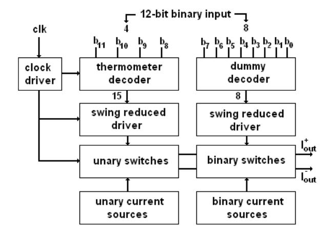

Figure 1. 12-bit segmented current-steering DAC

# III. SIMULINK® BEHAVIORAL MODEL

SIMULINK® model for the 12-bit segmented currentsteering DAC is shown in Fig. 2. The model consists of a 12 bit digital data generator system, an 8-bit binary weighted subDAC and a 4-bit thermometer-coded subDAC. The outputs and their complementary coming from both subDACs are summed together to form the analog output of the DAC system.

Binary weighted and thermometer-coded subDAC models are shown in Fig. 3 and Fig. 4, respectively. 8-bit binary inputs are applied to the input of the binary weighted subDAC and than passed through the latency equalizer and SRDs to the binary current sources/switches array. Similarly, the remaining 4-bit binary inputs are applied to the input of the thermometer-coded subDAC where are converted to 15 bit thermometer codes. Later the signals through SRDs are applied to the unary current sources/switches array.

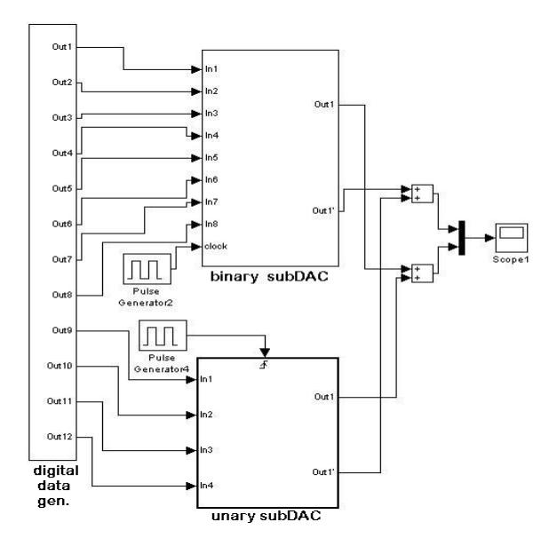

Figure 2. SIMULINK® model of the 12-bit segmented current-steering DAC

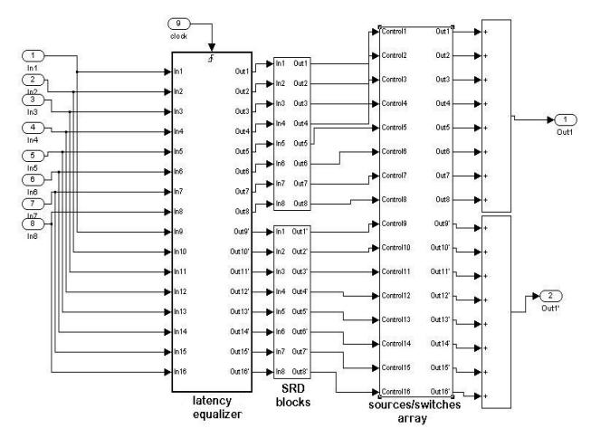

Figure 3. 8-bit binary weighted subDAC model

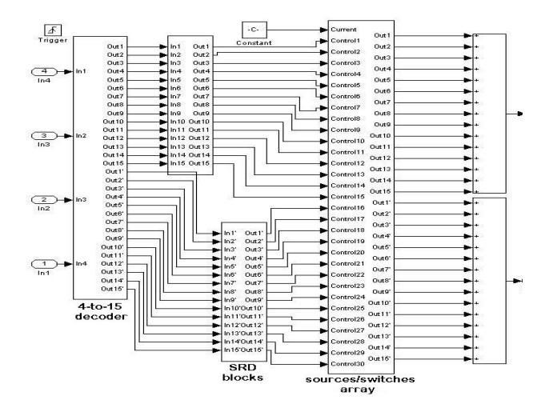

Figure 4. 4-bit thermometer-coded subDAC model

The model of each subDAC is divided into a digital binary-to-thermometer decoder (dummy decoder for the binary weighted subDAC), swing reduced drivers and an analog core cell which incorporates switches and current sources.

# *A. Binary-to-thermometer decoder*

4-bit binary inputs are converted to 15-bit thermometer codes by the mean of a 4-to-15 binary-to-thermometer decoder constructed using the NOR equivalents of the conversion functions necessary for 4-bit binary-tothermometer conversion. The decoder is shown in Fig. 5 and is modeled exactly the same way as the real implementation counterpart. Thus, NOR and NAND gates available in the SIMULINK® library are used.

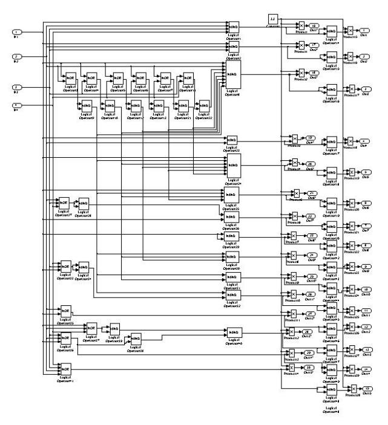

Figure 5. 4-to-15 binary-to-thermometer decoder model

## B. Swing reduced driver (SRD)

As in the real DAC implementations the swing reduced driver aims to reduce the swing of the voltage applied to the gates of the switch transistors, avoiding the operation in triode region of these transistors. The model developed for this action is shown in Fig. 6. The outputs of the decoder are applied to the inputs of the SRD blocks and the new voltage swing limits are defined according to the "if action" of the blocks given in Fig. 7a and b. For example, if the outputs signal of the decoder has a swing varying from 0 to 3.3V the swing at the output of the SRD varies from 1.8 to 2.2V. In real implementations the values of the swing limits are calculated using the transistors' dimensions of the core cell

#### C. Core cell

SIMULINK® block modeling the behavior of the one current source and switch is shown in Fig. 8. Basically, the switches will turn 'on' when the applied input from SRD is at its high level (2.2V) and will turn 'off' when the applied input from SRD is at its low level (1.8V). According to these on-off states at the input of the switches the value of the current source (binary weighted or unary) or a 0 will be available at the output of the switch.

From Fig. 2 it can be seen that pulse generators are used as clocks to synchronize all the blocks of the model.

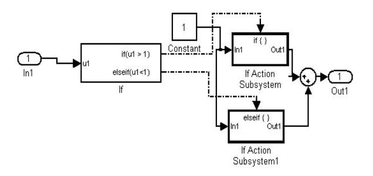

Figure 6. Swing reduced driver model

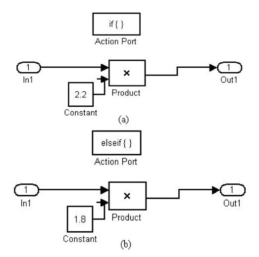

Figure 7. SRD "if action" (a) high and (b) low limits

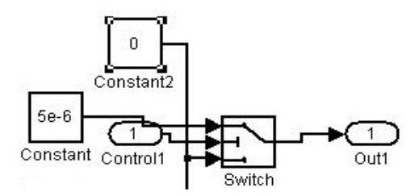

Figure 8. Core cell model

#### IV. PERFORMANCE VERIFICATION

The developed model is evaluated through simulations. Static and dynamic performance for the worst case operation of the system is observed. It must be noted that the worst case operation for the segmented current-steering DAC is defined as the non synchronous operation of the binary weighted and unary subDACs, mismatching of the current sources in each subDAC, and the different latency of the input signals. All these worst case conditions can be easily obtained by adjusting the clock signals and the values of the current sources.

## A. Static performance

In current-steering DACs static performance is mainly determined by the matching of the current source transistors. Because of the process variations current source transistors do not behave exactly the same way [5]. Fig. 9 shows the transfer characteristic of the 12-bit segmented current-steering DAC model simulated for the worst case operation. The update rate in this case is 1GSample/s.

Due to mismatching the main parameters of the static performance: integral and differential nonlinearity will be altered. The integral nonlinearity (INL) is simulated using a MATLAB® code based on (1).

$$INL_{k}^{norm} = \frac{A_{k}^{actual} - A_{k}^{ideal}}{LSB}$$
 (1)

Where  $A_k^{\ actual}$  and  $A_k^{\ ideal}$  are the actual and ideal analog outputs of the converter.  $INL_k^{\ norm}$  is the integral nonlinearity normalized to LSB steps.

Differential nonlinearity (DNL) is simulated using a SIMULINK® tool based on (2).

$$DNL_{k}^{norm} = \frac{A_{k+1}^{actual} - A_{k}^{actual} - LSB}{LSB}$$
 (2)

Where  $A_{k+1}^{\text{actual}}$  and  $A_k^{\text{actual}}$  are analog outputs corresponding to adjacent codes of the converter.  $DNL_k^{\text{norm}}$  is the differential nonlinearity normalized to LSB steps.

Simulated INL and DNL are shown in Fig. 10 and Fig. 11, respectively. Nonlinearities caused by mismatching are the remaining part of the graph when effect of the glitches is excluded.

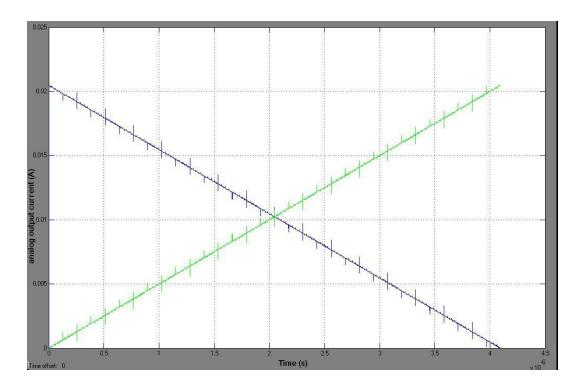

Figure 9. Transfer characteristic of the DAC

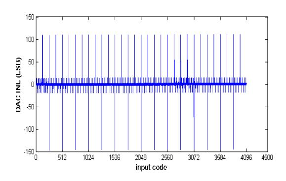

Figure 10. Simulated INL

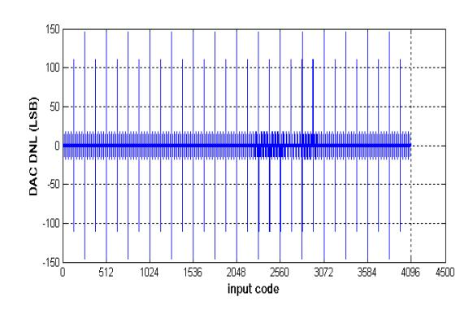

Figure 11. Simulated DNL

# *B. Dynamic Performance*

Spurious free dynamic range (SFDR) is the most important specification that gives information about the frequency spectrum of a nonideal DAC and its dynamic range before the fundamental signal is distorted. It can be defined as the difference in amplitude of the fundamental and the largest harmonic found within the Nyquist frequency band. A digital signal corresponding to a sine wave at 100MHz is applied to the input of the DAC. Fig. 12 shows the analog output of the converter with an update rate of 1GSample/s. The frequency spectrum of the output signal at 100MHz is shown in Fig. 13. It can be seen that for the worst case operation of the DAC the SFDR is 23dB.

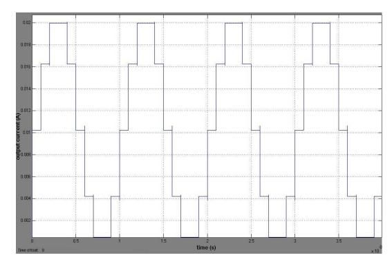

Figure 12. Output sinusoidal signal at 100MHz

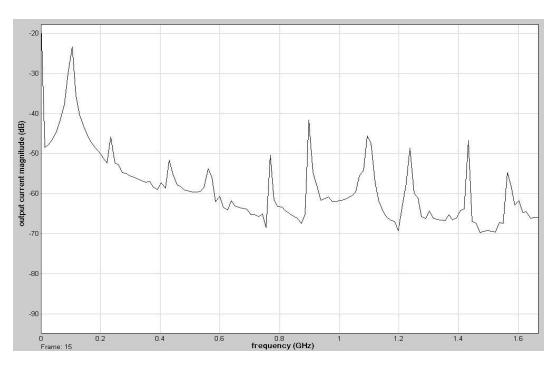

Figure 13. Frequency spectrum of the output sinusoidal signal at 100MHz

# V. CONCLUSIONS

A SIMULINK® behavioral model for segmented currentsteering DAC is developed. The model is attractive since it offers a complete view of the converter's behavior prior to transistor level design. Through the worst case analysis the static and dynamic performance of the system is evaluated. The model makes easier the high speed design of DAC systems. The tools developed for performance's measurements can be used for analysis of the data accumulated from the implemented DAC chips.

# REFERENCES

- [1] J. Vandenbussche, G. Van der Plas, G. Gielen and W. Sansen, "Behavioral Model of Reusable D/A Converters," IEEE Trans. on Cir. And Sys. –II: Analog and Digital Signal Processing, vol. 46, no. 10, pp. 1323-1326, October 1999.
- [2] A. C. R. da Silva, I. Grout, J. Ryan and T. O' Shea, "Generating VHDL-AMS Models of Digital-to-Analogue Converters from MATLAB®/SIMULINK®," Int. Conf. on Thermal, Mechanical and Multi-Physics Simulation Experiments on Microelectronics and Micro-Systems, EuroSime2007, pp. 1-7, 16-18 April 2007.
- [3] E. Bilhan, P. C. Estrada-Gutierrez, A. J. Valero-Lopez and F. Maloberti, "Behavioral Model of Pipeline ADC by Using SIMULINK®," Southwest Symp. on Mixed-Signal Design, SSMSD2001, pp. 147-151, 25-27 February 2001.
- [4] L. Luh, J. Choma and J. Draper, "A High-Speed Fully Differential Current Switch," IEEE Trans. on Cir. And Sys. –II: Analog and Digital Signal Processing, vol. 47, no. 4, pp. 358-363, April 2000.
- [5] A. Van den Bosch, M. Steyaert and W. Sansen, "Static and Dynamic Performance Limitations for High Speed D/A Converters," Kluwer Academic Publishers 2004.