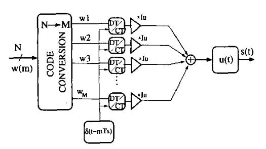
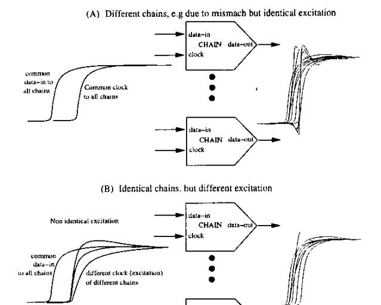
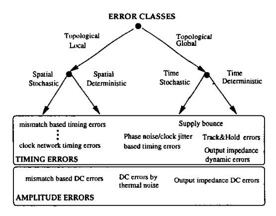
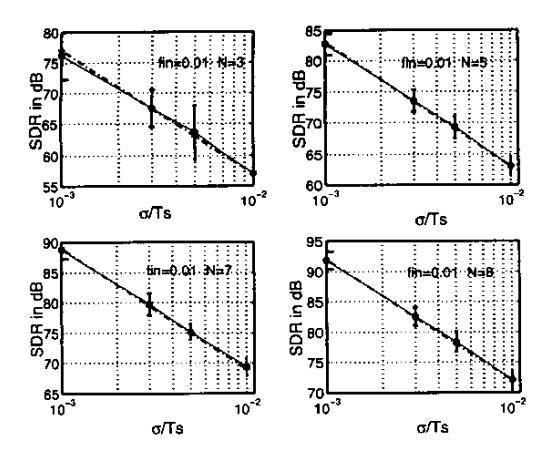
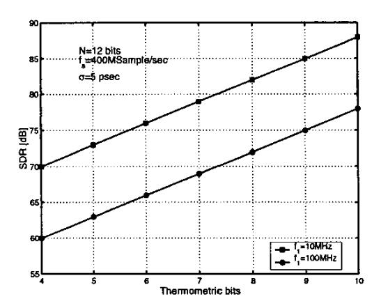
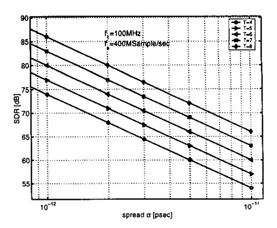

# MISMATCH-BASED TIMING ERRORS IN CURRENT STEERING DACS

Konstantinos Doris, Arthur van Roermund

Technical University Eindhoven E.H. 5.09, P.O.Box 513, 5600MB Eindhoven, The Netherlands

# Domine Leenaerts

Philips Research Laboratories Prof. Holstlaan 4, 5656 AA Eindhoven, The Netherlands

#### **ABSTRACT**

Current Steering Digital-to-Analog Converters (CS-DAC) are important ingredients in many high-speed data converters. Various types of timing errors such as mismatch based timing errors limit broad-band performance. A framework of timing errors is presented here and it is used to analyze these errors. The extracted relationship between performance, block requirements and architecture (e.g segmentation) gives insight on design tradeoffs in Nyquist DACs and multi-bit current-based  $\Sigma\Delta$  Modulators.

# 1. INTRODUCTION

The continuous-time DAC output s(t) that corresponds to an input code w(m) for the discrete-time m is composed by the sum of w(m) identical unit current pulses at a sampling rate  $f_s = 1/T_s$ . The conversion is described by a  $\Sigma\Delta$  function (see [1]):

$$s(t) = u(t) \otimes \sum_{m=-\infty}^{\infty} \Delta w(m) I_u \delta(t - mT_s)$$
 (1)

where  $\Delta w(m) = w(m) - w(m-1)$ , u(t) and  $\delta(t)$  are the unit step and delta pulse functions,  $\otimes$  stands for convolution and  $I_u$  is the amplitude of the unit current. The architecture that stands

Fig. 1. DAC core architecture.

for eq. (1) is shown in fig. 1. The binary input is decoded in a thermometer code and therefore, for an N-bit DAC there exist  $2^N-1$  identical unit Discrete- to Continuous-Time (DT/CT) elements. Each DT/CT element is made by a combination of blocks such as a latch, a driver and a current cell (a differential switch and a current source). This set of blocks is defined as a *chain*.

The interaction of the chains via global system nodes (clock, substrate, power supply etc) adds non-linear errors and noise. The most commonly addressed problem of this category is "clock-jitter"

[3, 1], generated either by semiconductor device noise of the clock-generator circuitry or by the interaction between the decoder, the chains and the clock-generator via the global nodes. Additionally, the inadequate matching between the devices of different chains results in different timing behavior for each unit, relevant to its location on the chip. This mismatch based varied timing behavior generates "glitches" [2]-[7] and generates signal distortion.

Little is known about how distortion is generated by mismatch based timing errors, about the impact they have on spectral performance, and about the tradeoff and requirements they place on architecture and building blocks. Crucial questions need answers: for example, how much mismatch-based timing error spread is it allowed by design for a chain in a N-bit thermometer decoded DAC in order to achieve a specific total harmonic distortion (THD)? How much segmentation should a designer use in a thermometer/binary segmented DAC when each chain has  $\sigma$  psec spread? These questions are considered very difficult to answer [7] and opinions often differ [2, 4, 5]. Prior published work focuses only to the so called MSB-LSB glitch [4]. Others [3, 6] propose as a solution the use of a Track-and-Hold (T/H) circuit in the output signal without knowing quantitatively how much impact the mismatch based timing errors have. It is known in practice that in the area of hundreds of MHz and resolution of more than 12 bits, the design of T/H becomes very difficult. The above reasons, and the intention to use CS-DACs in CT- $\Sigma\Delta$  modulators necessitate that we obtain a clear picture of all effects of timing errors in DACs.

This contribution follows a sequence of publications on DAC timing errors by the authors [8]-[9]. The novelty of the present contribution is that first, it provides a framework for all timing errors of CS-DACs, which is expressed in a very simple and compact mathematical form, and second, it analyzes mismatch based timing errors with the use of this framework. First, in section 2 all timing errors are classified according to their dependencies with the signal, topology, time etc. This provides a clear view of the physical mechanisms that generate timing errors. Next, in section 3 it is explained how the individual chain timing errors generate the total signal error through the data dependent operation of the DAC. It is shown first, that the principle that determines the signal error is the average of individual timing errors during transitions and second, that all timing errors phase-modulate the discrete-time, discreteamplitude input signal. This implies that both the properties of the physical errors and the properties of the input signal (resolution, noise shaping etc) are critical for the resulting distortion. Device mismatch based timing errors are considered as an example in section 4. Links are made between spectral performance, building blocks requirements and architectural parameters (bits,

Fig. 2. Generation of timing errors in current pulses.

CHAIN data

segmentation, noise-shaping order etc), which provide insight on very important design tradeoffs. Finally conclusions are drawn.

#### 2. ERROR CLASSIFICATION AND PROPERTIES

A chain is a dynamical system with a clock, data (voltages) as the inputs and a unit current as the output. The chain has intrinsic properties such as a transfer function. Dependent on the data value an output current pulse is generated during the clock excitation.

Differences of the current pulses result in three ways. First, when the chains are stimulated with the same input signals but they have different dynamical properties, consequently they produce different response. For example, due to mismatch the inputoutput transfer functions of the chains become different (different gain, offsets etc) and they generate skewed pulses. The differences are time-invariant and signal independent. Second, different pulses are created when different excitations are applied to identical chains. If some of the clock interconnection wires are shorter than the rest then for these lines the clock signal is steeper, and their associated chains generate skewed pulses compared to the rest of the chains. Another timing problem, clock-jitter, is based also on time-varied excitation: all the chains have the same dynamics, and all of them are stimulated in the same way during each clock pulse but differently for different clock pulses. Third, the behavior of the current pulses may change because the chains interact with each other dynamically via electrical coupling. This takes place through the global nodes of the system (power supply, bias, clock and output current summing node). Fig. 2 gives examples of the above concepts.

Next, a distiction is made on the basis of the time scaling of errors. Let us assume that each chain i gives a current  $I_u + \Delta I_i$ . The transition  $w_0 \to w_1$  results in an error charge

$$Q\epsilon(w_0, w_1) = \sum_{\min(w_0, w_1)}^{\max(w_0, w_1)} \Delta I_i \cdot T_s = \Delta I \cdot T_s$$

during the period  $T_s$  of the pulse. This charge scales proportionally to the sampling period  $T_s$ , therefore, the ratio of this charge over the nominal charge  $Q_{nom} = (w_1 - w_0)I_uT_s$  stays constant. This error is called an *amplitude* error. On the other hand, for switching errors we can assume that during the transition  $w_0 \to w_1$  the total charge error due to improper switching of a chain is  $Q_\epsilon$ . Then we define the *equivalent timing error*  $T_\epsilon$  during the code transition  $w_0 \to w_1$  as the timing error  $T_\epsilon$  that generates the same charge error  $Q_\epsilon$  during the same transition:

$$Q_{\epsilon} = T_{\epsilon}(w_0, w_1) \cdot (w_1 - w_0)I_u$$

Because  $Q_{\epsilon}$  stays constant when  $T_s$  scales, the ratio of  $\frac{Q_{\epsilon}}{Q_n \circ nl}$  scales proportionately to  $T_s$ . We call this error *timing* error. At switching errors can be modeled with an equivalent timing error.

Let us consider chains that do not interact with each other. Each chain has a topological related behavior, in the sense that, once a chip sample is taken, each chain shows a different behavior from another chain placed in a different location. Consequently, each chain has a local behavior. The physical problem lying behind local errors is limited device matching. For example, the threshold voltage values of two transistors defining two current switches, parts of two different chains, have values dependent on their position on the chip. Driven by the same input signal they create different timing errors. Local errors can be categorized to stochastic or deterministic, dependent on their spatial profile (see left side of fig. 3). An important property of local errors is that they can be corrected at a different time scale than that of the signal. For example, calibration corrects local errors in a slower rate than that of the signal. For global errors all switching chains behave in the same way with respect to each other. However, their behavior is time or signal dependent. The primary cause for this behavior is electrical interference and coupling between the chains via the global nodes of the system. Global errors can be corrected only at the same time scale with that of the signal.

Fig. 3. Error classification.

Finally, all timing errors can be time (in)variant. The time dependence describes whether a chain has different timing error for different sampling moments. Local errors are time invariant but global errors are usually time variant and can be distinguished to time-stochastic and -deterministic.

#### 3. THE SIGNAL ERROR GENERATION MECHANISM

To analyze timing errors we need to know:

- 1. Properties of various types of timing errors
- A general description of the equivalent timing error generated during a code transition.
- 3. How the equivalent timing error modulates the signal.

For step 1, we assign to each of the  $2^N-1$  chains a timing error  $\mu_j(m)$  that appears when the chain turns on/off, for  $j \in \{1,...,2^N-1\}$ . Ideally  $\mu_j=0$ , or constant, for every j. No assumptions are made on the type of errors at this moment.

For step 2, we note that the equivalent timing error  $T_c$ , referred in [8] as the Timing Non Linearity function (TNL), is essentially a timing error transfer function, i.e. the time domain analogous to the Integral Non Linearity (INL) function [3]. This concept is refined considerably in the present contribution compared to that of [8, 9]. Each time a new code is converted, the input of the converter changes from  $w_0 = w(m-1)$  to  $w_1 = w(m)$ . The output current changes from  $w_0 I_u$  to  $w_1 I_u$ , respectively. During this change each of the  $|\Delta w| = |w_1 - w_0|$  switching chains exhibits a switching behavior governed by  $\mu_j(m)$  with  $j \in [w_0, w_1]$ . The charge error for this code transition is given by

$$Q_{\epsilon}(w_0, w_1) = \operatorname{sgn}(w_1 - w_0) \sum_{j = \min(w_1, w_0)}^{\max(w_1, w_0)} \mu_j(m) I_u \quad (2)$$

The sgn() function defines if the error charge is added or subtracted. From  $Q_{\epsilon}(w_0,w_1)=T_{\epsilon}(w_0,w_1)\cdot (w_1-w_0)I_u$  and

$$Q_{\epsilon}(w_{0}, w_{1}) = \operatorname{sgn}(w_{1} - w_{0}) \sum_{j=\min(w_{1}, w_{0})}^{\max(w_{1}, w_{0})} \mu_{j}(m) I_{u}$$

$$= \left(\frac{1}{|w_{1} - w_{0}|} \sum_{j=\min(w_{1}, w_{0})}^{\max(w_{1}, w_{0})} \mu_{j}(m)\right) \cdot (w_{1} - w_{0}) I_{u}$$
(3)

we may conclude that

$$T_{\epsilon}(w_1, w_o) = \frac{1}{|w_1 - w_o|} \sum_{\min(w_1, w_0)}^{\max(w_1, w_0)} \mu_j(m)$$
(4)

The physical meaning of eq. (4) is that the principle of signal-error generation due to timing errors is the average of all unit chain errors that switch at each sample. This opposes to the principle of summation or accumulation that takes place for the amplitude errors (see definition of INL [3]).

Now recall that the ideal output signal description is given by eq. (1), which is changed now to

$$s(t) = u(t) \otimes \sum_{m} \Delta w(m) I_u \delta(t - mT_s - T_{\epsilon}(m))$$
 (5)

Consequently, the general effect of *all* types of DAC timing errors on the signal (step 3) is Pulse Duration Modulation (PDM).

Steps 1-3 (eq. (4)) and (5) define in the most general way the effects of all DAC timing errors. For example, for clock jitter all chains have the same timing error that changes between sampling moments, i.e.  $\mu_j(m) = \mu(m)$  for all j. Applying eq. (4) we arrive in  $T_{\epsilon}(w_m, w_{m-1}) = \mu(m)$  (see [1] for the solution of eq. (5))

## 4. MISMATCH BASED TIMING ERRORS

Assume now that  $\mu_j$  are time-invariant, spatially-stochastic errors with zero mean and spread  $\sigma$ . Then eq. (4) defines a random

variable, which is the mean of a set of identical and independent random variables. The variance of  $T_{\epsilon}$  [10] is

$$\sigma_{\mathsf{T}_{\epsilon}}^{2}(m) = E\{\mathsf{T}_{\epsilon}(w_{0}, w_{1})^{2}\} = \frac{\sigma^{2}}{|\Delta w(m)|} \tag{6}$$

where  $\sigma$  is the spread of the timing errors of a chain. The time-average of the expected error current power  $\langle P_{\epsilon}(m) \rangle$ 

$$\langle P_{\epsilon}(m) \rangle = \langle \sigma_{T_{\epsilon}}^2 \frac{\Delta w(m)^2 I_u^2}{T_{\epsilon}^2} \rangle$$
 (7)

shows that the generated signal error power depends on two factors: the spread of the equivalent timing error  $\sigma_{T_k}$  (eq. (6)) and the derivative  $\frac{\Delta w(m)}{\sigma}$  of the discrete-time, -amplitude input signal.

The first  $f_{\sigma}$  another manifestation of the law of the big numbers. If the difference of successive codes is large (large numbers of switched elements are used) the error converges to its mean value (zero in this case). Therefore, for a fixed spread  $\sigma$  per chain, the larger the number of bits (more elements), the smaller the effect of the timing errors.

The second factor is related to the properties of the input signal. It depends on the resolution, the OSR and the noise-shaping order of the input signal [1,9]. Recall that the input signal  $w(m)=x(m)+e_q(m)$  consists of signal x(m) and quantization  $e_q(m)$  parts, so  $\frac{\Delta w(m)}{T}=\frac{\Delta w(m)}{T}+\frac{\Delta e_q(m)}{T_s}$ . If the DAC is part of a CT- $\Sigma\Delta$  ADC then usually N is low (1-3) and noise-shaping is applied to move quantization noise towards higher frequencies and obtain extra dynamic range. This is achieved with differentiation of  $e_q(m)$ , which increases  $\frac{\Delta w(m)}{T_s}$  substantially. For example a second order noise shaper differentiates twice the quantization term  $e_q(m)$  and then  $\langle P_e \rangle$  is dominated by the power of the third order derivative of the quantization noise!

Both mentioned factors imply that for a given  $\sigma$  per chain it is better to increase the DAC core resolution as much as possible. In the best case the signal derivative is dominant, i.e.  $\frac{\Delta w(m)}{T_*} \simeq \frac{dx(t)}{dt}$  (x(t)) is the wanted signal). This situation usually applies to non Noise-shaped DACs. With  $x(t) = A + A \sin(2\pi f_1 t)$  we find

$$\langle P_{\epsilon} \rangle = 4Af_1 I_u \sigma^2 f_s \tag{8}$$

Then the Signal to Distortion ratio (SDR) is given by

$$SDR = \frac{P_s}{\langle P_e \rangle} = \frac{\frac{I_2^2 A^2}{2}}{4Af_1 I_u \sigma^2 f_s} = \frac{A}{8f_1 f_s \sigma^2}$$
(9)

For a full scale sinusoid with  $A = 1/2(2^N - 1) \simeq 2^{N-1}$ :

$$SDR = 3(N-1) - 10\log_{10}(\sigma^2 f_1 f_s) - 9.03 \text{ dB}$$
 (10)

or, using f = BW and  $f_s = 2BW \cdot OSR$ ,

$$SDR = 3(N-1) - 20 \log_{10}(\sigma BW) - 10 \log_{10}(OSR) - 12.03 \text{ dB}$$
(11)

From eq. (10) we see that SDR increases with 3dB per extra bit of resolution. The SDR drops with 20dB/dec with the spread  $\sigma$ , but only with 10dB/dec with the signal frequency and the sample rate. In terms of OSR, performance drops with 10dB/dec. This conflicts with the case of stochastic clock jitter, where performance gain is obtained when the OSR is increased [1, 9]. The comparison of theory and simulations is demonstrated in fig. 4 for  $f_1 = 0.01 \cdot f_s$  (eg 10MHz signal and  $f_s = 100$ Msample/sec). The simulations are based in a Matlab DAC behavioral model. The

Fig. 4. SDR for spatial random errors. Circles: average simulated values. Bars:  $3\sigma$  spread. Crosses with dashed line: Theory.

Fig. 5. SDR vs. segmentation in a N=12 bit DAC.

model assigns to all chains of an N-bit DAC timing errors according to the properties that the user defines. The vertical lines show the  $3\sigma$  spread of the SDR (50 runs each).

Let us assume an N-bit segmented DAC with T thermometer (MSB) and B binary (LSB) bits. There exist  $2^T-1$  MSB chains and B LSB ones , each having  $\sigma$  psec spread due to mismatch. The spread is assumed fixed when N,T,B scale. According to our analysis, the segmentation should maximize T over B. Fig. 5 shows the result of different segmentation used in a N=12-bit Nyquist DAC with  $f_1=10$ MHz and 100MHz,  $f_s=400$ MS/sec and  $\sigma=5$  psec. For 12 bit accuracy in 100MHz T should have 8 bits minimum. Moreover, we know from [4] that the THD generated by the MSB-LSB glitch is also minimized when T>>B.

In another scenario  $\sigma$  could scale with T. We can model the relationship  $\sigma=\sigma(T)$  or use a plot like that of fig. 6 to specify the timing error requirements for each chain. From this figure it results that for  $f_1=100 {\rm MHz}$  and  $f_s=400 {\rm MHz}$  to achieve 12-bit accuracy it is required that the chains are accurate to the  $\sigma=1$  psec level! In a  $\Sigma\Delta$  DAC with a low resolution DAC core and noise-shaping for the same accuracy the requirements for the chains will be even worse.

**Fig. 6.** SDR vs.  $\sigma$  for N=12.

#### 5. CONCLUSIONS

A framework of timing errors has been presented for CS-DACs that explains how timing errors are created and which are their dependencies with the signal, physical topology and time. It has been shown that the principle determining the signal error created by all timing errors is the average of the individual timing errors of the chains that switch during a sample change. This principle was applied to the case of mismatch-based timing errors. The results show that the signal error power depends on the timing skew spread per chain, the number of chains, and the properties of the input signal (resolution, sampling rate, noise-shaping). For optimal performance, the resolution and number of chains should be maximized, while sampling rate and noise-shaping order should be minimized. In Nyquist-rate segmented DACs, segmentation should be maximized. The proposed framework is easy to apply to other cases of timing errors and provides a good way to compare the effects and tradeoffs of different origins of timing errors, e.g. clock jitter vs mismatch based timing errors.

# 6. REFERENCES

- K. Doris et.al, "A General Analysis on the Timing Jitter in D/A Converters," IEEE, ISCAS 2002, Arizona, USA.
- [2] "High speed D/A Converters", Advances in Analog Circuit Design, Edt. 2001., Kluwer Academic Publishers, 2001.
- [3] R.J. v.d. Plassche "Integrated Analog-to-Digital and digital-to-analog Converters," Kluwer Academic Publishers, 1994.
- [4] C.H.Lin et.al, "A 10b 500 MSamples/s CMOS DAC in 0.6mm2", IEEE JSSC, vol.33, pp. 1948-1958, Dec. 1998.
- [5] A.v.d. Bosch et.al, 'A 10-bit 1Gsample/sec Nyquist Current-Steering CMOS D/A Converter' IEEE Custom Integrated Circuit Conf., 2000.
- [6] A. Bugeja et al "A 14-b, 100-MS/s CMOS DAC Designed for Spectral Performance," IEEE, JSSC, vol. 34, pp. 1719-1732, Dec. 1999.
- [7] J. Wikner et.al, "Modeling of CMOS Digital-to-Analog Converters for Telecommunications", IEEE, Trans. on Circuit and Systems part II, vol.46, no.5, May 1999.
- [8] K. Doris et.al, "Time Non Linearities in D/A Converters," Proc. European Circuit Theory and Design Conf., vol 3, pp. 353-357, Sep. 2001.
- [9] K.Doris et.al., "High Speed Digital to Analog Converter Issues with Applications to Sigma Delta Modulators, Advances in Analog Circuit Design, Edt. 2002., Kluwer Academic Publishers, 2002.
- [10] W.A. Gardner 'Introduction to random processes, with applications to signals and systems', McMillan Publ. Company. N.Y. 1986