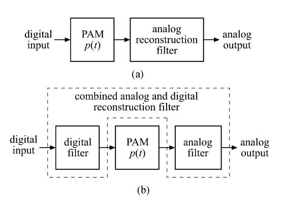
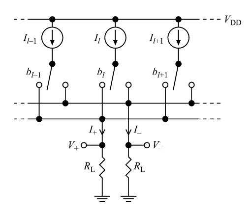
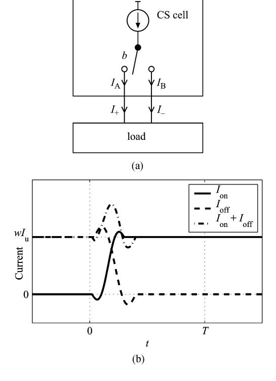
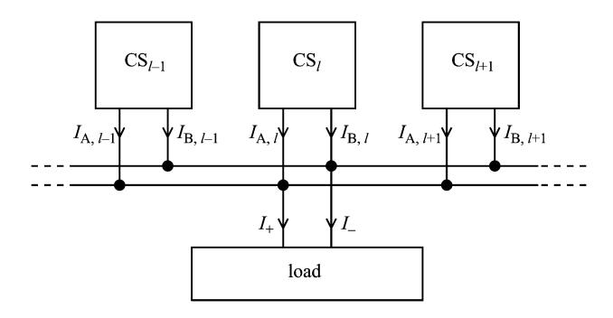
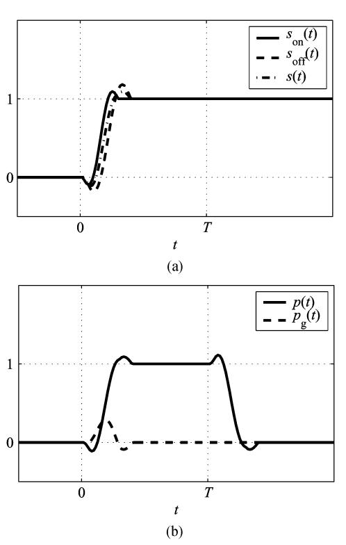
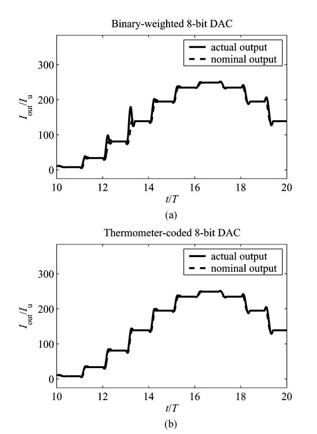
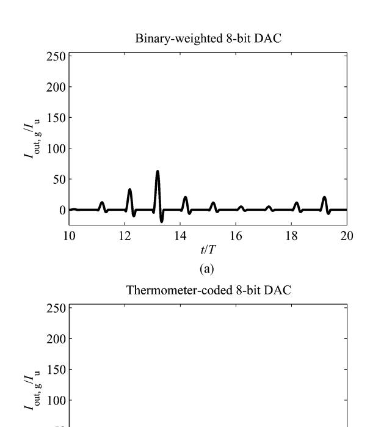
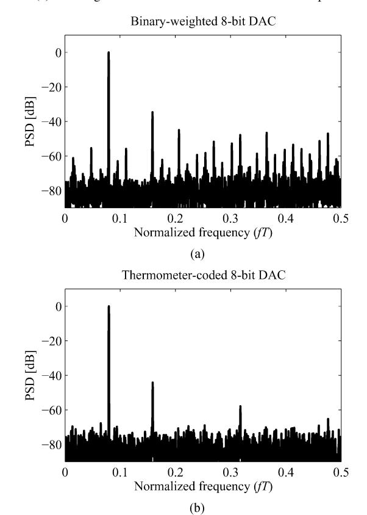
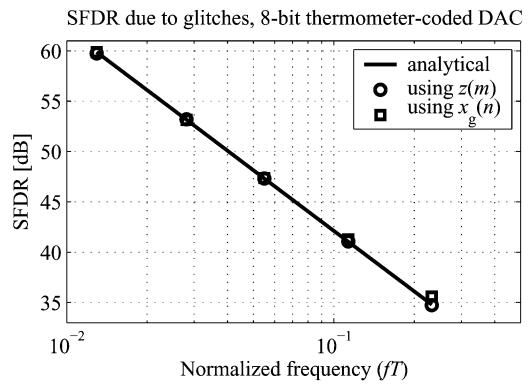

# Modeling of Glitches due to Rise/Fall Asymmetry in Current-Steering Digital-to-Analog Converters

K. Ola Andersson, Student Member, IEEE, and Mark Vesterbacka, Member, IEEE

Abstract—The current-steering digital-to-analog converter (DAC) is the most common type of DAC for high-speed applications. Glitches present in the DAC output contribute to nonlinear distortion in the DAC transfer characteristics degrading the circuit performance. One source of glitches is asymmetry in the settling behavior when switching on and off a current source. A behavioral-level model of this nonideal behavior is derived in this work. Further, a method with low computational complexity for estimating the influence of the modeled errors in the frequency domain is developed. This method can be utilized by circuit designers to derive circuit requirements for fulfilling a given frequency-domain specification, potentially relaxing the requirements compared with a worst-case analysis. Examples of model utilization are given in terms of an analytical examination and MATLAB simulations. A good agreement between simulated and analytical results is obtained.

Index Terms—Circuit simulation, current-mode circuits, data conversion, digital/analog conversion, integrated circuit modeling, mixed analog/digital integrated circuits, modeling, nonlinear distortion.

#### I. INTRODUCTION

LITCHES are present in the output of a current-steering digital-to-analog converter (DAC), e.g., due to skew between individual bits in the control word [1], [2], charge injection from switches [3], and asymmetry in the settling behavior when switching on and off current sources [4]. Glitches are dependent on the input sequence. This signal dependency results in nonlinear distortion [1] that degrades the overall circuit performance

The glitch properties of a DAC are often specified by the area of the glitch at the worst case code transition [4]–[6], which is often the middle code transition. However, specifying the worst-case glitch area does not provide enough information on how the glitches affect the DAC performance, e.g., in the frequency domain which is important in many communication applications [1]. Therefore, behavioral-level models that describe how glitches caused by different types of error sources affect the DAC performance are important. However, such behavioral-level models are rarely presented in the literature. In [2], a statistical analysis of glitches caused by static timing mismatch

Manuscript received August 27, 2004; revised March 10, 2005. This work was supported by the Center for Industrial Information Technology (CENIIT), Linköping University, Sweden. This paper was recommended by Associate Editor B. Maundy.

K. O. Andersson was with the Department of Electrical Engineering, Linköping University, SE-541 83 Linköping, Sweden. He is now with Ström & Gullikson AB, SE-220 07 Lund, Sweden (e-mail: olaa@isy.liu.se).

M. Vesterbacka is with the Department of Electrical Engineering, Linköping University, SE-541 83 Linköping, Sweden.

Digital Object Identifier 10.1109/TCSI.2005.853404

between individual bits in the DAC control word is presented. Different settling behavior when switching on and off current sources, i.e., asymmetry in the rise/fall behavior, also causes glitches. This type of glitch was modeled in [4], where the current wave forms when switching on and off current sources were described by damped sinusoids having different amplitudes and frequencies depending on the type of switching (on or off). In this work, the glitch model presented in [4] is generalized in the sense that the current wave forms when switching on and off current sources are described by arbitrary functions. This generalization enables powerful analyzes, both in the time domain and in the frequency domain.

First, an analysis of a 1-bit DAC is presented in order to illustrate the basic concept. The analysis of the 1-bit DAC is followed by an analysis of a general multi-bit DAC. Further, the developed model is analyzed in the frequency domain and a simple method for estimating the resulting frequency-domain behavior is developed. The method can be utilized by DAC designers to derive requirements on the current source settling behavior to fulfill a given frequency-domain specification through behavioral-level simulations. This approach can potentially be used to relax circuit requirements compared with requirements based on a worst-case analysis.

Some background information and an introduction to the definitions and notation used are given in Section II. The actual modeling is presented in Section III. Some examples on utilization of the developed model and methods are given in Section IV. A short discussion on how the use of a differential output is modeled is given in Section V and the work is concluded in Section VI.

#### II. PRELIMINARIES

In this section, we provide background information and introduce definitions and notation used in this work. In order to enable a mathematical analysis of the developed model, we need to clearly define how we choose to measure and evaluate the resulting glitches. Unfortunately, there is currently no universally accepted and mathematically unambiguous definition of a glitch. We consider one important contribution to the problem, i.e., the error due to rise/fall asymmetry in the current sources. In the following and in consistency with the terminology used in [4], which is the work that this work is based upon, we denote the error resulting from this rise/fall asymmetry a glitch. The derived model could of course be extended to include more effects such as charge feedthrough and capacitive coupling, but this is beyond the scope of the current work.

#### *A. Notation*

The DAC input is denoted , where is the sequence index, and the number of input bits in the DAC is denoted . The input is regarded as a sequence of integers in the interval . The DAC output is denoted , where denotes time. In certain cases where we wish to explicitly show that the output signal is represented with an electrical current, the notation is used for the output. Angular frequency is denoted by and frequency is denoted by .

## *B. Reconstruction*

A common way of mapping the digital input to the analog output, a process referred to as reconstruction, is to use pulseamplitude modulation (PAM). Using PAM, the DAC output is given by

$$y(t) = K \sum_{n = -\infty}^{\infty} x(n)p(t - nT)$$
 (1)

where is a pulse, is a scaling factor, and is the update (or sample) period. Note that (1) describes a linear mapping between and . Due to nonideal circuit behavior, e.g., glitches and unmatched circuit elements, the operation of an actual DAC implementation deviates from the description in (1) and nonlinear distortion occur in the DAC output. Ideal reconstruction is obtained if is a sinc pulse [\[7](#page-9-0)], i.e.,

$$p(t) = \frac{\sin\left(\frac{\pi t}{T}\right)}{\frac{\pi t}{T}} = \operatorname{sinc}\left(\frac{t}{T}\right). \tag{2}$$

The sinc pulse is not practically useful since it has infinite extension in time. Therefore, other pulse shapes with finite extension in time are used in practice. The most commonly used pulse is the square pulse

$$p(t) = \begin{cases} 1, & \text{for } t \in \left[-\frac{T}{2}, \frac{T}{2}\right) \\ 0, & \text{otherwise.} \end{cases}$$
 (3)

When pulses other than the sinc pulse are used, the reconstruction becomes nonideal. Let us consider the case when a square pulse is used. Let and denote the Fourier transforms of reconstructed with sinc and square pulses, respectively. The relation between and is

$$Y_{\text{square}}(\omega) = \operatorname{sinc}\left(\frac{\omega T}{2\pi}\right) \left(\sum_{k=-\infty}^{\infty} Y_{\text{sinc}}\left(\omega - k\frac{2\pi}{T}\right)\right).$$
 (4)

Hence, within the Nyquist band , the output obtained using the square pulse is attenuated with a sinc function, resulting in an approximate 3.9 dB attenuation for close to [\[5](#page-9-0)]. Moreover, spectral images of the ideal spectrum, also attenuated with the sinc function, appear around integer multiples of the sample frequency [\[1](#page-9-0)]. These nonideal properties can, in theory, be compensated for arbitrarily well with a linear filter, often denoted reconstruction filter, connected in cascade with the PAM block as illustrated in Fig. 1(a). Some of the filtering performed by the reconstruction filter, i.e., the compensation for the sinc weighting within the signal band, can be

Fig. 1. Signal reconstruction using PAM in combination with: (a) analog reconstruction filter and (b) combined analog and digital reconstruction filter.

performed by a digital filter connected to the input of the PAM block, as illustrated in Fig. 1(b).

# *C. Nonlinearity Errors*

In practice, it is not possible to implement a block that exactly performs the PAM operation. Nonlinearity errors are usually of special importance since they are more difficult to compensate for than linear errors. We let denote the nominal DAC output obtained from the PAM operation

$$y_{\text{nom}}(t) = K_{\text{nom}} \sum_{n=-\infty}^{\infty} x(n)p(t - nT)$$
 (5)

where is the nominal DAC gain and is the nominal pulse. Further, let denote the actual output. The error in the DAC output is the difference between and . In this work, we do only consider the contribution due to rise/fall asymmetry in the current sources. Following the terminology used in [[4\]](#page-9-0), we denote the resulting error a glitch. Hence, for this particular scenario, we define the glitch signal as

$$y_q(t) = y(t) - y_{\text{nom}}(t). \tag{6}$$

If other error sources are included, e.g., mismatch in current sources, (6) may be used to define a general error signal rather than a glitch signal.

In order for the definition in (6) to make sense, we also have to provide definitions for the nominal gain and the nominal pulse. Choosing the proper nominal pulse shape is not trivial. If the initial intention is to design a DAC with a certain pulse shape (e.g., a square pulse), an intuitive approach is to use that pulse as the nominal pulse. In [\[4](#page-9-0)], a pulse shape expressed with a tanh function was chosen as the nominal pulse. In this paper, we do not use a specific pulse shape. Instead, the following approach is used. A set of reconstruction filters is formed, containing all filters that can be implemented at an acceptable cost. What an acceptable cost is is up to the circuit designer to decide and is not defined here, but can, e.g., be defined in terms of filter order, etc. Further, a set of allowed pulse wave forms is formed. The set contains all pulses that in combination with a reconstruction filter in performs signal reconstruction that only deviates from ideal reconstruction within acceptable bounds. What these acceptable bounds are is also a choice for the circuit designer and is not defined here, but can, e.g., be expressed in terms of rejection of spectral images and maximum attenuation within the

Fig. 2. Ideal differential current-steering DAC.

Nyquist band. In order to decide which element in to choose as , we define the signal energy, , of the continuous-time signal on the interval as

$$E(z(t),\xi) = \int_{t_0}^{t_1} z^2(t)dt. \tag{7}$$

Often, the signal-to-noise ratio (SNR) and the signal-tonoise-and-distortion ratio (SNDR) are two important performance metrics, e.g., in communication applications [\[8](#page-9-0)]. If and are both finite, which is the case if the signals only adopt finite values and have finite extension in time, the SNDR due to glitches is

$$SNDR = \frac{E(y_{nom}(t), \xi)}{E(y_{q}(t), \xi)}.$$
 (8)

If the interval is infinite, the energy may also be infinite and the SNDR has to be defined in terms of power instead of energy. The term glitch energy is sometimes used for the area of the glitch, even if this is not strictly correct [[5\]](#page-9-0). Here, we use the term glitch energy for the signal energy of the glitch signal. We restrict the problem to only include contributions to the nonlinear distortion in the DAC output. This is accomplished by choosing the nominal gain, , and the nominal pulse, from an allowed set of gain factors (e.g., allowed ranges of unit currents or reference voltages, depending on the type of DAC that is used) and the set , respectively, such that the average glitch energy over all time intervals of the type is minimized. This can be seen as a least-squares adaptation of the nominal DAC transfer characteristics.

## *D. Current-Steering DACs*

The DAC architecture considered in this work is the current-steering DAC. An ideal differential current-steering DAC is shown in Fig. 2. It consists of a number of ideal weighted current sources, each controlled by a separate ideal current switch. The current is given by

$$I_l = w_l I_u \tag{9}$$

where is the unit current and is the integer weight of the current source. Usually, a current source with weight is implemented with unit current sources connected in parallel. The switches are controlled with a digital control word. Bit of the control word is denoted . Let denote the value of

during the time interval . The control bits are related to the input sequence according to

$$x(n) = \sum_{l} w_l b_l(n). \tag{10}$$

Further, the output current during the interval is given by

$$I_{+}(t) = \sum_{l} w_{l} I_{u} b_{l}(n) = I_{u} x(n).$$
 (11)

Similarly, the complementary output current is given by

$$I_{-}(t) = \sum_{l} w_{l} I_{u} \overline{b_{l}(n)}$$
 (12)

where denotes the complement of . In this work, the modeling is not developed for any specific encoding scheme. However, two specific examples are used to illustrate the modeling. These are the binary-weighted DAC, for which , and the fully thermometer-coded DAC, for which . A commonly used hybrid between the two architectures is the segmented DAC [\[3](#page-9-0)], [[9\]](#page-9-0), in which some of the most significant bits are encoded into thermometer code.

The ideal current-steering DAC, as it is described in this section, performs PAM with a square pulse [time shifted half a period compared with the square pulse in (3)]. In actual implementations, the current values deviate from the intended due to transistor mismatch [[10\]](#page-9-0), which causes nonlinear distortion. Finite output impedance in the current sources is another source of nonlinear distortion [\[11\]](#page-9-0). These other nonideal DAC properties are not included in the developed model.

## III. MODEL DERIVATION

In this section, we develop the model of glitches caused by rise/fall asymmetry in the current sources. First, a 1-bit DAC is analyzed to illustrate the concept. Then, an analysis of a general multi-bit DAC, which involves a more complex derivation than the 1-bit DAC, is made in a similar way. Further, a simple method for accurately estimating the behavior of the modeled glitches in the frequency domain is developed. For the analyzes presented in this section, we let the set of allowed nominal pulse shapes be the set of all pulse shapes, i.e., no restrictions are set on . The main reason for doing so is to be able to use the nominal pulse shape that corresponds to the global minimum of the glitch energy, which in turn enables an analytical derivation of the nominal pulse shape.

# *A. Analysis of a 1-Bit DAC*

First, the behavior of a 1-bit DAC is analyzed. Assume that, for the current-source-and-switch (CS) cell in Fig. 3(a), the switch is initially connected such that the whole current delivered from the current source is directed toward the positive output terminal. In that situation, and , where is the settled output current from the current source. At time , a switching is initiated, and at time , the system has settled such that and . For the time interval , we allow the two currents and to have arbitrary waveforms with the only boundary condition being that the currents have reached their final values before

Fig. 3. (a) 1-bit current-steering DAC. (b) Output current waveforms during switching.

. For example, the current waveforms may look like the ones in Fig. 3(b), in which case and . In general, the total output current from the current source is not constant during the switching, as indicated in Fig. 3(b). Further, we assume that the CS cell is symmetric in the sense that if the current is instead switched from the negative to the positive output terminal, then and . Also, if no switching takes place, the currents are assumed to remain constant during the whole interval. The system analyzed is assumed to be time invariant and memoryless, i.e., for every such that a switching is initiated at time , the current waveforms are the same during the interval , regardless of the history of the control signal and the value of .

We continue with the analysis of the single-ended output at the positive output terminal, letting denote the output current at that terminal. The result for the negative output terminal is obtained by simply replacing with . We define two functions of time, and with the properties

$$s_{\text{on}}(t) = s_{\text{off}}(t) = \begin{cases} 0, & \text{for } t \le 0\\ 1, & \text{for } t \ge T \end{cases}$$
 (13)

$$I_{\text{on}}(t) = s_{\text{on}}(t)wI_u, \quad \text{for } 0 < t < T$$
(14)

and

$$I_{\text{off}}(t) = (1 - s_{\text{off}}(t))wI_u, \quad \text{for } 0 < t < T.$$
 (15)

If and are equal, the DAC performs a PAM operation with the pulse shape

$$p(t) = s_{\text{on}}(t) - s_{\text{on}}(t - T) = s_{\text{off}}(t) - s_{\text{off}}(t - T).$$
 (16)

Hence, the DAC is linear and no glitches occur. In this work, and are assumed to be unequal. In [\[4](#page-9-0)], the current waveforms during switching on and off a current source were modeled with damped sinusoids with different amplitudes and frequencies depending on the type of switching (on or off). The model developed in [\[4](#page-9-0)] was compared with transistor-level models and a good agreement was observed. The use of unequal and as a source of glitches is merely a generalization of using damped sinusoids with different amplitudes and frequencies and is motivated with the good agreement with transistor-level models observed in [\[4](#page-9-0)].

We define a function , from which the nominal pulse is to be derived. is equal to and for and defines the nominal current waveforms according to

$$I_{\text{on,nom}}(t) = s(t)wI_u \tag{17}$$

$$I_{\text{off,nom}}(t) = (1 - s(t))wI_u. \tag{18}$$

Choosing the proper nominal pulse shape is equivalent to choosing the proper . For a 1-bit DAC, the determination of is straightforward, since half of the switching events involves switching in one direction, and the other half switching in the opposite direction. The average glitch energy is given by

$$E_g = \frac{P_s}{2} \int_0^T (I_{\text{on}} - I_{\text{on,nom}})^2 + (I_{\text{off}} - I_{\text{off,nom}})^2 dt$$
$$= \frac{P_s w^2 I_u^2}{2} \int_0^T \Delta_{\text{on}}^2 + \Delta_{\text{off}}^2 dt$$
$$= \frac{P_s w^2 I_u^2}{2} \int_0^T f(t) dt$$
(19)

where is the probability for a switching event to occur

$$\Delta_{\rm on} = s_{\rm on}(t) - s(t) \tag{20}$$

$$\Delta_{\text{off}} = s_{\text{off}}(t) - s(t). \tag{21}$$

Since the integrand for every , is minimized by minimizing for every . It is readily shown that this is accomplished by choosing

$$s(t) = \frac{s_{\text{on}}(t) + s_{\text{off}}(t)}{2}.$$
 (22)

The resulting glitch currents when switching on and off the current source are

$$I_{\text{on},g}(t) = I_{\text{on}}(t) - I_{\text{on,nom}}(t)$$

$$= wI_u \frac{s_{\text{on}}(t) - s_{\text{off}}(t)}{2}$$
(23)

$$I_{\text{off},g}(t) = I_{\text{off}}(t) - I_{\text{off,nom}}(t)$$

$$= wI_u \frac{s_{\text{on}}(t) - s_{\text{off}}(t)}{2}$$
(24)

respectively. Hence, every time a switching event occurs, the same glitch is present at the DAC output, regardless of the type of switching (on or off).

The nominal DAC output for an arbitrary input sequence is given by

$$I_{\text{out,nom}}(t) = wI_u \sum_{n=-\infty}^{\infty} b(n)p(t - nT)$$
 (25)

Fig. 4. N-bit DAC topology with arbitrary encoding of the control word.

where the nominal pulse is given by

$$p(t) = s(t) - s(t - T).$$
 (26)

The actual output current can be expressed as

$$I_{\text{out}}(t) = I_{\text{out,nom}}(t) + I_{\text{out,}g}(t)$$

$$= wI_u \left( \sum_{n = -\infty}^{\infty} b(n)p(t - nT) + \sum_{n = -\infty}^{\infty} |b(n) - b(n - 1)| + \sum_{n = -\infty}^{\infty} |b(n) - b(n - 1)| + \sum_{n = -\infty}^{\infty} |b(n) - b(n - 1)| + \sum_{n = -\infty}^{\infty} |b(n) - b(n - 1)| + \sum_{n = -\infty}^{\infty} |b(n) - b(n - 1)| + \sum_{n = -\infty}^{\infty} |b(n) - b(n - 1)| + \sum_{n = -\infty}^{\infty} |b(n) - b(n - 1)| + \sum_{n = -\infty}^{\infty} |b(n) - b(n - 1)| + \sum_{n = -\infty}^{\infty} |b(n) - b(n - 1)| + \sum_{n = -\infty}^{\infty} |b(n) - b(n - 1)| + \sum_{n = -\infty}^{\infty} |b(n) - b(n - 1)| + \sum_{n = -\infty}^{\infty} |b(n) - b(n - 1)| + \sum_{n = -\infty}^{\infty} |b(n) - b(n - 1)| + \sum_{n = -\infty}^{\infty} |b(n) - b(n - 1)| + \sum_{n = -\infty}^{\infty} |b(n) - b(n - 1)| + \sum_{n = -\infty}^{\infty} |b(n) - b(n - 1)| + \sum_{n = -\infty}^{\infty} |b(n) - b(n - 1)| + \sum_{n = -\infty}^{\infty} |b(n) - b(n - 1)| + \sum_{n = -\infty}^{\infty} |b(n) - b(n - 1)| + \sum_{n = -\infty}^{\infty} |b(n) - b(n - 1)| + \sum_{n = -\infty}^{\infty} |b(n) - b(n - 1)| + \sum_{n = -\infty}^{\infty} |b(n) - b(n - 1)| + \sum_{n = -\infty}^{\infty} |b(n) - b(n - 1)| + \sum_{n = -\infty}^{\infty} |b(n) - b(n - 1)| + \sum_{n = -\infty}^{\infty} |b(n) - b(n - 1)| + \sum_{n = -\infty}^{\infty} |b(n) - b(n - 1)| + \sum_{n = -\infty}^{\infty} |b(n) - b(n - 1)| + \sum_{n = -\infty}^{\infty} |b(n) - b(n - 1)| + \sum_{n = -\infty}^{\infty} |b(n) - b(n - 1)| + \sum_{n = -\infty}^{\infty} |b(n) - b(n - 1)| + \sum_{n = -\infty}^{\infty} |b(n) - b(n - 1)| + \sum_{n = -\infty}^{\infty} |b(n) - b(n - 1)| + \sum_{n = -\infty}^{\infty} |b(n) - b(n - 1)| + \sum_{n = -\infty}^{\infty} |b(n) - b(n - 1)| + \sum_{n = -\infty}^{\infty} |b(n) - b(n - 1)| + \sum_{n = -\infty}^{\infty} |b(n) - b(n - 1)| + \sum_{n = -\infty}^{\infty} |b(n) - b(n - 1)| + \sum_{n = -\infty}^{\infty} |b(n) - b(n - 1)| + \sum_{n = -\infty}^{\infty} |b(n) - b(n - 1)| + \sum_{n = -\infty}^{\infty} |b(n) - b(n - 1)| + \sum_{n = -\infty}^{\infty} |b(n) - b(n - 1)| + \sum_{n = -\infty}^{\infty} |b(n) - b(n - 1)| + \sum_{n = -\infty}^{\infty} |b(n) - b(n - 1)| + \sum_{n = -\infty}^{\infty} |b(n) - b(n - 1)| + \sum_{n = -\infty}^{\infty} |b(n) - b(n - 1)| + \sum_{n = -\infty}^{\infty} |b(n) - b(n - 1)| + \sum_{n = -\infty}^{\infty} |b(n) - b(n - 1)| + \sum_{n = -\infty}^{\infty} |b(n) - b(n - 1)| + \sum_{n = -\infty}^{\infty} |b(n) - b(n - 1)| + \sum_{n = -\infty}^{\infty} |b(n) - b(n - 1)| + \sum_{n = -\infty}^{\infty} |b(n) - b(n - 1)| + \sum_{n = -\infty}^{\infty} |b(n) - b(n - 1)| + \sum_{n = -\infty}^{\infty} |b(n) - b(n - 1)| + \sum_{n = -\infty}^{\infty} |b(n) - b(n - 1)| + \sum_{n = -\infty}^{\infty} |b(n) - b(n - 1)| + \sum_{n = -\infty}^{\infty} |b(n) - b$$

where

$$I_{\text{out},g}(t) = wI_u \sum_{n=-\infty}^{\infty} |b(n) - b(n-1)| p_g(t-nT)$$
 (28)

is the overall glitch current and

$$p_g(t) = \frac{s_{\text{on}}(t) - s_{\text{off}}(t)}{2}.$$
 (29)

The expression appearing in (28) is used to detect whether or not a switching event occurs at .

### *B. Analysis of a Multi-Bit DAC*

We now extend the analysis to an -bit DAC with arbitrary encoding of the control word. The topology analyzed is shown in Fig. 4. It consists of a number of CS cells. For the present analysis, we assume that the output currents for each individual CS cell are independent on the states of the other CS cells. This is of course an approximation, since in an actual implementation, on-chip cross talk causes the currents to be dependent on switching actions taking place in surrounding cells.

Each CS cell has an associated weight and an associated control bit . During an internal switching event initiated at in , either

$$\begin{cases}
I_{A,l}(t) = w_l I_u(1 - s_{\text{off}}(t)) \\
I_{B,l}(t) = w_l I_u s_{\text{on}}(t)
\end{cases}$$
(30)

or

$$\begin{cases}
I_{A,l}(t) = w_l I_u s_{\text{on}}(t) \\
I_{B,l}(t) = w_l I_u (1 - s_{\text{off}}(t))
\end{cases}$$
(31)

depending on the type of switching. The functions and have the properties given in (13). Further, we assume that all CS cells have identical and .

As in the analysis of the 1-bit DAC, we analyze the behavior of the positive output terminal, letting denote the output current at that terminal. For an arbitrary input sequence, we can express the resulting output current during the interval as

$$I_{\text{out}}(t) = I_u \left( x(n-1) + \sum_{l \in \mathcal{L}_{\text{on}}} w_l s_{\text{on}}(t - nT) - \sum_{l \in \mathcal{L}_{\text{off}}} w_l s_{\text{off}}(t - nT) \right)$$
(32)

where

$$\mathcal{L}_{\text{on}} = \{l : b_l(n) - b_l(n-1) = 1\}$$
(33)

$$\mathcal{L}_{\text{off}} = \{l : b_l(n) - b_l(n-1) = -1\}. \tag{34}$$

Further, the nominal output current for the same interval is

$$I_{\text{out,nom}}(t) = I_u \left( x(n-1) + \left( \sum_{l \in \mathcal{L}_{\text{off}}} w_l - \sum_{l \in \mathcal{L}_{\text{off}}} w_l \right) s(t-nT) \right)$$
(35)

where is a function that describes the nominal switching behavior of the DAC. The choice of is not as straightforward as for the 1-bit DAC and involves assumptions on the statistics of the input sequence.

To simplify the notation, we consider the case and, hence, the time interval . The glitch current is

$$I_{\text{out},g}(t) = I_{\text{out}}(t) - I_{\text{out,nom}}(t)$$

$$= I_u \left( \sum_{l \in \mathcal{L}_{\text{on}}} w_l(s_{\text{on}}(t) - s(t)) - \sum_{l \in \mathcal{L}_{\text{off}}} w_l(s_{\text{off}}(t) - s(t)) \right). \tag{36}$$

As for the 1-bit DAC, should be chosen to minimize the average glitch energy per switching event. Let denote the event characterized by and . Further, let denote the (finite) set of all possible . To each , there are associated sets and as defined in (33) and (34). The average glitch energy is given by

$$E_g = \sum_{a \in A} P(a) \int_0^T \left( I_{\text{out},g}^a(t) \right)^2 dt \tag{37}$$

where

$$I_{\text{out},g}^{a}(t) = I_{u} \left( \sum_{l \in \mathcal{L}_{\text{on},a}} w_{l}(s_{\text{on}}(t) - s(t)) - \sum_{l \in \mathcal{L}_{\text{off}}} w_{l}(s_{\text{off}}(t) - s(t)) \right)$$
(38)

and is the probability for the event to occur. If is such that , then , so events of this type give zero contribution to regardless of the choice of . We combine the events in for which into pairs of events for which

$$\begin{cases} x_0^a = x_{-1}^b \\ x_{-1}^a = x_0^b. \end{cases}$$
 (39)

The pairs and are considered identical and the set of all pairs is denoted . We can now rewrite (37) as

$$E_{g} = \sum_{(a,b)\in\mathcal{AB}} E_{g}^{(a,b)}$$

$$= \sum_{(a,b)\in\mathcal{AB}} \int_{0}^{T} \left[ P(a) \left( I_{\text{out},g}^{a}(t) \right)^{2} + P(b) \left( I_{\text{out},g}^{b}(t) \right)^{2} \right] dt$$
(40)

In order to derive the proper , we have to make an assumption regarding the statistical properties of the input sequence. The assumption is that

$$P(a) = P(b)$$
 for every  $(a, b) \in \mathcal{AB}$  (41)

i.e., the transition from to occurs on the average as often as the reverse transition. We define the numbers and to be the total number of unit current sources that are switched on and off during the event , respectively. The numbers and are given by

$$n_{\rm on}^a = \sum_{l \in C} w_l \tag{42}$$

$$n_{\text{off}}^{a} = \sum_{l \in \mathcal{L}_{\text{off},a}} w_{l} \tag{43}$$

respectively. It is easily realized that and for any given pair . A given term in (40) is minimized by minimizing

$$e_g^{(a,b)} = \frac{E_g^{(a,b)}}{I_u^2 P(a)} = \int_0^T f(t)dt$$
 (44)

where

$$f(t) = (n_{\text{on}}^a \Delta_{\text{on}} - n_{\text{off}}^a \Delta_{\text{off}})^2 + (n_{\text{off}}^a \Delta_{\text{on}} - n_{\text{on}}^a \Delta_{\text{off}})^2$$

$$(45)$$

$$\Delta_{\rm on} = s_{\rm on}(t) - s(t) \tag{46}$$

$$\Delta_{\text{off}} = s_{\text{off}}(t) - s(t). \tag{47}$$

Since the integrand for every , is minimized by minimizing for every . This is accomplished by choosing

$$s(t) = \frac{s_{\text{on}}(t) + s_{\text{off}}(t)}{2}.$$
 (48)

Since this choice of minimizes each term in (40) separately, it also minimizes . Hence, assuming that for every results in the same as for the 1-bit DAC and, therefore, the same nominal pulse .

Inserting (48) into (36) yields the glitch current

$$I_{\text{out},g}(t) = I_u \sum_{l \in \mathcal{L}_{\text{on}} \cup \mathcal{L}_{\text{off}}} w_l \frac{s_{\text{on}}(t) - s_{\text{off}}(t)}{2}$$
$$= I_u p_g(t) n_{\text{tot}}$$
(49)

where

$$p_g(t) = \frac{s_{\text{on}}(t) - s_{\text{off}}(t)}{2} \tag{50}$$

$$n_{\text{tot}} = \sum_{l \in \mathcal{L}_{\text{on}} \cup \mathcal{L}_{\text{off}}} w_l. \tag{51}$$

The number is the total number of unit current sources that is subject to a switching operation. For an arbitrary input sequence , the nominal and actual DAC outputs can be expressed as

$$I_{\text{out,nom}}(t) = I_u \sum_{n = -\infty}^{\infty} x(n)p(t - nT)$$
 (52)

and

$$I_{\text{out}}(t) = I_{\text{out},\text{nom}}(t) + I_{\text{out},g}(t)$$

$$= I_u \left( \sum_{n=-\infty}^{\infty} x(n) p(t - nT) + \sum_{n=-\infty}^{\infty} g(n) p_g(t - nT) \right)$$
(53)

respectively, where

$$g(n) = \sum_{l} |b_{l}(n) - b_{l}(n-1)| w_{l}$$
 (54)

is the total number of switched unit current sources in the transition from to at the DAC input and is dependent on the encoding strategy (e.g., degree of segmentation). In order to have small glitches, it is desirable to have small values of . Hence, can be used as a high-level performance metric for comparing different encoding strategies.

# *C. Analysis in the Frequency Domain*

So far, the modeling has been performed in the time domain. In, e.g., communication applications, the frequency domain properties are often more relevant [\[1](#page-9-0)]. An analysis on how the modeled glitches affect the frequency-domain properties of the DAC is presented in this section. For simplified notation, we normalize the output with respect to the unit current to obtain the output

$$y(t) = \sum_{n=-\infty}^{\infty} x(n)p(t-nT) + g(n)p_g(t-nT).$$
 (55)

The spectrum (Fourier transform) of the output is

$$Y(\omega) = X(e^{j\omega T})P(\omega) + G(e^{j\omega T})P_g(\omega)$$
 (56)

where and are the Fourier transforms of and , respectively, and

$$X(e^{j\omega T}) = \sum_{n=-\infty}^{\infty} x(n)e^{-j\omega T}$$
 (57)

$$G(e^{j\omega T}) = \sum_{n=-\infty}^{\infty} g(n)e^{-j\omega T}$$
 (58)

are the (discrete-time) Fourier transforms of and , respectively.

From this point, we restrict the analysis to the Nyquist band . In accordance with the commonly used concept of input-referred noise, we introduce the concept of input-referred glitches. The input-referred glitch spectrum is defined as

$$G_{\rm ir}(e^{j\omega T}) = \frac{P_g(\omega)}{P(\omega)}G(e^{j\omega T}). \tag{59}$$

It is readily verified that within the Nyquist band

$$Y(\omega) = P(\omega) \left( X(e^{j\omega T}) + G_{ir}(e^{j\omega T}) \right)$$
 (60)

i.e., the input-referred glitch is a signal in the discrete-time input domain that applied to the input of the nominal PAM block results in the same spectrum as the glitch signal within the Nyquist band.

In order to make the concept of input-referred glitches practically useful, we continue the analysis with a few approximations. If is close to a square pulse, then

$$|P(\omega)| \approx \left| T \operatorname{sinc}\left(\frac{\omega T}{2\pi}\right) \right|.$$
 (61)

If the DAC is oversampled, i.e., the signal bandwidth is significantly smaller than half the sampling frequency, then

$$|P(\omega)| \approx |P(0)| \text{ for } \omega \in (-2\pi f_0, 2\pi f_0)$$
 (62)

where is the signal band. We assume that a similar approximation is valid for , i.e.,

$$|P_q(\omega)| \approx |P_q(0)| \text{ for } \omega \in (-2\pi f_0, 2\pi f_0).$$
 (63)

This is a valid approximation, e.g., if is a short square or triangular pulse or has a shape that resembles one of these. Provided that the two approximations in (62) and (63) are valid, can be approximated with

$$\left| G_{\rm ir}(e^{j\omega T}) \right| \approx \frac{\left| P_g(0) \right|}{\left| P(0) \right|} \left| G(e^{j\omega T}) \right|. \tag{64}$$

For a finite-length input sequence, we can make an approximate analysis of the spectral distribution of the glitch energy by considering the squared absolute value of the discrete Fourier transform (DFT) of the input-referred glitch sequence, which we define as

$$g_{\rm ir}(n) = \frac{|P_g(0)|}{|P(0)|}g(n) \tag{65}$$

and compare this with the squared absolute value of the DFT of the input sequence in order to obtain SNR values for different frequency bands, etc. Note that is not the inverse transform of , but only an approximation.

A more accurate approach is to form a sampled version of the output

$$z(m) = y(mT_1) \tag{66}$$

where in order to reduce aliasing effects [\[5](#page-9-0)], and analyze the DFT of . This approach has a higher computational cost than the previous, since it requires more samples. Both methods are used and compared in Section IV.

## *D. Modeling Summary and Comments*

In this section, we provide a summary of the modeling and give a few comments regarding its use. The purpose of the summary is to simplify the understanding of the modeling results before proceeding with the examples presented in Section IV.

The switching on and off of current sources was characterized by two functions, and . The glitches modeled in this work occur due to that and are assumed not to be equal. This assumption is motivated with the work presented in [\[4](#page-9-0)], where it was shown that the switching on and off of current sources could be accurately modeled with damped sinusoids having different amplitudes and frequencies depending on the type of switching. The modeling presented here is a generalization of the modeling presented in [[4\]](#page-9-0) that enables a powerful analysis both in the time domain and the frequency domain.

The nominal DAC output was characterized by the nominal switching function , which was chosen as the average of and in order to minimize the resulting glitch energy. The resulting nominal pulse is . Choosing a nominal pulse that does not minimize the glitch energy results in a glitch current on the form

$$I_{\text{out},g}(t) = K \left( \sum_{n=-\infty}^{\infty} x(n) p_{g,\text{linear}}(t - nT) + \sum_{n=-\infty}^{\infty} g(n) p_{g}(t - nT) \right)$$
(67)

where the first part is a linear function of the input sequence that does not contribute with any nonlinear distortion and can be compensated for using a linear filter.

An important result that can be extracted from the modeling is that the magnitude and the area of the glitch associated with the transition from to is proportional to the total number of switched unit current sources . This has been stated previously by others (see, e.g., [[3\]](#page-9-0), [\[6](#page-9-0)]), but only motivated with intuitive argumentation.

The model was further analyzed and a simple method for estimating the influence in the frequency domain was developed. Themethodutilizestheconceptofinput-referredglitchsequence, which is introduced in this work. In many cases, the glitch specification of a DAC is given in terms of the worst-case glitch area [\[4](#page-9-0)]–[\[6](#page-9-0)]. Worst case analyses have a tendency of resulting in unnecessarily hard circuit requirements. Applying the simple frequency-domain analysis on signals that are typical for a given applicationallowsthedesignertoinsteadusebehavioral-levelsimulations in discrete time to obtain requirements on . Theserequirementscanbeusedasdesigntargetsonlowerabstraction levels in the design of current sources, switches, and switch drivers. Note that can be calculated with

$$|P(0)| = \left| \int_{-\infty}^{\infty} p(t)dt \right| \tag{68}$$

and similarly for

$$|P_g(0)| = \left| \int_{-\infty}^{\infty} p_g(t)dt \right|. \tag{69}$$

Inthederivationforthemulti-bitcase,itisstatedthatiftheinput is constant during two consecutive samples, no switching and, hence, no glitches occur. This assumes a static mapping between the digital input and the control word. In a DAC utilizing dynamic element matching (DEM) [\[12](#page-9-0)], redundancy in the control word is exploited by random selection of different representations of the same input value in order to reduce nonlinear distortion arising from current source mismatch. In a DEM DAC, switching can occur evenif the inputis constant.Even ifthe properties ofa DEM DAC do not conform with the assumptions used in the derivation, the results given in (52)–(54) are valid also for a DEM DAC.

The rise/fall asymmetry is not the only existing source of glitches. Due to mismatch in parasitic load capacitances and driving capabilities between different signal paths in, e.g., the clock distribution network of the digital part, there will be a static timing mismatch between different bits in the control word which is another source of glitches. This type of error has a stochastic component, i.e., it varies from chip to chip, and is strongly layout dependent. A statistical analysis of timing errors caused by mismatch in DACs is given in [\[2\]](#page-9-0). Glitches may also be caused by cross talk from the digital parts of the DAC. These glitches are also strongly layout dependent and have to be addressed at the layout level. Note that properties such as the signal dependency for glitches caused by other sources might differ considerably from the corresponding properties of the derived model. In order to obtain an accurate general glitch model, it is of course required that models of all relevant glitch sources are combined into one model. This is, however, beyond the scope of the present work.

#### IV. EXAMPLES

A few examples on application of the developed model are given in this section. An analytical examination of the properties of a fully thermometer-coded DAC is presented, followed by simulation examples on one binary-weighted and one thermometer-coded DAC.

# *A. Analysis of the Thermometer-Coded DAC*

In this section, we analyze the behavior of a fully thermometercodedDACwith respect toglitchescausedbyrise/fallasymmetry using the developed model and methods. In the following, we neglect the fact that the input is quantized in order to simplify the analysis. For a fully thermometer-coded DAC, the number of switched unit current sources is given by

$$g(n) = |x(n) - x(n-1)|. (70)$$

For a sinusoidal input

$$x(n) = x_{\rm dc} + x_a \cos(\omega nT) \tag{71}$$

we make a first-order approximation

$$x(n-1) \approx x(n) + (-1)x_a \frac{\partial}{\partial n} \cos(\omega nT)$$
  
=  $x(n) + x_a \omega T \sin(\omega nT)$  (72)

resulting in

$$g(n) \approx x_a \omega T |\sin(\omega n T)|.$$
 (73)

A Fourier series expansion of (73) yields

$$g(n) \approx \frac{2x_a \omega T}{\pi} + \frac{4x_a \omega T}{\pi} \sum_{k=1}^{\infty} \frac{1}{4k^2 - 1} \cos(2k\omega nT). \quad (74)$$

Hence, even-order distortion appears in the output. The spurious-free dynamic range (SFDR) is a linearity measure defined as the power ratio between the fundamental tone and the largest spurious tone. The largest spurious tone in this case is the second

Fig. 5. Waveforms used in the simulations. The functions s (t), s (t), and s(t) are plotted in (a), whereas the resulting pulses p(t) and p (t) are plotted in (b).

harmonic (corresponding to the term with in (74)). The SFDR is in linear scale given by

$$SFDR_{lin} = \frac{x_a^2}{\left(\frac{|P_g(0)|}{|P(0)|} \frac{4x_a\omega T}{3\pi}\right)^2} = \left(\frac{3\pi |P(0)|}{4\omega T |P_g(0)|}\right)^2$$
(75)

and in logarithmic scale

$$SFDR_{log} = 20 \log_{10} \left( \frac{3\pi |P(0)|}{4T|P_{a}(0)|} \right) - 20 \log_{10}(\omega) \, dB. \quad (76)$$

Hence, the SFDR decreases 20 dB/dec with increasing signal frequency. Since is roughly proportional to [see, e.g., (61)], the factor that appears in (75) and (76) is approximately constant. Therefore, the sampling period has only a small influence on the SFDR, even though may seem from (75) and (76) that has a large influence on the SFDR.

## *B. Simulation Examples*

Some examples of simulations performed in MATLAB, intended to illustrate the application of the developed model, are presented in this section. The functions and used in the simulations are plotted together with the resulting in Fig. 5(a). In the transition region, and are described by one period of a sine wave superpositioned onto a straight line. The resulting pulses and are plotted in Fig. 5(b).

Two different 8-bit DACs are considered in the simulations, one binary-weighted DAC and one fully thermometer-coded DAC. A sinusoidal input sequence

$$x(n) = \frac{2^8 - 1}{2} (1 + \sin(2\pi f T n))$$
$$= \frac{2^8 - 1}{2} (1 + \sin(2\pi f_N n)) \tag{77}$$

Fig. 6. Transient responses for 8-bit DACs. The output from a binary-weighted DAC is plotted in (a) and the output from a thermometer-coded DAC is plotted in (b).

is used, where is the normalized signal frequency. The output waveforms for the binary-weighted and the thermometer-coded DACs are plotted in Fig. 6(a) and (b), respectively, for . Large deviations from the nominal output, i.e., glitches, are present in the output from the binaryweighted DAC. The glitches for the thermometer-coded DAC are considerably smaller. Hence, using a thermometer-coded architecture efficiently limits the impact of rise/fall asymmetry in the current sources. The glitch currents for the binary-weighted and the thermometer-coded DACs are plotted in Fig. 7(a) and (b), respectively.

In order to estimate the frequency-domain behavior, we create the sequence

$$x_q(n) = x(n) + g_{ir}(n) \tag{78}$$

where is defined in (65). For the waveforms used in the simulations,

$$\frac{|P_g(0)|}{|P(0)|} \approx 0.030. \tag{79}$$

The magnitude of the DFT of for the binary-weighted DAC is plotted in dB scale in Fig. 8(a). The corresponding plot for the thermometer-coded DAC is shown in Fig. 8(b). The signal spectra shown in Fig. 8 have been normalized with respect to the power of the fundamental tone.

Simulations were also performed using the more accurate method utilizing setting . The

Fig. 7. Glitches for 8-bit DACs. The glitches for a binary-weighted DAC are plotted in (a) and the glitches for a thermometer-coded DAC are plotted in (b).

Fig. 8. Magnitude of the DFT of x (n) for (a) a binary-weighted and (b) thermometer-coded DAC.

resulting spectra are almost identical to those plotted in Fig. 8. This indicates that the simple method of calculating the DFT

Fig. 9. Simulated and calculated values of SFDR plotted as functions of normalized frequency for a thermometer-coded 8-bit DAC.

of gives a good estimation of the amplitudes of the spurious tones, at least for the waveforms used in these examples, even though the corresponding phases might be incorrectly estimated.

The SFDR values for the thermometer-coded DAC estimated from the simulations are plotted as a function of in Fig. 9, together with the theoretical values given by (76). Good agreement is observed between the different methods.

In [3], it is argued that glitches do not contribute to nonlinear distortion in a fully thermometer-coded DAC. The underlying assumption implied in the discussion given in [3] is that the rise/fall behavior of the current sources is symmetric. In practice, it is not possible to design a current source with perfectly symmetric rise/fall behavior which, according to the analysis presented in this work, results in nonlinear distortion. In order to reduce the nonlinearities, the current sources should be designed to have as symmetric rise/fall behavior as possible, which is equivalent to keeping the ratio as small as possible.

## V. GLITCHES IN THE DIFFERENTIAL OUTPUT

Since the number of switched unit current sources, , is the same for both the positive and the negative output, it is easily realized that the glitches modeled in this work are identical in the positive and negative outputs. Hence, these glitches constitute a common-mode error that cancels perfectly in the differential output if the two outputs are perfectly matched. However, in practice there is always a small mismatch between the two outputs, e.g., due to mismatch between the load resistors. Moreover, intermodulation in subsequent stages (e.g., filters or buffers) between the fundamental tone and the spurious tones in the two single-ended outputs may cause errors that do not cancel in the differential output. Therefore, it is desirable to keep the glitch errors small in the single-ended outputs, even if they cancel for perfectly matched differential signal paths.

The differential output is given by

$$I_{\text{out,diff}}(t) = 2I_u \left( \sum_{n=-\infty}^{\infty} x(n)p(t-nT) \right) - 2I_u \frac{2^N - 1}{2}$$
(80)

where

$$p(t) = s(t) - s(t - T)$$
(81)

$$s(t) = \frac{s_{\text{on}}(t) + s_{\text{off}}(t)}{2}.$$
(82)

Hence, the differential output may be described with a PAM operation using the same pulse as for the nominal output in the single-ended case.

#### VI. CONCLUSION

A model of glitches in current-steering DACs was developed. The model was based on asymmetry in the settling behavior when switching on and off a current source and is a generalization of a model presented earlier. The nominal transfer characteristics of the DAC was chosen to minimize the resulting glitch energy in order to only incorporate errors resulting in nonlinear distortion.

The developed model was analyzed and a simple method for estimating the influence of glitches due to rise/fall asymmetry in the frequency domain was developed. The method utilizes the concept of input-referred glitches and has a potential of relaxing circuit requirements through avoidance of a worst-case glitch analysis.

The model is restricted to glitches caused by rise/fall asymmetry in the current sources. Glitches caused by other sources might have considerably different properties, e.g., in terms of signal dependency. For example, glitches caused by static timing mismatch between individual bits of the control word are not incorporated. This type of error is strongly layout dependent and to some extent stochastic in nature. Therefore, it is difficult to incorporate in a model on a behavioral level. Naturally, to obtain an accurate general glitch model, it is required that models of all relevant glitch sources are included.

A few examples involving an analytical examination of a thermometer-coded DAC and simulations on binary-weighted and thermometer-coded DACs were presented to illustrate the use of the model. A good agreement between analytical and simulated results was obtained.

# REFERENCES

- [1] P. Hendricks, "Specifying communication DACs," *IEEE Spectr.*, vol. 34, no. 7, pp. 58–69, Jul. 1997.
- [2] K. Doris, A. van Roermund, and D. Leenaerts, "Mismatch-based timing errors in current steering DACs," in *Proc. IEEE Int. Symp.Circuits and Systems*, vol. 1, Bangkok, Thailand, 2003, pp. 977–980.
- [3] C.-H. Lin and K. Bult, "A 10-b 500-Msample/s CMOS DAC in 0.6 mm ," *IEEE J. Solid-State Circuits*, vol. 33, no. 12, pp. 1948–1958, Dec. 1998.
- [4] J. Vandenbussche, G. V. der Plas, G. Gielen, and W. Sansen, "Behavioral model of reusable D/A converters," *IEEE Trans. Circuits Syst. II, Analog. Digit. Signal Process.*, vol. 46, no. 10, pp. 1323–1326, Oct. 1999.
- [5] Fundamentals of Sampled Data Systems. Analog Devices, Inc., Norwood, MA, USA. [Online]. Available: http://www.analog.com
- [6] R. Neff, "Automatic synthesis of CMOS digital/analog converters," Ph.D. dissertation, Univ. of California, Berkely, 1995.
- [7] C. Shannon, "Communication in the presence of noise," *Proc. IRE*, vol. 37, pp. 10–21, Jan. 1949.
- [8] , "A mathematical theory of communication," *Bell Syst. Tech. J.*, vol. 27, pp. 379–423–623–656, 1948.
- [9] J. Schoeff, "An inherently monotonic 12 bit DAC," *IEEE J. Solid-State Circuits*, vol. SC-14, no. 6, pp. 904–911, Dec. 1979.
- [10] M. Pelgrom, A. Duinmaijer, and A. Welbers, "Matching properties of MOS transistors," *IEEE J. Solid-State Circuits*, vol. 24, no. 5, pp. 1433–1440, Oct. 1989.
- [11] A. V. den Bosch, M. Borremans, M. Steyaert, and W. Sansen, "A 10-bit 1-Gsample/s Nyquist current-steering CMOS D/A converter," *IEEE J. Solid-State Circuits*, vol. 36, no. 3, pp. 315–324, Mar. 2001.
- [12] L. Carley, "A noise-shaping coder topology for 15+ bit converters," *IEEE J. Solid-State Circuits*, vol. 24, no. 2, pp. 267–273, Apr. 1989.

**K. Ola Andersson** was born in Lindesberg, Sweden, in 1976. He received the M.Sc. degree in applied physics and electrical engineering and the Lic.Eng. degree in electronics systems, and the Ph.D. degree from Linköping University, Linköping, Sweden, in 2000, 2002, and 2005, respectively.

His research interests as a graduate student included modeling and implementation of digital-to-analog converters for telecommunication applications. Between December 1999 and January 2002, he worked as a Research Engineer at Ericsson

Microelectronics AB, Linköping, Sweden, with similar issues. He is currently working with intellectual property related issues specifically targeting the areas of electronics and signal processing at Ström & Gullikson AB, Lund, Sweden

**Mark Vesterbacka** received the M.Sc. degree in applied physics and electrical engineering, the Lic.Eng. degree in applied electronics, and the Ph.D. degree in electronics systems from Linköping University, Linköping, Sweden, in 1991, 1995, and 1997, respectively.

From 1997, he held faculty positions at Linköping University where he was appointed professor of electronics systems in 2002. He is concerned with the design of mixed-signal systems, targeting communication systems in particular.