# A New Method for Determining the FET Small-Signal Equivalent Circuit

GILLES DAMBRINE, ALAIN CAPPY, FRÉDÉRIC HELIODORE, AND EDOUARD PLAYEZ

Abstract —A new method to determine the small-signal equivalent circuit of FET's is proposed. This method consists in a direct determination of both the extrinsic and intrinsic small-signal parameters in a low-frequency band. This method is fast and accurate, and the determined equivalent circuit fits the S-parameters very well up to 26.5 GHz.

#### I. Introduction

NOWLEDGE of the small-circuit equivalent circuit of a field effect transistor is very useful for the device performance analysis (gain, noise, etc.) in designing of microwave circuits and characterizing the device technological process. Usually, the small-signal equivalent circuit is obtained by optimizing the component values to closely fit the small-signal microwave scattering parameters measured on the device. However, this equivalent circuit determination has several drawbacks:

- (i) Accurate broad-band S-parameter measurement is required.
- (ii) For small differences in the error function, the optimum element values can vary depending upon the optimization method and the starting values.
- (iii) To have a physical significance, the equivalent circuit requires a preliminary determination of certain parameters (gate resistance or inductances, for example).

In order to overcome these difficulties we have chosen to develop a new method to determine the FET small-signal equivalent circuit. This method consists in a direct, fast, and accurate measurement of the different elements performed at relatively low frequency. Although this method was developed in our laboratory for chip devices in a test fixture, it is very well suited for wafer-probing systems, and the first results obtained using such probes are very promising. Therefore, a large amount of data directly connected with the design or the process of FET's can be obtained without any very high frequency measurements or important computational effort. The aim of this paper is to describe this novel method. In Section II, the theoretical basis as well as a description of the different steps required to determine the equivalent circuit elements is presented. In Section III, a measurement technique of the extrinsic elements (series resistances and inductances, parasitic capacitances) is proposed. The experimental results are

Manuscript received July 27, 1987; revised January 29, 1988. The authors are with the Centre Hyperfrequences et Semiconducteurs, U.A. 287 CNRS, Universite des Sciences et Techniques de Lille Flandres Artois, 59655 Villeneuve d'Ascq Cedex, France.

IEEE Log Number 8821216.

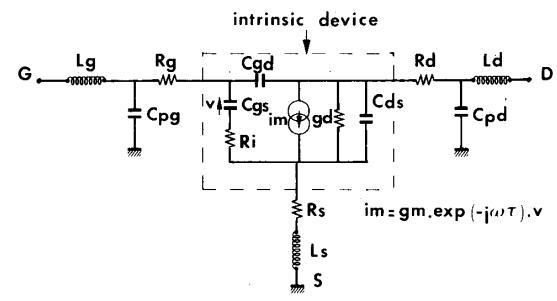

Fig. 1. Small-signal equivalent circuit of a field effect transistor.

described in Section IV. First, the text fixture performances are presented. The evolution of the equivalent circuit elements versus  $V_{gs}$  and  $V_{ds}$  are then shown. In order to check the validity of our method, a comparison between the measured S parameters and the S parameters calculated from the equivalent circuit is carried out. Quite good agreement between theoretical and experimental S parameters, proving the validity of our approach, is pointed out

### II. THEORETICAL ANALYSIS

The conventional small-signal equivalent circuit of a field effect transistor is shown in Fig. 1. Basically, this equivalent circuit can be divided into two parts:

- (i) the *intrinsic* elements  $g_m, g_d, C_{gs}, C_{gd}$  (which includes, in fact, the drain-gate parasitic),  $C_{ds}, R_i$ , and  $\tau$ , which are functions of the biasing conditions:
- (ii) the extrinsic elements  $L_g$ ,  $R_g$ ,  $C_{pg}$ ,  $L_s$ ,  $R_s$ ,  $R_d$ ,  $C_{pd}$ , and  $L_d$ , which are independent of the biasing conditions.

Since the intrinsic device exhibits a PI topology, it is convenient to use the admittance (Y) parameters to characterize its electrical properties. These parameters are [1]

$$y_{11} = \frac{R_i C_{gs}^2 \omega^2}{D} + j\omega \left(\frac{C_{gs}}{D} + C_{gd}\right)$$
 (1)

$$y_{12} = -j\omega C_{gd} \tag{2}$$

$$y_{21} = \frac{g_m \exp(-j\omega\tau)}{1 + jR_i C_{gs}\omega} - j\omega C_{gd}$$
 (3)

$$y_{22} = g_d + j\omega (C_{ds} + C_{gd})$$
 (4)

with  $D = 1 + \omega^2 C_{es}^2 R_i^2$ .

0018-9480/88/0700-1151\$01.00 ©1988 IEEE

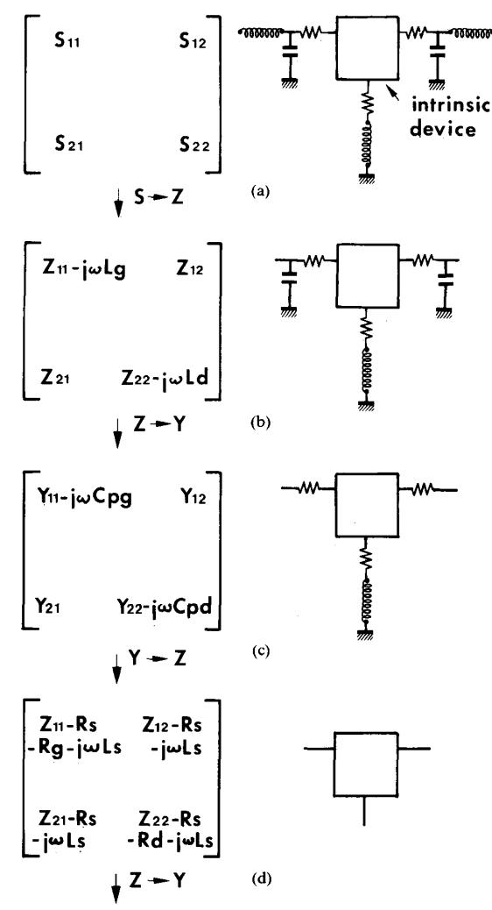

Fig. 2. Method for extracting the device intrinsic Y matrix.

For a typical low-noise device, the term  $\omega^2 C_s^2 R_i^2$  is less than 0.01 at low frequency (F < 5 GHz) and D = 1 constitutes a good approximation. In addition, assuming  $\omega \tau \ll 1$ , we have

$$y_{11} = R_i C_{gs}^2 \omega^2 + j\omega (C_{gs} + C_{gd})$$
 (5)

$$y_{12} = -j\omega C_{gd} \tag{6}$$

$$y_{21} = g_m - j\omega \left( C_{sd} + g_m (R_i C_{ss} + \tau) \right) \tag{7}$$

$$y_{22} = g_d + j\omega (C_{ds} + C_{gd}).$$
 (8)

Expressions (5)–(8) show that the intrinsic small-signal elements can be deduced from the Y parameters as follows:  $C_{gd}$  from  $y_{12}$ ,  $C_{gs}$  and  $R_i$  from  $y_{11}$ ,  $g_m$  and  $\tau$  from  $y_{21}$ , and, lastly, gd and  $C_{ds}$  from  $y_{22}$ . Therefore, the problem is to determine the Y matrix of the intrinsic device from experimental data. Assuming that all the extrinsic elements are known, this can be carried out using

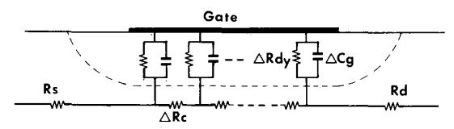

Fig. 3. Sketch of the distributed RC network under the gate yielding equations (15), (16), and (17).

the following procedure (Fig. 2):

- a) measurement of the S parameters of the extrinsic device;
- b) transformation of the S parameters to impedance (Z) parameters and subtraction of  $L_g$  and  $L_d$  that are series elements;
- c) transformation of Z to Y parameters and subtraction of  $C_{pg}$  and  $C_{pd}$  that are in parallel;
- d) transformation of Y to Z parameters and subtraction of  $R_g$ ,  $R_s$ ,  $L_s$ ,  $R_d$  that are in series;
- e) transformation of Z to Y parameters that correspond to the desired matrix.

Therefore, the determination of the intrinsic admittance matrix can be carried out using some simple matrix manipulations if the different extrinsic elements are known. The measurement technique of these elements constitutes a key point of our method and it will then be described now.

# III. MEASUREMENT OF THE EQUIVALENT CIRCUIT EXTRINSIC ELEMENTS

# A. Determination of the Parasitic Resistances and Inductances

As Diamant and Laviron have suggested, the S-parameter measurements at zero drain bias voltage can be used for the evaluation of device parasitics because the equivalent circuit is much simpler [2]. Curtice and Camisa [9] have used this biasing condition to optimize the device parasitics using the program SUPER-COMPACT. An alternative approach is proposed in this work where all the parasitics are directly deduced from measurements performed at  $V_{ds} = 0$ . For this purpose, Fig. 3 shows the distributed RC network representing a FET channel under the gate at  $V_{ds} = 0$ . For any gate biasing conditions [3], [4], the impedance parameters  $z_{ij}$  can be written

$$z_{11} = R_c/3 + z_{dy} (9)$$

$$z_{12} = z_{21} = R_c/2 \tag{10}$$

$$z_{22} = R_c \tag{11}$$

where  $R_c$  is the channel resistance under the gate and  $z_{dy}$  is the equivalent impedance of the Schottky barrier.  $z_{dy}$  can be written

$$z_{dy} = \frac{R_{dy}}{1 + j\omega C_y R_{dy}} \quad \text{with } R_{dy} = \frac{nkT}{qI_g} \quad (12)$$

where n is the ideality factor, k the Boltzmann constant, T the temperature,  $C_g$  the gate capacitance, and  $I_g$  the dc gate current.

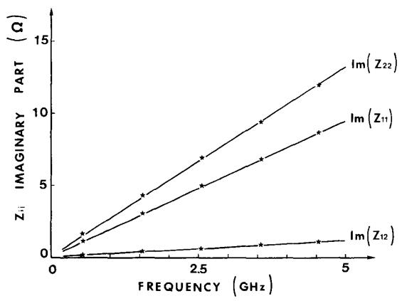

Fig. 4. Evolution of the Z parameters' imaginary part versus frequency under forward gate bias voltage and zero drain bias voltage.

As the gate current increases,  $R_{dy}$  decreases and  $C_g$  increases but the exponential behavior of  $R_{dy}$  versus  $V_{gs}$  is the dominant factor; consequently the term  $R_{dy}$   $C_g \cdot \omega$  tends to zero for gate current densities close to  $5 \cdot 10^7 - 10^8$  A/m². In that case, we have

$$z_{dy} \simeq R_{dy} = \frac{nkT}{qI_g}.$$
 (13)

For such a gate current, the capacitive effect of the gate disappears and the  $z_{11}$  parameter becomes real:

$$z_{11} = R_c/3 + \frac{nkT}{qI_g}. (14)$$

In addition, the influence of the  $C_{pg}$  and  $C_{pd}$  parasitic capacitances is negligible and consequently the extrinsic Z parameters are simply determined by adding the parasitic resistances  $R_s$ ,  $R_g$ ,  $R_d$  and inductances  $L_g$ ,  $L_s$ ,  $L_d$  to the intrinsic Z parameters. Then we have

$$Z_{11} = R_s + R_g + \frac{R_c}{3} + \frac{nkT}{qI_g} + j\omega(L_s + L_g)$$
 (15)

$$Z_{12} = Z_{21} = R_s + R_c/2 + j\omega L_s \tag{16}$$

$$Z_{22} = R_s + R_d + R_c + j\omega(L_s + L_d). \tag{17}$$

These expressions show that the imaginary part of the Z parameters increases linearly versus frequency while the real part is frequency independent. In addition it must be noted that the real part of  $Z_{11}$  increases as  $1/I_g$ .

As shown in Figs. 4 and 5 the theoretical expressions (15), (16), and (17) are in quite good agreement with experimental findings. To obtain these figures, the S parameters of the device were measured using the HP 8510 network analyzer and then transformed into Z parameters using the well-known translation formulas. These figures show a linear evolution of the Z parameters' imaginary parts while the real part of  $Z_{11}$  increases as  $1/I_g$ . As a consequence, the parasitic inductances can be provided by these plots:  $L_s$  from  $Im(Z_{12})$ ,  $L_g$  from  $Im(Z_{11})$ , and  $L_d$  from  $Im(Z_{22})$ . In addition, the linear extrapolation of the

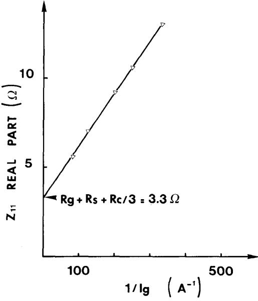

Fig. 5. Evolution of the  $Z_{11}$  real part as a function of  $1/I_g$ .

plot  $\operatorname{Re}(Z_{11})$  versus  $1/I_g$  to the ordinate gives the value of  $R_s+R_g+R_c/3$ . Therefore the Z parameters' real parts provide three relations between the four unknowns  $R_s$ ,  $R_g$ ,  $R_d$ , and  $R_c$ . At this step, an additional relation is needed to separate the four unknowns. This additional relation can be:

- (i) The value of the sum  $R_s + R_d$  determined by the conventional method [5], [6]. It must be emphasized that this determination can be carried out with the network analyzer using the real part of  $Z_{22}$ .
- (ii) The value of  $R_g$  if it can be provided from the resistance measurement from pad to pad.
- (iii) The value of  $R_s$  and  $R_d$  provided by dc measurement [7].
- (iv) The value of  $R_c$  if the channel technological parameters are known.

Therefore, the determination of the four parameters  $R_s$ ,  $R_g$ ,  $R_d$ , and  $R_c$  does not constitute a real problem since some redundant relations are available in most cases.

At this step, it should be noted that the gate resistance introduced in expression (15) is the gate resistance at relatively high gate current. In that case, a gate finger has to be considered as a ladder containing incremental series resistances, shunt Schottky diodes, and series channel resistances [8]. This results in a nonlinear character of  $R_g$  that becomes different to its value when the FET is normally biased as an amplifier. However, for gate metallization resistances commonly encountered (100–300  $\Omega/\text{mm}$ ), the error introduced by the distribution effect is less than 10 percent. In the case of higher metallization resistances, the distribution effect has to be taken into consideration.

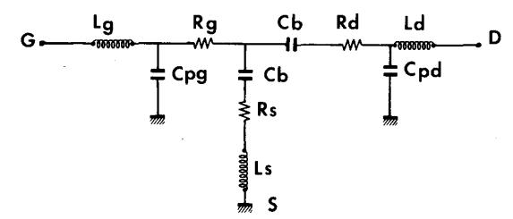

Fig. 6. Small-signal equivalent circuit of a FET at zero drain bias voltage and gate voltage lower than the pinchoff voltage.

In conclusion, the previous analysis shows that, except perhaps for high gate metallization resistance devices, the series parasitic elements  $R_s$ ,  $R_g$ ,  $R_d$ ,  $L_s$ ,  $L_g$ , and  $L_d$  can be provided by S-parameter measurement performed under zero drain bias and forward gate bias voltage condition.

## B. Measurement of the $C_{pg}$ and $C_{pd}$ Parasitic Capacitances

In the previous section it has been shown that suppressing the capacitive effect of the gate provides the series elements. Following the same philosophy, the input and output  $C_{pg}$  and  $C_{pd}$  parasitic capacitances are measured by suppressing the conductivity of the channel. As a matter of fact, at zero drain bias and for a gate voltage lower than the pinchoff voltage  $V_p$ , the intrinsic gate capacitance (i.e., under the gate) cancels, as does the channel conductance. Under these biasing conditions, the FET equivalent circuit is shown in Fig. 6. In this figure  $C_b$  represents the fringing capacitance due to the depleted layer extension at each side of the gate. For frequencies up to a few gigahertz, the resistances and inductances have no influence on the imaginary part of the Y parameters, which can be written

$$\operatorname{Im}(Y_{11}) = j\omega(C_{pg} + 2 \cdot C_b) \tag{18}$$

$$Im(Y_{12}) = Im(Y_{21}) = -j\omega C_b$$
 (19)

$$\operatorname{Im}(Y_{22}) = j\omega(C_b + C_{nd}). \tag{20}$$

Thus, the three unknowns  $C_b$ ,  $C_{pg}$ , and  $C_{pd}$  can be calculated using (18)–(20).

From an experimental viewpoint, the FET is biased as mentioned before  $(V_{ds} = 0, V_{gs} < V_p)$  and the S parameters are measured and transformed into Y parameters.

As shown in Fig. 7 the imaginary parts of the experimental Y parameters increase linearly versus frequency, which is in quite good agreement with expressions (18)–(20). In addition it can be easily verified that the two  $C_{pg}$  and  $C_{pd}$  capacitances provided by the previous plots are independent of  $V_{gs}$  when  $V_{gs} < V_p$ . Therefore these two capacitances can be considered as parasitic.

This new method for determining the parasitic capacitances values is very useful for two main reasons.

- A FET design can be characterized by means of parasitic capacitances.
- (ii) The *intrinsic* gate-to-source capacitance can be accurately defined if  $C_{pg}$  is known. As a consequence

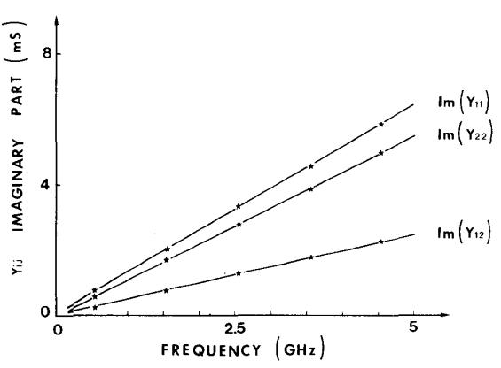

Fig. 7. Evolution of the Y parameters' imaginary part versus frequency, yielding the  $C_{pg}$  and  $C_{pd}$  pad capacitances.  $V_{gs} = -3$  V.

it is possible to determine the *intrinsic* device cutoff frequency  $f_c = g_m/2\pi C_{gs}$ , that is one of the main device quality factors.

Finally it has been shown that all the device parasitic elements can be measured under zero drain bias voltage conditions. Consequently it is possible to determine the intrinsic Y parameters and the equivalent circuit components for any gate and drain bias voltages following the method described in Section II.

Before presenting some experimental results concerning the small-signal equivalent circuit, it seems important to discuss the frequency range used for these measurements. In fact, the frequency has to be low enough in order for expressions (5)–(8) to be valid, while the low frequency boundary is mainly determined by the network analyzer. In addition, the frequency range has to be wide enough in order to accurately define the parameter evolution laws versus frequency. In the following part, the results will be given in the case of measurements performed in the range 1-5 GHz. This frequency range has been successfully used for gate length in the range  $0.25-1~\mu m$  and for gate width in the range  $100-400~\mu m$ .

In the case of higher gate length structures, the upper frequency limit has to be reduced in order for the approximation D=1 to be valid. On the other hand, for high-frequency devices with ultrashort gate length (<0.3  $\mu$ m) and small gate width (<100  $\mu$ m) the Y parameter becomes very low. Hence, the measurement frequency range has to be translated towards higher frequencies in order to provide higher values of the intrinsic Y parameters, which are less sensitive to the measurement noise.

#### IV. EXPERIMENTAL RESULTS

As previously mentioned, this new method for determining the FET equivalent circuit is quite suitable for microwave wafer probing equipment. However, since such a system is not yet in operation in our laboratory, the method was developed for chip devices in a test fixture. A test fixture photograph is shown in Fig. 8. This test fixture

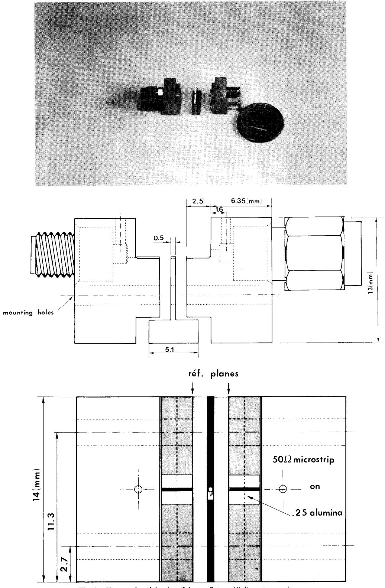

Fig. 8. Photograph and drawing of the test fixture. All dimensions are in mm.

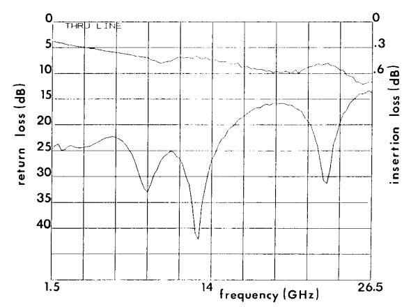

Fig. 9. Return and insertion losses of the test fixture with a through line.

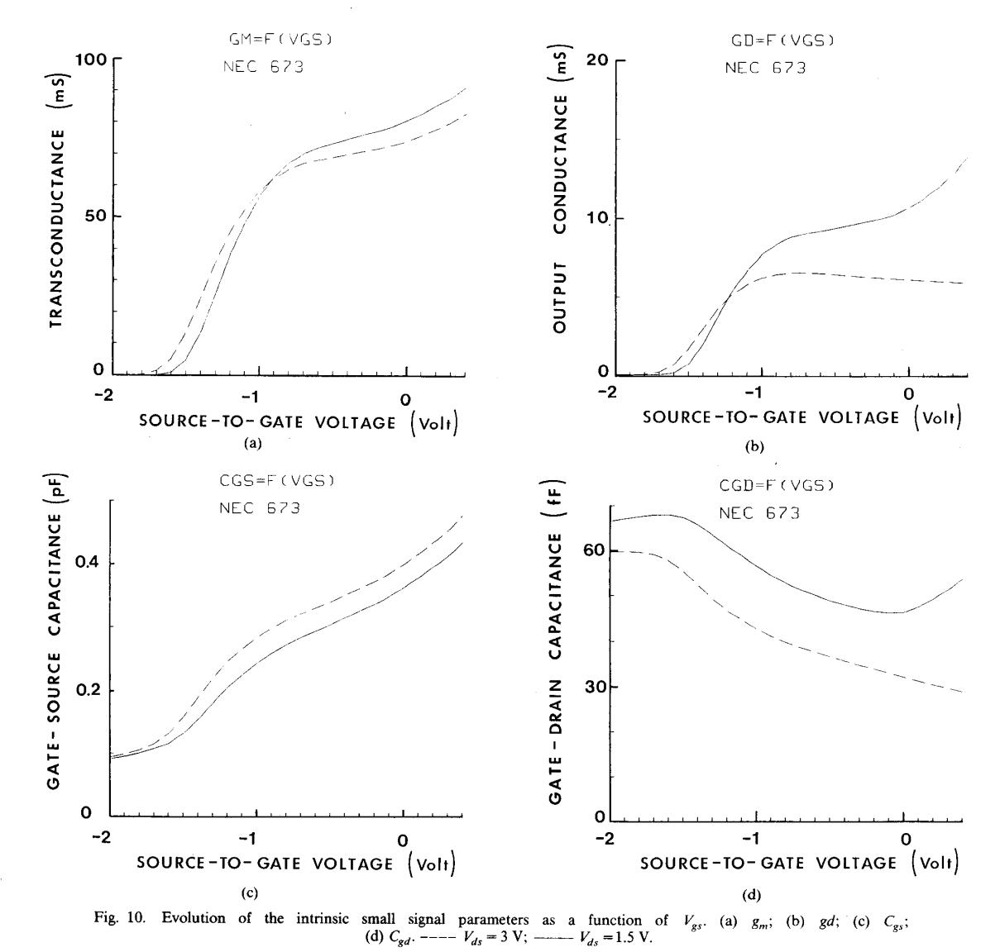

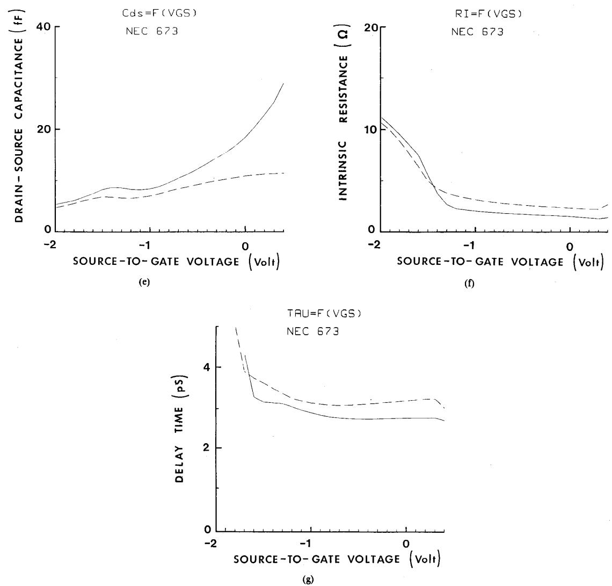

Fig. 10. Continued: (e)  $C_{ds}$ ; (f)  $R_i$ ; (g)  $\tau$ . ----  $V_{ds} = 3$  V; -----  $V_{ds} = 1.5$  V.

comprises a center block sandwiched between two lateral blocks. The chip is mounted on the center block and bonded to 50  $\Omega$  microstrip lines on 0.01 in. thick alumina substrate that are mounted on the lateral blocks. Male and female K connectors are used to interface the microstrip to the coaxial system. This text fixture is very well suited for the TSD calibration which is used to deduce the S parameters of the device only. Fig. 9 shows the return and insertion losses of the fixture with the through line. At 26.5 GHz the insertion loss is 0.7 dB while the return loss is  $-14 \, \mathrm{dB}$ .

#### A. The Equivalent Circuit Parameters

In the case of a commercial  $0.3 \times 280 \ \mu\text{m}^2$  gate structure device (NE 67300), Fig. 10 shows the evolution of the small-signal parameters  $g_m$ , gd,  $C_{gs}$ ,  $C_{gd}$ ,  $C_{ds}$ ,  $R_i$  and  $\tau$ 

versus  $V_{gs}$  for two different drain-to-source bias voltages. These evolutions are quite similar to those obtained using the conventional least-squares fit of the S parameters [10], although a few seconds of computing time are needed only with our method to obtain these plots.

In terms of accuracy, it should be noted that the five main parameters  $g_m$ ,  $g_d$ ,  $C_{gs}$ ,  $C_{gd}$  and  $C_{ds}$  are precisely obtained since the associated experimental Y parameters are in quite good agreement with expressions (5)–(8). These four parameters are determined within a 2–3 percent estimated accuracy. On the other hand, the real part of  $y_{11}$ , which provides the  $R_i$  value, has a very low value (a few 0.1 ms) and is rather sensitive to the measurement noise. As a consequence, the  $R_i$  determination error can be as high as 50 percent, which also introduces about a 20 percent inaccuracy on the transit time.

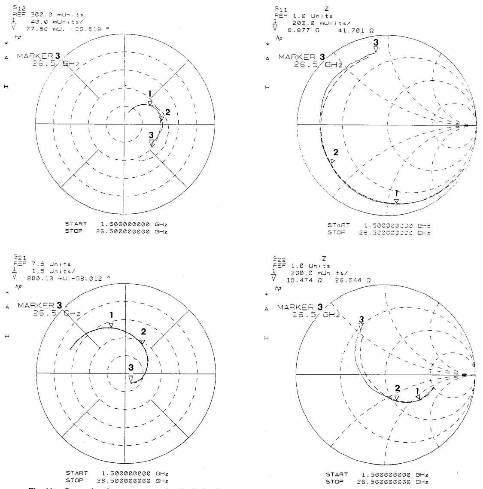

Fig. 11. Comparison between measured and calculated S parameters in the range 1-26.5 GHz. Device NE 67300  $V_{gs} = 0$  V;  $V_{ds} = 3$  V. ———————————————————————————————————

| Element values | $V_{ds} = S V$ . | casuic   | u,       | ··- ca | icuiaic | .u. V I - | - J G1   | .12, V   |  |
|----------------|------------------|----------|----------|--------|---------|-----------|----------|----------|--|
|                |                  | nH       |          |        | ohm     |           |          | fF       |  |
| Extrinsic      | $L_s$            | $L_g$    | $L_d$    | $R_s$  | $R_g$   | $R_d$     | $C_{pg}$ | $C_{pd}$ |  |
|                | 0.039            | 0.27     | 0.38     | 1.5    | 1.4     | 1.5       | 48       | 92       |  |
|                | _                | pF       |          | mS     |         | _ ohm     | pS       |          |  |
| Intrinsic      |                  | $C_{gs}$ | $C_{gd}$ | $g_m$  | $g_d$   | $R_{i}$   | τ        |          |  |
|                | (                | 0.398    | 0.032    | 74     | 6.1     | 2.4       | 3.2      |          |  |

# B. Broad-Band S Parameters

In order to show the validity of our approach, the S parameters were measured in the range 1–26.5 GHz and compared with the S parameters computed from the equivalent circuit. The results of this comparison are given in Fig. 11 in a typical case. The absence of resonances or

noise in the experimental data can be noted. This figure shows that the calculated S parameters are in quite good agreement with experimental findings for the three parameters  $S_{11}$ ,  $S_{21}$ ,  $S_{22}$  while the main difference concerns  $S_{12}$ , which is not surprising. Therefore, the equivalent circuit deduced from low-frequency measurements can fit very

well the device S parameters up to 26.5 GHz. The equivalent circuit determined in a low-frequency range can thus be used as an electrical characterization of the technological process as well as for the design of both hybrid and monolithic microwave circuits.

#### V. Conclusions

A new method for determining the small-signal equivalent circuit components of FET's has been described. This method consists in a direct determination of all the FET parasitic elements, including the  $C_{pg}$  and  $C_{pd}$  pad capacitances. The knowledge of these parasitic element values allows us to determine the intrinsic small-signal parameters after a few simple matrix manipulations. Compared with the conventional method, based on S parameters fit in a broad frequency range, this new method has several advantages:

- All the extrinsic and intrinsic components are directly determined.
- This new method is fast and accurate and only a network analyzer is needed.
- (iii) The method is very well suited for wafer-probing systems since it is very fast and is performed in a low-frequency range.
- (iv) The method is very well suited to obtain a large amount of data directly connected with the design or the process of FET's.

## ACKNOWLEDGMENT

The authors would like to thank Prof. G. Salmer for his interest and encouragement in this study.

#### REFERENCES

- [1] R. A. Minasian, "Simplified GaAs MESFET model to 10 GHz,"
- Electron. Lett., vol. 13, no. 8, pp. 549-541, 1977.
  [2] F. Diamant and M. Laviron, "Measurement of the extrinsic series elements of a microwave MESFET under zero current condition," in Proc. 12th European Microwave Conf., 1982, pp. 451-456.
- [3] K. W. Lee, K. Lee, M. S. Shur, Tho T. Vu, P. C. T. Roberts, and M. J. Helix, "Source, drain and gate series resistances and electron saturation velocity in ion implanted GaAs FET's," IEEE Trans. Electron Devices, vol. ED-32, pp. 987-992, May 1985.
- [4] A. Cappy, "Propriétés physiques et performances potentielles des composants submicroniques à effet de champ: Structure conventionnelle et à gaz d'électron bidimensionnel," Thèse de Doctorat, Lille, France, 1986.
- [5] P. L. Hower and N. G. Bechtel, "Current saturation and smallsignal characteristics of GaAs field effect transistors," IEEE Trans. Electron Devices, vol. ED-20, pp. 213-220, Mar. 1973.
- [6] H. Fukui, "Determination of the basic device parameters of a GaAs MESFET," Bell Syst. Tech. J., vol. 58, no. 3, pp. 771-795,
- [7] L. Yang and S. I. Long, "New method to measure the source and drain resistance of the GaAs MESFET," IEEE Electron Device Lett., vol. EDL-7, pp. 75-77, Feb. 1986.
- [8] J. Granlund, "Resistance associated with FET gate metallization,"
- IEEE Electron Device Lett., vol. EDL-1, pp. 151–153, Aug. 1980.
   W. R. Curtice and R. L. Camisa, "Self-consistent GaAs FET models for amplifier design and device diagnostics," IEEE Trans. Microwave Theory Tech., vol. MTT-32, pp. 1573-1578, Dec. 1984.

[10] H. A. Willing, C. Rauscher, and P. De Santis, "A technique for predicting large-signal performance of GaAs MESFET," IEEE Trans. Microwave Theory Tech., vol. MTT-26, pp. 1017-1023, Dec.

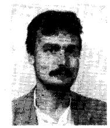

Gilles Dambrine was born in Avion, France, on May 15, 1959. He received the Dipl. Eng. degree from the Ecole Universitaire d'Ingénieur de Lille

In 1986 he joined the Centre Hyperfréquences et Semiconducteurs of the University of Lille I, Villeneuve d'Ascq, where he is working on GaAs FET measurement technics in the millimeterwave range.

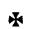

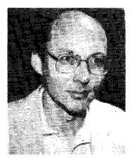

Alain Cappy was born in Chalons sur Marne, France, on January 25, 1954.

In 1977 he joined the Centre Hyperfrequences et Semiconducteurs at the University of Lille, France, and he received the Docteur en Electronique and Docteur es Sciences degrees from the University of Lille. His main research interests are concerned with the semiconductor device modeling, the noise modeling in submicrometergate FET's and TEGFET's, and the FET characterization techniques.

Dr. Cappy is a founder of the International GaAs Simulation Group.

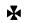

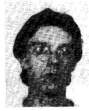

Frédéric Heliodore was born in May 1962. He received the Ph.D. degree in 1987 from the University of Lille, France. He is currently doing postdoctoral research in the RCM division of Thomson CSF.

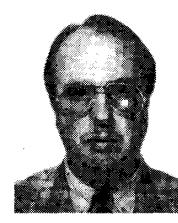

Edouard Playez was born in Hermaville, France, on May 11, 1946. He joined the Centre Hyperfréquences et Semiconducteurs of the University of Lille as technician in 1968. After receiving the dipl. Eng. degree from the Conservatoire National des Arts et Métiers in 1975 he became manager of a technical team there devoted to microwave measurements