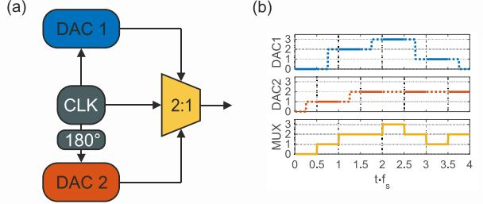
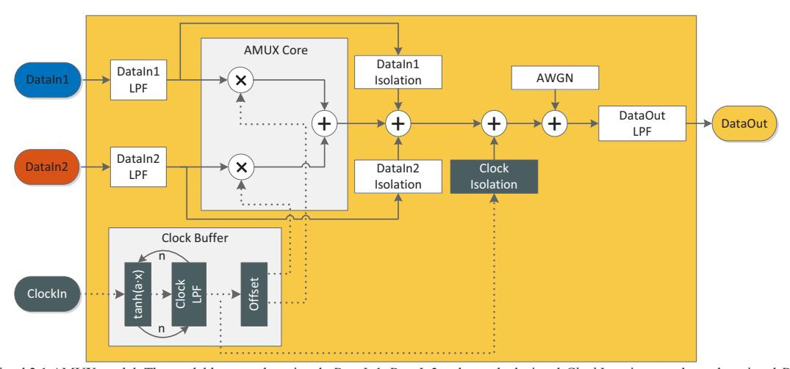
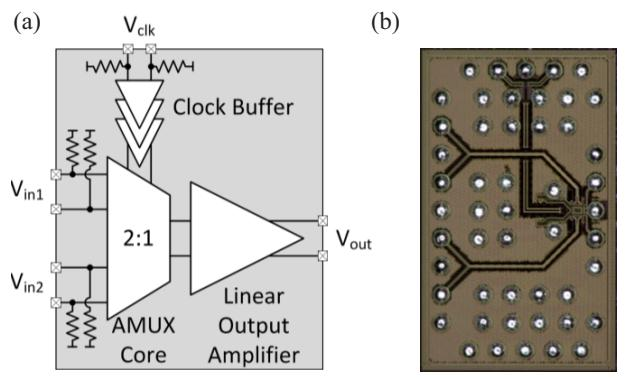
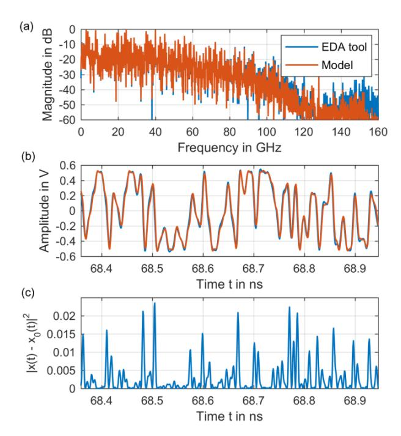
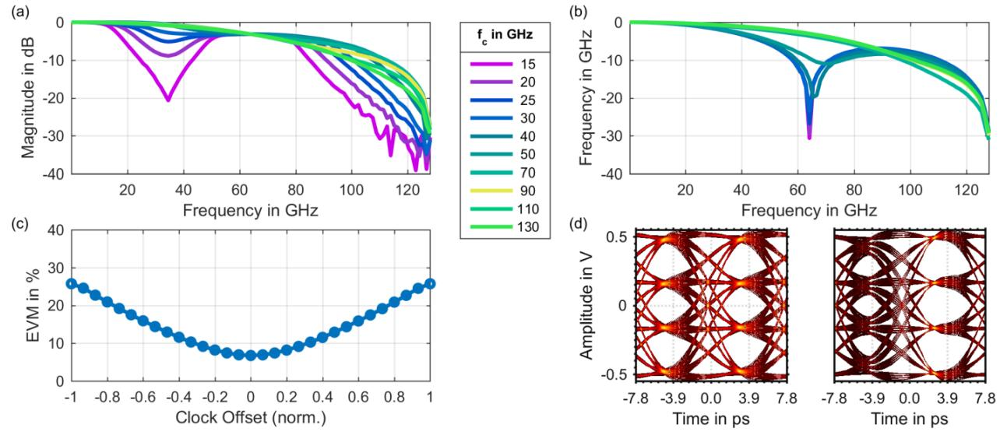

# Behavioral Model for a High-Speed 2:1 Analog Multiplexer

Christian Schmidt1,2,\*, Patrick Zielonka1,2, Volker Jungnickel1 , Ronald Freund1,2, Tobias Tannert3 , Markus Grözing3 , Manfred Berroth3 , Friedel Gerfers4

1 Photonic Networks and Systems, Fraunhofer Heinrich- Hertz-Institute, Berlin, Germany 2 Institute of Telecommunication Systems, Technical University of Berlin, Berlin, Germany 3 Institute of Electrical and Optical Communications Engineering, University of Stuttgart, Stuttgart, Germany 4 Institute of Computer Engineering and Microelectronics, Technical University of Berlin, Berlin, Germany

*Abstract***— A novel concept for digital-to-analog converters (DACs) has been introduced recently, to overcome their bandwidth limitations by combining the outputs of multiple DACs with an analog multiplexer (AMUX). In this paper, a behavioral model for a high-speed 2:1-AMUX is introduced, which significantly reduces the simulation time for a 2:1-AMUX-DAC system. The behavioral model is implemented in Matlab and fitted with simulation data from an electronic design automation tool for a high-speed 2:1-AMUX integrated circuit with a normalized mean square error < -20 dB. Eventually, multiple model parameters are varied in order to study their impact on the system's behavior.** 

*Keywords—analog multiplexer; behavioral model; digital-toanalog conversion; multiplexing; high-speed communications* 

## I. INTRODUCTION

During the last decade, the annual global internet protocol traffic has been rising at an enormous rate and is going to increase further [1], whereby the demand for high data rates requires an increase in optical network capacity. The utilization of DACs for high-speed optical transceivers is highly desirable in order to realize flexibility in terms of modulation bandwidth and modulation format. Furthermore, pre-distortion may be used in order to mitigate transmitter as well as channel impairments. However, the performance of energy-efficient high-speed CMOS DACs is limited by current technology, especially in terms of bandwidth [2].

Recently, multiple concepts have been introduced in order to overcome the performance limitations, i.e. time interleaving DAC (TI-DAC) [3], frequency interleaving DAC (FI-DAC) [4]-[6] and analog multiplexing DAC (AMUX-DAC) [7-9]. The AMUX-DAC concept enhances both the sample rate and the bandwidth compared to a single DAC solution. By combining energy-efficient CMOS DACs with a fast AMUX integrated circuit (IC) in bipolar technology, the performance is enhanced, while the power consumption is kept tolerable.

Simulating the AMUX-DAC architecture on transistor level in an electronic design automation (EDA) tool is very timeconsuming, especially, if the impact of multiple parameters needs to be studied. In order to conduct simulations on systemlevel a behavioral model is needed. This way, the impact of the utilization of AMUX-DACs in high-speed transceivers can be

\* christian.schmidt@hhi.fraunhofer.de orcid.org/0000-0002-5689-4475

Fig. 1. AMUX-DAC concept: (a) block diagram (b) time domain characteristic.

quantified and the IC design process can be supported with bandwidth requirements etc.

In this paper, we introduce a generic behavioral model for a 2:1 AMUX in order to drastically decrease computation time by at least three orders of magnitude, which is of particular interest for system simulation. First, the AMUX-DAC concept as well as the investigated AMUX IC [7], are introduced. Then, the behavioral model is introduced and explained in detail. Furthermore, the model is implemented in Matlab and fitted with simulation data obtained from an EDA tool. Eventually, the AMUX model is embedded in an AMUX-DAC system in order to study the impact of multiple parameters on both system behavior and performance.

## II. SYSTEM CONCEPT AND ACTUAL CHIP

In Fig. 1, the AMUX-DAC concept is visualized. In Fig. 1 a), a conceptual block diagram is shown for the case of two DACs, whereby the outputs of the DACs, which are clocked with a 180° phase shift, are combined with the 2:1 AMUX. In Fig. 1 b), the idealized operation of the AMUX-DAC is shown in the time domain, whereby the AMUX connects the DACs' output signals in the center of each sample to the output, which is denoted with a drawn through line. While one of the DACs' output signals is switched through, the other DAC performs a transition, which is denoted with a dotted line.

The AMUX IC is implemented in IHPs SiGe-HBT BiCMOS technology SG13G2 [10]. In Fig. 3, a block diagram of the IC as well as a photograph of the chip are shown. The fully differential circuit design is composed of the AMUX core, the clock buffer and a linear output amplifier [7].

Fig. 2. Behavioral 2:1 AMUX model: The model has two data signals *DataIn1*, *DataIn2* and one clock signal *ClockIn* as input and one data signal *DataOut* as the output. The input data signals are multiplied with the clock signal in the AMUX core, combined and fed to the output port. Multiple parasitic effects are modeled.

The AMUX core consists of two transconductance amplifiers, which pass the signal currents to clocked current switch pairs, which select the corresponding input port. The unused input port current is switched to a dummy load. The core's output consists of cascode transistors and load resistors to generate the output voltage.

The clock buffer consists of multiple high-gain Cherry-Hooper amplifiers, which are overdriven by the input signal in order to generate steep slopes, i.e. a quasi-rectangular clock signal for the AMUX core.

The output amplifier is implemented as a multi-stage amplifier consisting of two series connected emitter followers and a linearized differential transconductance cascode stage. It is used to compensate the loss of the AMUX to achieve an overall gain of one and to match to the output impedance.

The AMUX is intended to be placed in an AMUX-DAC system consisting of two DACs, each running at a sample rate of 64 GS/s and generating a symbol rate of 64 GBd. The outputs of the DACs are combined with the 2:1 AMUX in order to generate an 128 GBd signal, whereby the AMUX operates at half-clock, i.e. 64 GHz.

Fig. 3. (a) Block diagram of the 2:1 AMUX [3], (b) photograph of the chip.

#### III. BEHAVIORAL MODEL

In order to develop a behavioral model for the actual IC presented in Sec. II, which can be easily adapted to other AMUX ICs, a fairly generic approach is taken and a quasi-linear model without nonlinear distortions in the data path was created. The resulting model is shown in Fig. 2. It consists of two data input signals *DataIn1* and *DataIn2*, a clock input signal *ClockIn* and a data output signal *DataOut*.

The input data signals *DataIn1* and *DataIn2* are low pass filtered, which accounts for the low pass characteristic of the transmission lines including pads and bumps, as well as for the low pass characteristic of the transconductance amplifiers. In the AMUX core, the data signals are multiplied with the clock signal(s) and added.

The clock input signal ClockIn is processed in the clock buffer in order to generate ideally two rectangular clock signals. First, ClockIn is feed n times through a combination of a tanh-characteristic and a low pass filter, which corresponds to a bandwidth limited differential amplifier cascade. The argument a defines the slope of the tanh-characteristic. The low pass characteristic of the transmission line, pads and bumps has no major impact on the sine clock input signal. Eventually, the clock signal is duplicated and a phase offset is applied to one of the signals in order to generate two clock signals with a phase difference of  $\pi$ , which are then fed to the AMUX core.

Furthermore, feed through is accounted for by adding the data signals *DataIn1* and *DataIn2* as well as the clock signal *ClockIn*, attenuated by an isolation value, to the combined data signal. Additive white Gaussian noise can be added to account for the thermal noise of the circuit.

The combined data signal is eventually low pass filtered to generate the output signal *DataOut*.

Fig. 4. AMUX output difference between the EDA tool  $x_0(t)$  and the behavioral model x(t): (a) spectrum, (b) excerpt from time domain signal, (c) squared error between both time domain signals.

#### IV. PARAMETER FITTING

In order to fit the generic model to the IC presented in Sec. II, the parameters of the behavioral model are fitted with simulation data obtained with a SPICE-level circuit simulator, which is denoted as 'reference data' in the following. The fitting is performed on the differential signals and the low pass characteristics are chosen from standard analog filter characteristics, i.e. Bessel, Butterworth and Gaussian, in order to easily vary their parameters in the following section. The behavioral model is implemented in Matlab.

The reference data for the AMUX IC consists of two PAM-8 signals at 64 GBd at the input, which are multiplexed to form a single 128 GBd PAM-8 output signal. The transient simulation reference data is interpolated on an evenly spaced time vector with 16 samples per symbol relative to the output symbol rate.

The fitting of the behavioral model is performed in two steps. First, a least squares (LS) channel estimation is performed on several sub-systems of the IC, e.g. from the bumps on the input pads to the AMUX core and from the AMUX core to the bumps on the output pads, in order to roughly estimate the parameters of the standard filters [11]. Second, a multi-parameter optimization is performed, to both fit the parameters of the clock path and to optimize the roughly estimated parameters. Thereby, a brute force approach is chosen in order to check all parameter combinations. Note, that other approaches, e.g. gradient-based, are viable as well. In order to evaluate the quality of the fitting, the normalized mean square error (NMSE) was used, which can be calculated according to:

NMSE = 
$$10 \log_{10} \left( \frac{\langle (x(t) - x_0(t))^2 \rangle}{\langle x_0(t)^2 \rangle} \right)$$
, (1)

TABLE I. EXTRACTED PARAMETERS FOR THE SIGE-HBT 2:1 AMUX BEHAVIORAL MODEL

| Parameter                 | Value                                                |
|---------------------------|------------------------------------------------------|
| DataIn1 LPF,              | 4th order Butterworth filter                         |
| DataIn2 LPF               | $f_c = 120 \text{ GHz}$                              |
| DataIn1 isolation,        | 50 dB                                                |
| DataIn2 isolation         |                                                      |
| DataOut LPF               | 4th order Butterworth filter $f_c = 125 \text{ GHz}$ |
| Clock offset              | 0                                                    |
| Tanh argument a           | 2.5                                                  |
| Clock amplifier cascade n | 1                                                    |
| Clock LPF                 | 6th order Butterworth filter $f_c = 80 \text{ GHz}$  |
| Clock isolation           | 60 dB                                                |
| AWGN                      | -                                                    |

whereby, x(t) and  $x_0(t)$  denote the output signal of the behavioral model and the reference data, respectively.  $\langle \cdot \rangle$  denotes the expected value operator. The optimization is stopped after an NMSE of < -20 dB was achieved, i.e. -20.8 dB, because no improvements >0.1 dB were possible.

In order to obtain a visual impression and to compare the results of the behavioral model simulation with the reference data, both the spectrum of the AMUX output signal as well as a cut out of this signal in the time domain are plotted in Fig. 4. As expected from the low NMSE, the spectrum as well as the time domain signal fit very well to the reference data. However, for fast signal transitions, i.e. high frequencies, there is a non-negligible squared error as shown in Fig. 4(c).

## V. AMUX-DAC SYSTEM

In this section, several simulations are conducted in order to investigate the implications of multiple model parameters on the behavior of the AMUX-DAC system. This way, new insights on the behavior and the resulting performance are obtained.

For the simulations, the parameters are chosen as follows. An 128 GBd PAM-4 signal with 220 pseudo-random samples is split into two sub-signals, which are fed to the DACs. The DACs are running at 64 GS/s with one sample per symbol. They are assumed ideal for this simulation in order to study the AMUX impairments in an isolated manner. The sample rate for the analog simulation is 1024 GS/s. The basic parameters for the AMUX are chosen as in Tab. I. The results are visualized in Fig. 5.

In Fig. 5(a), the magnitude of the frequency responses is shown for varying the 3 dB bandwidth  $f_c$  of the data path input filter DataInLpf. For both data paths the filter parameters are chosen equally. The frequency responses are obtained with a least-squares channel estimation at two samples per symbol at the output [11]. Note, that the sinc-roll-off of the DAC was not compensated. For low bandwidths, a dip of the frequency responses at 32 GHz, i.e. at half clock-frequency, as well as a plateau around 64 GHz is observed. This effect could be attributed to the AMUX behaving as a mixer, since the data signals are each multiplied with the clock signal.

Fig. 5. Simulation results for the behavioral 2:1 AMUX model: (a) channel frequency response for variation of the 3dB bandwidth *fc* of the input low pass filter, (b) channel frequency response for variation of the 3dB bandwidth *fc* of the clock low pass filter, (c) EVM with respect to the clock offset, (d) PAM4 eye diagrams without a clock offset (left) and with a normalized clock offset of +0.467 (right).

In Fig. 5(b) the frequency responses are shown for varying the 3 dB bandwidth *fc* of the clock low pass filter *ClockLpf*. For low cutoff frequencies, there is a clear dip of the frequency response at 64 GHz, which moves to higher frequencies, when increasing the bandwidth of the filter.

In Fig. 5(c) the error vector magnitude (EVM) of the received constellation is visualized with respect to clock mismatches, i.e. the clock offset, which is normalized to the amplitude of the clock signal. For small clock offsets < 0.3 the EVM is below 10 %. In Fig. 5(d) eye diagrams for 128 GBd PAM4 are shown for the basic configuration without clock offset (left) and with a clock offset of +0.467 (right). Due to the offset, the odd samples become worse and the even samples become better.

Please note, that simulating the AMUX-DAC system with 220 pseudo-random samples with the behavioral model took less than a minute, whereas simulation of 217 samples with the EDA tool took almost two days.

## VI. CONCLUSION & OUTLOOK

In this paper a behavioral model for a high-speed 2:1 AMUX was presented. The model was adapted to reference data obtained from a transistor-level simulation from an EDA tool with an NMSE of -20.8 dB. Parameter variations of the model showed the system's frequency response under varying filter conditions for both data path and clock path. Furthermore, degradations due to clock mismatches were shown. The model provides a profound tool both to examine the potential bottlenecks in the IC design and to derive specifications (e.g. bandwidth, gain, etc.) for the sub-blocks of the AMUX IC. Furthermore, the computation time could be drastically decreased. As a next step, the model accuracy for high frequencies needs to be improved and moreover, the model needs to be fitted with experimental data and compared to the simulation-based results presented here.

### REFERENCES

- [1] Cisco, "Cisco Visual Networking Index: Forecast and Methodology, 2016–2021," White Paper, June 2017.
- [2] C. Laperle and M. OSullivan, "Advances in high-speed dacs, adcs, and dsp for optical coherent transceivers," Lightwave Technology, Journal of, vol. 32, no. 4, pp. 629–643, Feb 2014.
- [3] H. Huang, J. Heilmeyer, M. Grözing, M. Berroth, J. Leibrich and W. Rosenkranz, An 8-bit 100-GS/s Distributed DAC in 28-nm CMOS for Optical Communications. IEEE Transactions on Microwave Theory and Techniques, 2015, 63(4), 1211-1218.
- [4] C. Schmidt, C. Kottke, V. Jungnickel, and R. Freund, "High-speed digitalto-analog converter concepts," in Proc. SPIE Photonics West, vol. 10130, Jan. 2017, pp. 101 300N–101 300N–9.
- [5] C. Schmidt, C. Kottke, V. Jungnickel, and R. Freund, "Enhancing the bandwidth of dacs by analog bandwidth interleaving," in Proceedings of 10th ITG-Symposium Broadband Coverage in Germany;. VDE, 2016.
- [6] X. Chen, S. Chandrasekhar, S. Randel, G. Raybon, A. Adamiecki, P. Pupalaikis, and P. Winzer, "All-electronic 100-ghz bandwidth digital-toanalog converter generating pam signals up to 190 gbaud," Journal of Lightwave Technology, 2016.
- [7] T. Tannert, X.Q. Du, D. Widmann, M. Grözing, M. Berroth, C. Schmidt, C. Caspar, J.H. Choi, V. Jungnickel and R. Freund, "A SiGe-HBT 2:1 Analog Multiplexer with more than 67 GHz Bandwidth," in Proceedings of BCTM 2017, 2017.
- [8] D. Ferenci, M. Grözing, and M. Berroth, "A 25 GHz Analog Multiplexer for a 50GS/s D/A-Conversion System in InP DHBT Technology," IEEE Compound Semiconductor Integrated Circuit Symposium (CSICS), 2011.
- [9] H. Yamazaki, M. Nagatani, S. Kanazawa, H. Nosaka, T. Hashimoto, A. Sano, and Y. Miyamoto, "Digital-preprocessed analog-multiplexed DAC for ultrawideband multilevel transmitter," Journal of Lightwave Technology, vol. 34, no. 7, pp. 1579–1584, apr 2016.
- [10] H. Rücker, B. Heinemann, and A. Fox. "Half-terahertz sige bicmos technology." Silicon Monolithic Integrated Circuits in RF Systems (SiRF), 2012 IEEE 12th Topical Meeting on. IEEE, 2012.
- [11] R. D. Nowak, "Penalized least squares estimation of Volterra filters and higher order statistics," IEEE Trans. Signal Process., vol. 46, no. 2, pp. 419–428, Feb. 1998.