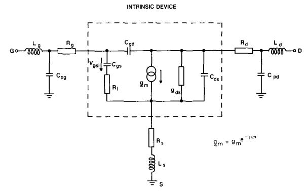
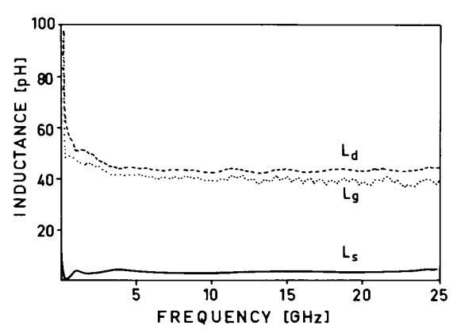
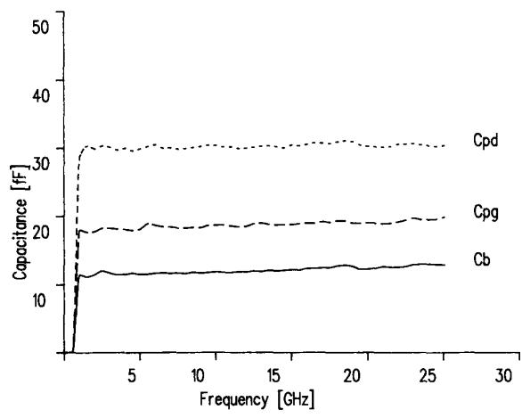
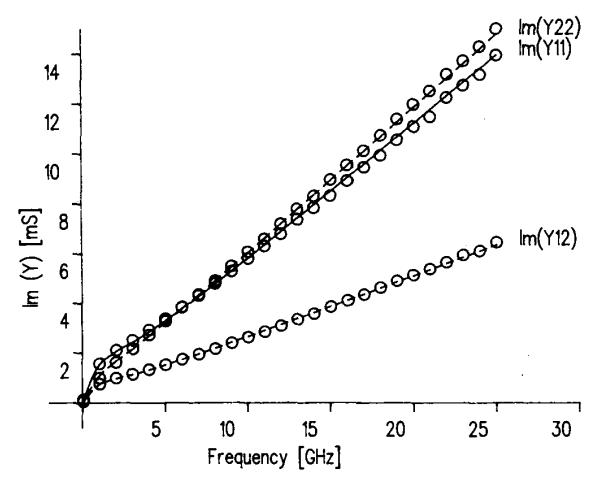
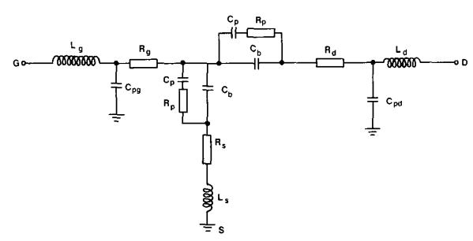
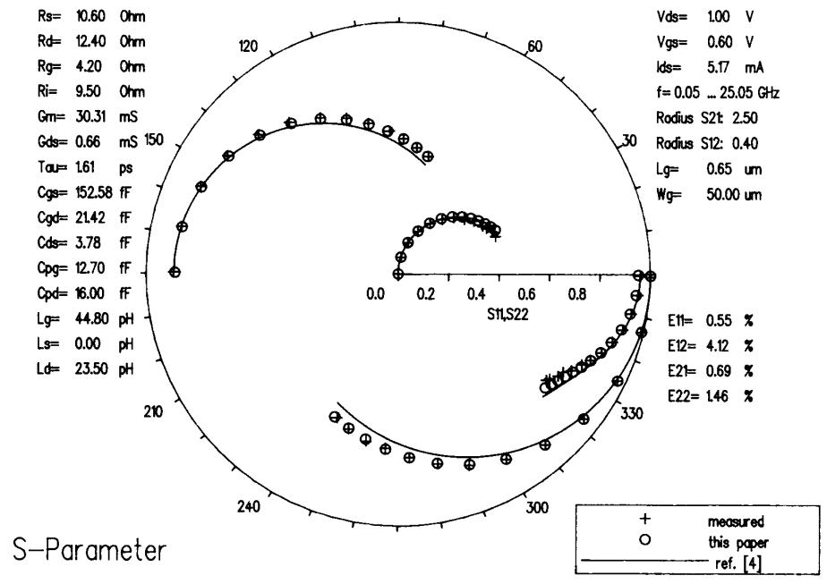
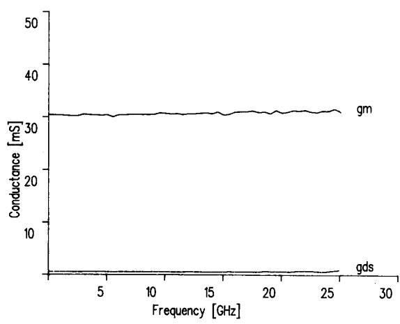
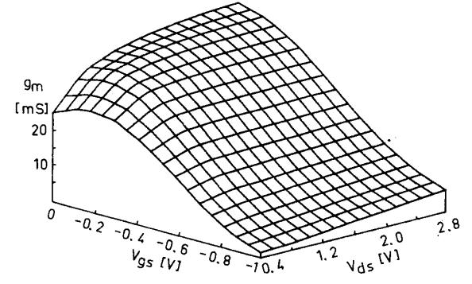
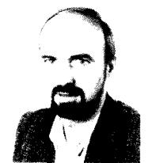
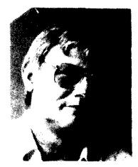

# Broad-Band Determination of the FET Small-Signal Equivalent Circuit

## MANFRED BERROTH AND ROLAND BOSCH

Abstract —An improved method to determine the broad-band small-signal equivalent circuit of field effect transistors (FET's) is proposed. This method is based on an analytic solution of the equations for the Y parameters of the intrinsic device and allows direct determination of the circuit elements at any specific frequency or averaged over a frequency range. The validity of the equivalent circuit can be verified by showing the frequency independence of each element. The method can be used for the whole range of measurement frequencies and can even be applied to devices exhibiting severe low-frequency effects.

#### I. Introduction

FOR THE DEVELOPMENT of analog and digital integrated circuits, an accurate device model is a valuable tool. Especially for high-speed digital applications, a large-signal model must be used that describes the active device over the whole operating range from dc to more than 10 GHz. The most suitable method to examine a FET at high frequencies involves S-parameter measurements. For the characterization of the broad-band behavior of a device, measurements have to be performed at many bias settings over the frequency range of interest, as the electrical properties of an FET strongly depend on the applied gate- and drain-to-source voltages. This huge amount of S-parameter data of a single FET can be reduced to a set of 15 frequency-independent variables using an equivalent circuit of physically meaningful elements as shown in Fig. 1. Several commercially available programs exist which optimize some or all of these parameters. Although in general the measured S-parameter data are approximated in an acceptable manner by these methods, the resulting element values depend on the starting values and may differ considerably from their physical values.

Several authors [1], [2] have shown that a so-called cold modeling, when the FET is measured at 0 V drain-to-source voltage, can be used to reduce the unknown set of parameters to seven or eight variables, which results in better convergence and reduced computation time. But as stated in [1], there are still problems concerning the unequivocal determination of the optimum values of the equivalent circuit using these general optimizing programs. A new method has been proposed in [3] and extended in [4] to determine the seven internal device

Manuscript received April 10, 1989; revised January 31, 1990. The authors are with the Fraunhofer Institute for Applied Solid State Physics, Eckerstr. 4, D-7800 Freiburg. West Germany. IEEE Log Number 9035736.

Fig. 1. Small-signal equivalent circuit of a field effect transistor.

elements analytically at frequencies below 5 GHz. We have verified this method and observed an excellent fit up to 5 GHz but significant errors at higher frequencies. Therefore we improved this method to determine the internal device parameters analytically without frequency limitations. We are now able to evaluate the small-signal equivalent circuit at any frequency over the range of S-parameter measurements which was limited to 26 GHz. Additionally, the procedure described here is very fast, because no iteration loops are necessary.

# II. THEORETICAL ANALYSIS

The small-signal equivalent circuit is shown in Fig. 1. The circuit is divided into the external parasitic elements and the intrinsic device, containing seven unknown parameters. The intrinsic device is described by the following Y parameters [3]:

$$Y_{11} = \frac{R_i C_{gs}^2 \omega^2}{D} + j\omega \left(\frac{C_{gs}}{D} + C_{gd}\right) \tag{1}$$

$$Y_{12} = -j\omega C_{\sigma d} \tag{2}$$

$$Y_{21} = \frac{g_m e^{-j\omega\tau}}{1 + j\omega R_i C_{gs}} - j\omega C_{gd} \tag{3}$$

$$Y_{22} = g_{ds} + j\omega (C_{ds} + C_{gd}), \tag{4}$$

where

$$D = 1 + \omega^2 C_{gs}^2 R_i^2. \tag{5}$$

Separating (1) through (4) into their real and imaginary

0018-9480/90/0700-0891\$01.00 ©1990 IEEE

parts, the elements of the small-signal equivalent circuit can be determined analytically as follows (see the Appendix):

$$C_{gd} = -\frac{\operatorname{Im}(Y_{12})}{\omega} \tag{6}$$

$$C_{gs} = \frac{\text{Im}(Y_{11}) - \omega C_{gd}}{\omega} \left[ 1 + \frac{(\text{Re}(Y_{11}))^2}{(\text{Im}(Y_{11}) - \omega C_{gd})^2} \right] \tag{7}$$

$$R_{i} = \frac{\text{Re}(Y_{11})}{(\text{Im}(Y_{11}) - \omega C_{od})^{2} + (\text{Re}(Y_{11}))^{2}} \tag{8}$$

$$g_m = \sqrt{\left(\left(\text{Re}(Y_{21})\right)^2 + \left(\text{Im}(Y_{21}) + \omega C_{gd}\right)^2\right)\left(1 + \omega^2 C_{gs}^2 R_i^2\right)} \tag{9}$$

$$\tau = \frac{1}{\omega} \arcsin\left(\frac{-\omega C_{gd} - \operatorname{Im}(Y_{21}) - \omega C_{gs} R_i \operatorname{Re}(Y_{21})}{g_m}\right) \tag{10}$$

$$C_{ds} = \frac{\operatorname{Im}(Y_{22}) - \omega C_{gd}}{\omega} \tag{11}$$

$$g_{ds} = \operatorname{Re}(Y_{22}). \tag{12}$$

Equations (6) through (12) are valid for the whole frequency range and drain voltages greater than 0 V. Prior to the determination of these intrinsic device elements, the extrinsic elements have to be evaluated, valid for the whole range of frequencies and bias voltages. This is done by "cold modeling" of the equivalent circuit as described in [4]. Thus, S parameters are measured at 0 V drain-tosource voltage with strongly forward biased gate. From the imaginary parts of the corresponding Z parameters, the external inductances  $L_s$ ,  $L_d$ , and  $L_g$  are deduced. The external resistances  $R_s$ ,  $R_d$ , and  $R_g$  are determined from the real parts and from an additional relation described in [5], which was modified for HEMT's to take into account the different charge control of these devices. Then, the external pad capacitances  $C_{pd}$  and  $C_{pg}$  as well as the fringing capacitance  $C_b$  are extracted from S parameters taken under pinch-off condition and a drainto-source voltage equal to 0.

# III. MEASUREMENTS

Several different types of FET's have been investigated to verify our method. We examined HEMT's ( $l_g=0.6~\mu m$ ,  $W_g=50~\mu m$ ) as well as MESFET's and inverted HEMT's ( $l_g=1~\mu m$ ,  $W_g=250~\mu m$ ). The latter showed significant low-frequency effects due to parallel conduction in the doped AlGaAs layer, as discussed later. The measurements were performed on a microwave probing system. The frequency range was 50 MHz to 25 GHz for all measurements. For the "hot modeling," the S parameters were measured at many gate and drain voltages in order to deduce the bias dependence of the intrinsic elements.

Fig. 2. Frequency dependence of the external inductances

#### IV. RESULTS

At high gate current densities, the gate capacitance is shorted by a low junction resistance, and the imaginary parts of the Z parameters are dominated by the parasitic inductances of the device for the whole measured frequency range. Fig. 2 shows the frequency dependence of the external inductances, as determined from the imaginary parts of the Z parameters for a GaAs/AlGaAs inverted HEMT device. Very constant values are obtained from 1 GHz up to 25 GHz, proving the validity of the assumptions used. The deviations below 1 GHz are due to errors in the measurement of the extremely low inductances at these frequencies. The real parts of the Z parameters are frequency independent up to 25 GHz and can be used to determine the parasitic source, gate, and drain resistances using one additional relation. We apply the method described in [5] to determine the sum of  $R_s$ and  $R_d$  for MESFET's and other devices showing a quadratic gate voltage dependence of the drain current. In the case of a linear transfer function of the device, we modify this procedure by plotting the real part of  $Z_{22}$ versus  $1/(1-\eta)$  instead of  $1/(1-\sqrt{\eta})$ , where  $\eta$  is  $(V_{gs}-V_{to})/V_{po}$ .

Far below pinch-off, the imaginary parts of the Y parameters are described by the capacitances of the device. The frequency dependence of the external pad capacitances and the residual gate capacitance at gate voltages below pinch-off are presented in Fig. 3. Again it is shown that the assumptions used are valid up to 25 GHz. We have also measured inverted HEMT structures exhibiting a severe low-frequency effect during this measurement below pinch-off, as shown in Fig. 4. The imaginary parts of the Y parameters show two distinct regions of different slopes. The behavior can be explained by the assumption of a conducting path in the doped AlGaAs layer. An equivalent circuit for such a device with the 2DEG channel pinched off is shown in Fig. 5. Between the gate and the conducting layer, a parasitic capacitance,  $C_p$ , is effective as soon as the shielding 2DEG channel is depleted. This capacitance, however, is significant only at low frequencies due to the high resistivity of the AlGaAs form-

Fig. 3. Frequency dependence of the external capacitances  $C_{pg}$  and  $C_{pd}$  and the residual fringing capacitance  $C_b$ .

Fig. 4. Imaginary parts of the *Y* parameters of an inverted HEMT device with parallel conduction in the buried AlGaAs layer.

ing a RC low-pass circuit. Using the equivalent circuit of Fig. 5, we can obtain good agreement with the measured Y parameters for the whole frequency range, as shown in Fig. 4 by dashed lines. According to this model, the pad capacitances are determined by the slope of the imaginary parts of the Y parameters at high frequencies.

The hot modeling method described in [4] is limited to frequencies below 5 GHz, which is a severe limitation for present and future applications of GaAs FET devices. We compared the method described in [4] with our fully analytical approach up to our measurement limit, with the results shown in Fig. 6. The crosses indicate the measured S parameters of a heterostructure FET with pulse doped layers on both sides of the undoped channel with a gate length of  $0.6~\mu m$ . The solid line represents the results of the method described in [4], and the circles show the results of our method. Obviously, our model yields an improved agreement with the measured data at high

Fig. 5. Equivalent circuit of the inverted HEMT device with parallel conduction for zero drain voltage and gate voltage below pinch-off of the 2DEG channel.

frequencies, and model extrapolations to higher frequencies are more reliable.

The low error averages,  $E_{ij}$ , of our improved model should be noted. Additionally, our approach can be used to verify the validity of the equivalent circuit at high frequencies. The equivalent circuit remains valid as long as its elements turn out to be constant with frequency, with the deviation from the mean value being an indication of the error of this element value. As an example, Fig. 7 shows the internal parameters  $g_m$  and  $g_{ds}$  versus frequency (calculated by means of (9) and (12)); these are nearly constant with frequency, confirming the validity of the equivalent circuit also at high frequencies, which has not been shown yet in this manner.

As the accuracy of our parameter extraction is high and the computer time is negligible, we can calculate the small-signal equivalent circuit elements at many operating points. Thus the bias dependence of all internal elements is rapidly established, allowing nonlinear modeling at high frequencies. For example, Fig. 8 shows a three-dimensional plot of the transconductance versus drain-to-source and gate-to-source voltages of a MESFET.

#### V. Conclusion

An improved method to determine the broad-band small-signal equivalent circuit of FET's is presented. If desired, the equivalent circuit elements can be uniquely determined at any frequency describing exactly the measured S parameters, which is not possible with conventional fitting programs. Also, any frequency interval of interest can be used for averaging the analytically determined values of the small-signal elements. The validity of the equivalent circuit can be verified by plotting the determined parameters versus frequency. This improved method can also be used for devices showing low-frequency effects as well as for devices with applications far beyond 5 GHz.

## APPENDIX

Most of the variables can be determined by simple algebraic operations. To separate for  $g_m$  and  $\tau$  we have

Fig **6**Comparison of measured data of d 0 6 pm heterostructure field effect transistor (crosses) with simulation results of our procedure presented by circle\ dnd the method proposed in **[4]** (solid lines)

vice of Fig. 6 versus frequency. Fig. 7. Transconductance **g,** and output conductance *g,,* of the de-

to use the following equation:

$$Y_{21} = \frac{g_m e^{-j\omega\tau}}{1 + jR_i C_{gs}\omega} - j\omega C_{gd}.$$

This can be rewritten as

$$Y_{21} = \frac{g_m (1 - j\omega R_i C_{gs}) (\cos(\omega \tau) - j\sin(\omega \tau))}{1 + R_i^2 C_{gs}^2 \omega^2} - j\omega C_{gd}.$$

Fig. 8. Transconductance **g,,,** of a 1 pm MESFET versus gate and drain voltage.

We can separate the real and imaginary parts:

$$\operatorname{Re}(Y_{21}) = \frac{g_m(\cos(\omega\tau) - \omega R_i C_{gs} \sin(\omega\tau))}{1 + R_i^2 C_{gs}^2 \omega^2}$$

$$\operatorname{Im}(Y_{21}) = -\frac{g_m(\omega R_i C_{gs} \cos(\omega\tau) + \sin(\omega\tau))}{1 + R_i^2 C_{gs}^2 \omega^2} - \omega C_{gd}.$$

For simplification of the notation we use

$$R = \text{Re}(Y_{21})$$

$$I = \text{Im}(Y_{21}) + \omega C_{gd}$$

$$\phi = \omega \tau$$

$$b = \omega C_{gs} R_i$$

$$a = \frac{g_m}{1 + b^2}.$$

Then we get

$$R = a(\cos\phi - b\sin\phi)$$

$$I = -a(b\cos\phi + \sin\phi).$$
 (A1)

Rewriting (A1),

$$\cos \phi = \frac{R}{a} + b \sin \phi.$$

Now we can solve for  $\phi$ :

$$\sin \phi = \frac{-I - bR}{a(1+b^2)}.$$

Using (A1), we can solve for a:

$$a = \sqrt{\frac{I^2 + R^2}{1 + b^2}} \ .$$

By resubstitution we get  $g_m$  and  $\tau$ .

## ACKNOWLEDGMENT

The authors would like to thank Dr. W. H. Haydl and Dr. J. Rosenzweig for their encouragement and for valuable discussions of this work and W. Benz for assistance in dc measurements.

#### REFERENCES

- [1] W. R. Curtice and R. L. Camisa, "Self-consistent GaAs FET models for amplifier design and device diagnostics," *IEEE Trans. Microwave Theory Tech.*, vol. MTT-32, pp. 1573–1578, Dec. 1984.
- [2] T.-H. Chen and M. Kumar, "Novel GaAs FET modelling technique for MMICs," in *Tech. Dig.*, 1988 GaAs Symp. (Nashville, TN), Nov. 1988, pp. 49-52.
- [3] R. A. Minasian, "Simplified GaAs MESFET model to 10 GHz,"
- [3] K. A. Minasian, Simplified Gars Medical Industrial Today Selectron. Lett., vol. 13, no. 8, pp. 549–551, 1977.
  [4] G. Dambrine, A. Cappy, F. Heliodore, and E. Playez, "A new method for determining the FET small-signal equivalent circuit," IEEE Trans. Microwave Theory Tech., vol. 36, pp. 1151–1159, July

[5] P. L. Hower and N. G. Bechtel, "Current saturation and smallsignal characteristics of GaAs field effect transistors," IEEE Trans. Electron Devices, vol. ED-20, pp. 213-220, Mar. 1973.

H

Manfred Berroth was born at Obersontheim, West Germany, in 1956. He received the Dipl.-Ing. degree from the University of the Federal Armed Forces, Munich, in 1979.

He then developed microprocessor systems and dedicated image processing software as a consultant. In 1987, he joined the Institute for Applied Solid State Physics at Freiburg, West Germany, where he is currently engaged in the development of circuit simulation models for GaAs field effect transistors as well as integrated circuit design.

Ħ.

Roland Bosch was born in Stuttgart, Germany, on April 7, 1937. He studied at the Technical University of Stuttgart and the Albert Ludwig University of Freiburg, Germany, and received the Diplom-Physiker degree in 1964.

Since then he has been employed at the Fraunhofer-Institute for Applied Solid-State Physics, Freiburg, Germany. He carried out theoretical and experimental work on the Gunn effect in GaAs and subsequently was engaged in making InP Gunn diodes for millimeter-wave

applications. Currently he is involved in GaAs microwave FET and MMIC research and development projects. His work focuses mainly on microwave measurements of active and passive components and on the evaluation of equivalent circuits.