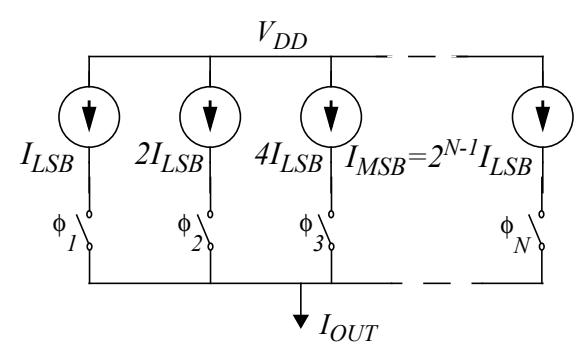
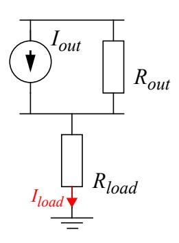
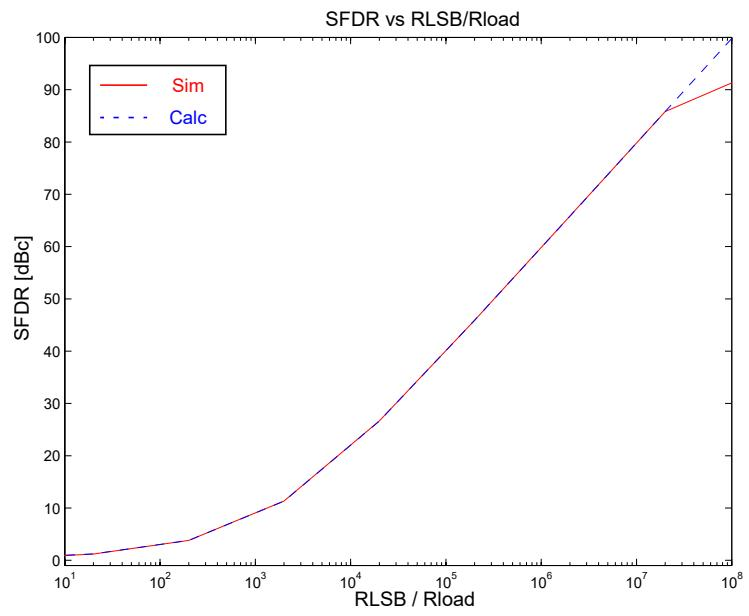
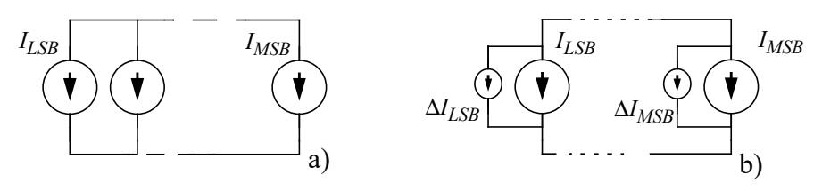
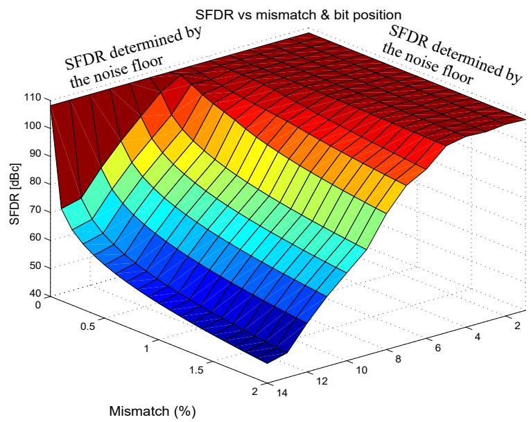
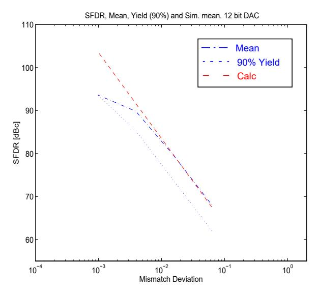
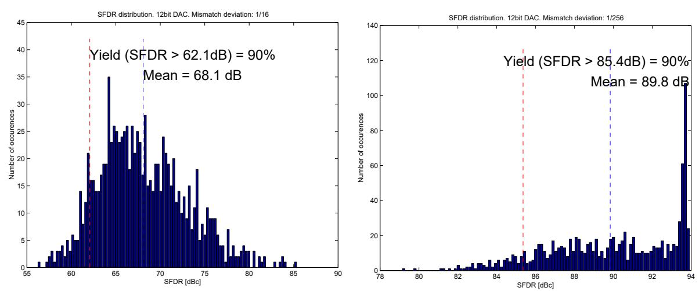
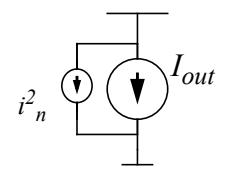
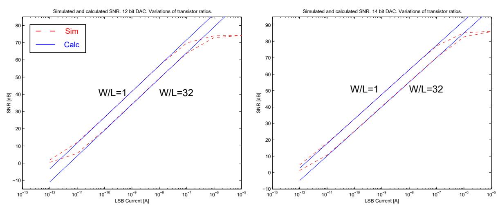

# **Influence of Circuit Imperfections on the Dynamic Performance of DACs**

J Jacob Wikner1 , Nianxiong Tan2

*1) Electronics Systems, Linköping University, 58183 Linköping Sweden, jacobw@isy.liu.se*

*Abstract – Digital-to-analog converters are crucial building blocks for telecommunication applications. For this kind of applications, the traditional static performance requirements do not apply. Dynamic performance is of the greatest importance. This paper discusses the aspects of the dynamic performance of digital-to-analog converters and models the influence of non-idealities of circuit components (such as output impedance, mismatch, circuit noise, etc.) on the dynamic performance. Both deterministic and statistic effects are modelled. The purpose of this modelling is to provide an insightful design guidance for high dynamic performance digital-to-analog converters.*

### **I. INTRODUCTION**

High-speed DACs are important building blocks in telecommunication systems. DACs are one of key components in wideband radio systems [1] and high speed internet access [2]. For these and similuar applications, the traditional performance parameters such as offset error, gain error, integral non-linearity (INL), differential non-linearity (DNL), etc., are not directly applicable. For telecommunication applications, it is the dynamic performances that determine the quality of DACs [3]. Among the most important dynamic performance parameters are spuriousfree dynamic range (SFDR), inter-modulation distortion (IMD), signal-to-noise ratio (SNR) and signal-to-noise-and-distortion ratio (SNDR, or SINAD). They usually directly determine the quality of DACs for telecommunications.

There are publications on DACs [4-13], however most publications are focused on improving the static performance [4-6]. Some have reported the dynamic performance of DACs [7-11]. In recent measurements we had an SFDR larger than 65dBc for a 10-bit 1.5V CMOS DAC [10]. How could we achieve this result when knowing that the matching of small transistors in standard digital CMOS is relatively low (0.1 ~ 1%)? This made us rethink how the mismatch can influence the dynamic range and what are the design parameters that can influence the dynamic range. For a given process, can we provide an insightful design guidance to meet the dynamic performance requirement such as SFDR and SNR? In this paper, we will address these questions and discuss the influence of output impedance, matching and noise on the dynamic performance.

### **II. DAC STRUCTURES**

The use of switched current sources is a natural choice for DACs implemented in a standard digital CMOS process. In this paper we study binary weighted DACs as shown in figure 1 and discussed in [9]. The switches in figure 1, , are controlled by the digital input code, , where and is the number of bits. The digital code is with as the least significant bit (LSB) and the most significant bit (MSB). The switched currents are summed at the output node and terminated by a suitable resistance. The output current of the DAC shown φ*i bi i* = 1 2,, , … *N N b*1*b*2…*bN b*1 *bN*

*2) MERC, Ericsson Components AB, 164 81 Stockholm, Sweden, ekantan@eka.ericsson.se*

in figure 1 is given by

$$I_{out}(X) = I_{LSB}[b_1 + 2b_2 + \dots + 2^{N-1}b_N] = I_{LSB}X$$
 (1)

where

$$X = b_1 + 2b_2 + \dots + 2^{N-1}b_N \tag{2}$$

 is the digital code, with being LSB and MSB. *bi i* = 1 2,, , … *N b*1 *bN*

**Figure 1: An N-bit binary weighted DAC**

Notice, that segmentation of MSBs can be used to reduce glitch energy [3, 10, 11]. However, this will not affect the modelling in this paper. We only concern with binary weighted DACs.

### **III. INFLUENCE OF OUTPUT IMPEDANCE VARIATIONS**

Due to the finite output impedance of a realized current source (figure 2), the output current delivered to the load is given by

$$I_{load} = \frac{R_{out}}{R_{out} + R_{load}} I_{out}$$
 (3)

where is given by equation (1). *Iout*

**Figure 2: Finite output impedance in current sources**

The total output impedance is dependent on how many current sources that are connected to the output (figure 1) and therefore input signal dependent which will give distortion. With the signal dependent output conductance, , equation (3) can be rewritten as *Gout*( ) *X* = 1 ⁄ *Rout*( ) *X*

$$I_{load}(X) = \frac{1}{1 + G_{out}(X)/G_{load}} I_{out}(X)$$
 (4)

where X indicates the digital input given by equation (2) and  $G_{load} = 1/R_{load}$  is the load conductance. The output conductance associated with the LSB current source is assumed to be  $G_{LSB}$ . The output conductance for CMOS current sources is proportional to the current and therefore the total output conductance,  $G_{out}(X)$ , of the converter is

$$G_{out}(X) = G_{LSB}[b_1 + 2b_2 + \dots + 2^{N-1}b_N] = G_{LSB}X$$
 (5)

where X is given by equation (2). Combining equations (1), (4) and (5), we have

$$I_{load}(X) = I_{LSB} \cdot G_{load} / G_{LSB} \cdot (1 - (1 + X[G_{LSB} / G_{load}])^{-1})$$
 (6)

A converted full-scale sinusoidal in an offset binary code is given by

$$I_{out}(X) = A(1 + \sin \Omega) \tag{7}$$

where  $\Omega$  is the normalized angular frequency and A is the amplitude given by

$$A = \frac{2^N - 1}{2} I_{LSB} (8)$$

The SFDR is given [12] by

SFDR = 
$$\left(1 + 2\frac{R_{LSB}/R_{load}}{2^N - 1} \cdot \left[1 + \sqrt{1 + \frac{2^N - 1}{R_{LSB}/R_{load}}}\right]\right)^2$$
 (9)

If  $R_{LSB}/R_{load}$  is high, equation (9) can be approximated by

$$SFDR\left(\frac{R_{LSB}}{R_{load}}, N\right) \approx \frac{(R_{LSB}/R_{load})^2}{2^{2(N-2)}} = 20\log(R_{LSB}/R_{load}) - 6(N-2) \text{ [dB]}$$
 (10)

In figure 3 we show the simulated and calculated SFDR for a 12 bit DAC.

Figure 3: Simulated and calculated SFDR as a function of the ratio between output and terminating impedances.

Calculation agrees well with the simulations. For high ratios the spurious is hidden below the quantization noise floor. *RLSB Rload* ⁄

### **IV. INFLUENCE OF MISMATCH**

In this paper we focus on two kinds of mismatch to find a design guidance that can be used when designing DACs with binary weighted current sources. The first kind of mismatch is deterministic error in one of the current sources. In the second mismatch problem a random mismatch in every current source is assumed. The mismatch can be modelled as error sources coupled in parallel with the nominal current source, as shown in figure 4b). All the error sources can then be summed and modelled with a resultant error current source.

**Figure 4: Mismatch modeling with current error sources a) Without mismatch and b) with mismatch**

#### **A) Influence of deterministic variations**

Suppose that there is a relative mismatch error, , in the current source controlled by the -th LSB, the output signal can be written as ∆*i i*

$$I_{out}(X) = I_{out}(X) + I_{LSB} 2^{i-1} \Delta_i b_i$$
 (11)

where is the wanted signal as defined by equation (1). The absoule error current for the -th LSB current source (figure 4b) is given by *Iout*( ) *X i*

$$\Delta I_i = I_{LSB} \cdot 2^{i-1} \cdot b_i \tag{12}$$

It is seen from equation (11) that mismatch errors in the more significant bits (where is large) will affect the signal stronger. Due to the large error current in the MSBs harmonics of odd order due to the pulse waves (digital bits) occurs. In [12, 13] the derivation of the SFDR is dicussed and given *i*

$$SFDR(i, \Delta_i) \approx 13.5 + 6(N - i) - 20\log\Delta_i \text{ [dB]}$$
(13)

For % (MSB in a 14-bit DAC) the calculations give dB. Note that equation (13) is valid for errors in the more significant bits. ∆14 = SFDR 53 1 ≈

Shown in figure 5 is the simulation result for a 14-bit DAC when varying the mismatch error and bit position. It can be seen in the figure that the simulation gives dB for %. For smaller deterministic mismatch errors in lower significant bits, the error can not be modelled as contribution to the distortions. In this case the spurious may also be determined by the noise floor (figure 5) and therefore the SFDR can be approximated by using the known level of noise, see section V. SFDR 53 ≈ ∆14 = 1

**Figure 5: SFDR as a function of mismatch error and bit position.**

#### **B) Influence of statistic variations**

mated by

In the above section, we discussed the current error in different bit positions. In reality current error due to process variations is of statistic nature. The mismatch of transistors can be modelled as an error current source in parallel with every single original current source as shown in figure 4b. Suppose there is as mismatch error, . The statistic error current source in the LSB is a normal distribution with a mean value and standard deviation . For the -th LSB, the error current has the mean value and standard deviation . It is assumed that the mismatch between the individual current sources are uncorrelated. When assuming uncorrelated mismatch current sources the expected value of SFDR can be approxiδ*i* µ = 0 σ σ*LSB* = *i* µ*i* = 0 σ*i* 2*i* – 1σ*LSB* =

$$E\{SFDR(N, \sigma_{LSB})\} \approx 3N + 7.5 - 20\log\sigma_{lSB}$$
 (14)

This is discussed in [12, 13] and an exact expression is given in [12].

Shown in figure 6 are the simulated SFDRs for a 12 bit DAC. The calculated value from equation (14) is also drawn in the figures. Also given in the figure is the SFDR with 90% yield. This means that with a given statistic mismatch error, 90% of the chips having an SFDR larger than or equal to the value given in the figure. Histograms and simulation data are given in figure 7 for different mismatch, . σ

The simulations have been done with MatLab 4.2c on Sun Ultra work station. Histograms as shown in figure 7 have been calculated with 1000 samples. For each individual sample an FFT with 57643 samples was calculated. The ratio between the signal frequency and the sampling frequency is irrational. In figure 7b) it should be noted that spurious are detected in the noise floor and therefore a small error is introduced in the mean and yield value. More simulation results are given in [12].

**Figure 6: SFDR for a 12 bit DAC as function of the mismatch standard deviation (**σLSB**). The 90% yield and the calculated SFDR value is shown in the same graph.**

**Figure 7: Histogram of SFDR for a 12bit DAC with a)** σLSB**=1/16 b)** σLSB**=1/256**

### **V. INFLUENCE OF NOISE**

The SNR for an ideal -bit DAC over the whole Nyquist band is given by *N*

$$SNR = 6.02N + 1.76 [dB]$$
 (15)

Due to the circuit noise inherent in the DAC, this theoretical value cannot always be achieved. Shown in figure 8 is the current source with a noise source added.

**Figure 8: Noise modelling of current source**

In CMOS DACs, the thermal noise from the transistors usually dominates. The spectral density of the thermal noise introduced in a current source is given by

$$\overline{i_n^2}/\Delta f = \frac{8}{3}kTg_m \tag{16}$$

where k is Boltzmann's constant, T is the absolute temperature and  $g_m$  is the transconductance of the transistor. The transconductance,  $g_m$  of the LSB current source transistor, is determined by

$$g_m \approx \sqrt{2\mu_0 C_{ox}(W/L) I_{LSB}} \tag{17}$$

where  $\mu_0$  is the surface mobility,  $C_{ox}$  is the capacitance per gate area, (W/L) is the transistor size ratio. Using the noise and transconductance definitions in equations (16) and (17) and assuming that the thermal noise in the transistors dominate, the noise power within a certain bandwidth, BW, in the LSB current source is

$$\overline{i_{tot}^2} = \frac{8}{3}kT(BW)\sqrt{2K'(W/L)I_{LSB}}$$
 (18)

When we connect different current sources to the output, all thermal noise associated with the switched current-sources will decrease the SNR. From [12] it is seen that SNR can be written as

$$SNR \approx 15\log I_{LSB} + 3N - 5\log \frac{W}{L} - 10\log BW - 5\log K' - 10\log(kT) - 7 \text{ [dB] (19)}$$

Shown in figure 9 is the simulated and calculated SNR values vs. LSB current for different transistor sizes. Ericsson's process was used. It is seen from figure 9 that for high currents in the LSB, the thermal noise is less than the average quantization noise and SNR approaches the theoretical value given by equation (15). When the current is small, it is the thermal noise that limits SNR since the thermal noise is relative large compared to the signal current.

Figure 9: SNR as function of LSB current. a) 12 bit DAC b) 14 bit DAC

#### VI. DISCUSSION AND CONCLUSIONS

When constructing DACs for telecommunication some important factors are the output impedance of the current sources, mismatch error and the circuit noise since they have a strong influence on the dynamic performance. In this paper we have discussed the influences and presented formulas that can be used as a design guidance and they have been verified at the system level in MatLab.

### **VII. ACKNOWLEDGMENTS**

The help with invaluable hints and discussions from Mikael Gustavsson, Electronics Systems, Linköping University, is highly appreciated.

## **VIII. REFERENCES**

- [1] B. Hedberg, *"Wideband radio system"*, Internal communication, Ericsson Radio Systems AB, Sweden
- [2] I. Berggren, *"Analog front end for XDSL"*, Internal communication, Ericsson Telecommunications AB, Sweden
- [3] N. Tan, *"High performance DACs for telecommunication"*, Internal report, Ericsson Components AB, Sweden.
- [4] P. Conway, D. Yu, *"DAC design offers high-speed linear performance"*, Microwaves & RF, August 1994.
- [5] M. Otsuka, S. Ichiki, T. Tskuada, T. Matsuura, K. Maio, *"Low-Power, Small-Area 10bit D/A Converter for Cell-Based IC"*, 1995 IEEE symposium on Low Power Electronics, pp. 66-67
- [6] B. G. Henriques, J. E. Franca, *"High-Speed D/A Conversion with Linear Phase sinx/x Compensation"*, Conf. ISCAS 1993, Vol II. pp. 1204-1207
- [7] B. G. Henriques, J. E. Franca, *"A High-Speed Programmable CMOS Interface System Combining D/A Conversion and FIR Filtering"*, IEEE Journal of solid-state circuits, Vol. 29, No. 8, August 1994
- [8] J. M. Fournier, P. Senn, *"A 130-MHz 8-b CMOS Video DAC for HDTV Applications"*, IEEE Journal of solid-state circuits, Vol. 26, No. 7, July 1991
- [9] C. A. A. Bastiaansen, D. Wouter, J. Groenewald, H. J. Schouwenaars, H. A. H. Termeer, *"A 10-b 40-MHz 0.8-*µ*m CMOS Current-Output D/A Converter"*, IEEE Journal of solidstate circuits, Vol. 26, No. 7, July 1991
- [10] N. Tan, *"A 1.5-V 3-mV 10-bit 50 Ms/s CMOS DAC with low distortion and low intermodulation in standard digital CMOS process"*, In proc. 1997 IEEE Custom Integrated Circuits Conference (CICC'97), Santa Clara, USA, pp.599-602, May, 1997
- [11] N. Tan, E. Cijvat, H. Tenhunen, *"Design and implementation of High-Performance CMOS D/A Converter"*, Conf. ISCAS Hong Kong 1997, Vol I. pp. 421-424.
- [12] J. J. Wikner, N. Tan, "*Modelling of DACs for Telecommunication*", LiTH-ISY-R-1983, Linköping University.
- [13] N. Tan, J. J. Wikner, "*A CMOS Digital-to-Analog Converter Chipset for Telecommunication*", IEEE Magazine on Circuits and Devices, September 1997